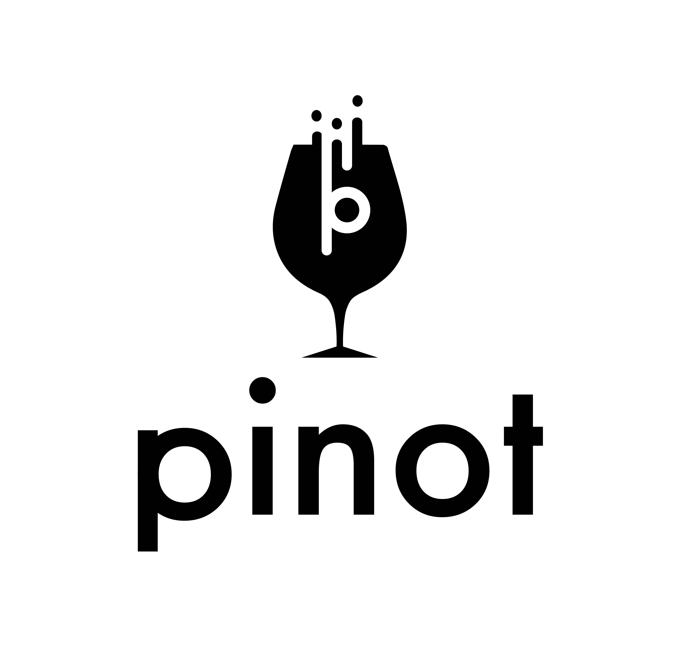

# Introduction

## What is Pinot?

Pinot is a realtime distributed OLAP datastore, which is used at LinkedIn to deliver scalable real time analytics with low latency. It can ingest data from offline data sources \(such as Hadoop and flat files\) as well as streaming events \(such as Kafka\). Pinot is designed to scale horizontally, so that it can scale to larger data sets and higher query rates as needed.



## Features of Pinot

* A column-oriented database with various compression schemes such as Run Length, Fixed Bit Length
* Pluggable indexing technologies - Sorted Index, Bitmap Index, Inverted Index
* Ability to optimize query/execution plan based on query and segment metadata .
* Near real time ingestion from streams and batch ingestion from Hadoop
* SQL like language that supports selection, aggregation, filtering, group by, order by, distinct queries on data.
* Support for multivalued fields
* Horizontally scalable and fault tolerant

## When should I use it?

Pinot is designed to answer OLAP queries with low latency. It is suited in contexts where fast analytics, such as aggregations, are needed on immutable data, possibly, with real-time data ingestion.

## When should I not use it?

Pinot is not a replacement for your database, nor a search engine. It addresses fast analytics on immutable data and it is not thought by design, to handle data updates or deletions. Joins are currently not supported, but this problem can be overcome by using PrestoDB for querying Pinot \([https://prestodb.io/](https://prestodb.io/)\).  
  
For more information about PrestoDB connector for Pinot see [https://github.com/apache/incubator-pinot/tree/master/kubernetes/examples/helm\#access-pinot-using-presto](https://github.com/apache/incubator-pinot/tree/master/kubernetes/examples/helm#access-pinot-using-presto)  
introduced in [https://github.com/prestodb/presto/pull/13504](https://github.com/prestodb/presto/pull/13504)

## Quick example

Pinot works very well for querying time series data with lots of Dimensions and Metrics. Filters and aggregations are easy and fast.

```text
SELECT sum(clicks), sum(impressions) FROM AdAnalyticsTable
  WHERE ((daysSinceEpoch >= 17849 AND daysSinceEpoch <= 17856)) AND accountId IN (123456789)
  GROUP BY daysSinceEpoch TOP 100
```

## Who uses Pinot?

Pinot powers several big players, including LinkedIn, Uber, Factual, Weibo, Slack and more .



## Tutorial

If you want to learn how to run Pinot straight, see



If you prefer some concepts and tutorials first,  see



## Installation

Pinot may be run on the cloud, but it can also be installed and run on local computers or servers. You may get started either with a bare-metal installation or a kubernetes one \(either locally or in the cloud\). Get immediately started with Pinot by checking the quick start examples 






