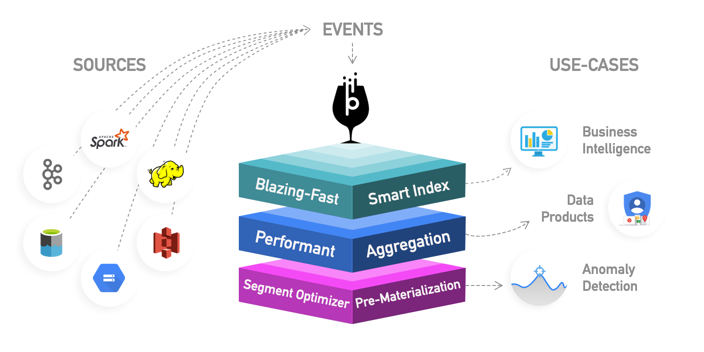

# Introduction

## What is Pinot?

Pinot is a real-time distributed OLAP datastore, purpose-built to provide ultra low latency analytics, even at extremely high throughput. It can **ingest directly from streaming data sources - such as Apache Kafka and Amazon Kinesis - and make the events available for querying instantly**. It can also ingest from batch data sources - such as Hadoop HDFS, Amazon S3, Azure ADLS, Google Cloud Storage.

At the heart of the system is a columnar store, with several smart indexing and pre-aggregation techniques for low latency. **This makes Pinot the most perfect fit for user-facing realtime analytics**. At the same time, Pinot is also a great choice for other analytical use-cases, such as internal dashboards, anomaly detection and ad-hoc data exploration.

Pinot was built by engineers at LinkedIn and Uber and is designed to scale up and out with no upper bound. Performance always remains constant based on the size of your cluster and an expected query per second \(QPS\) threshold.


Join us in our Slack channel for questions, troubleshooting, and feedback. You can request an invite from -  [https://communityinviter.com/apps/apache-pinot/apache-pinot](https://communityinviter.com/apps/apache-pinot/apache-pinot) .

We'd love to hear from you




### 

## Get started

Our documentation is structured to let you quickly get to the content you need and is organized around the different concerns of users, operators, and developers. If you're new to Pinot and want to learn things by example, please take a look at our _getting started_ section.

### Starter guides



To start importing data into Pinot, check out our guides on batch import and stream ingestion based on our [plugin architecture](developers/plugin-architecture/).



### Query example

Pinot works very well for querying time series data with many dimensions and metrics over a vast unbounded space of records that scales linearly on a per node basis. Filters and aggregations are both easy and fast.

```sql
SELECT sum(clicks), sum(impressions) FROM AdAnalyticsTable
  WHERE 
       ((daysSinceEpoch >= 17849 AND daysSinceEpoch <= 17856)) AND 
       accountId IN (123456789)
  GROUP BY 
       daysSinceEpoch TOP 100
```

Pinot supports SQL for querying read-only data. Learn more about querying Pinot for time series data in our [PQL \(Pinot Query Language\)](users/user-guide-query/querying-pinot.md) guide.

## Installation

Pinot may be deployed to and operated on a cloud provider or a local or virtual machine. You may get started either with a bare-metal installation or a Kubernetes one \(either locally or in the cloud\). To get immediately started with Pinot, check out these quick start guides for bootstrapping a Pinot cluster using Docker or Kubernetes.

### Standalone mode





### Cluster mode





## Learn

For a high-level overview that explains how Pinot works, please take a look at our basic concepts section.



To understand the distributed systems architecture that explains Pinot's operating model, please take a look at our basic architecture section.



## Overview

This section focuses on answering the most frequently asked questions for people exploring the newly evolving category of distributed OLAP engines. Pinot was created by authors at both Uber and LinkedIn and has been hardened and battle tested at the very highest of load and scale.

#### Is Pinot a data warehouse or a database?

While Pinot doesn't match the typical mold of a database product, it is best understood based on your role as either an analyst, data scientist, or application developer.

**Enterprise business intelligence**

For analysts and data scientists, Pinot is best viewed as a highly-scalable data platform for business intelligence. In this view, Pinot converges big data platforms with the traditional role of a data warehouse, making it a suitable replacement for analysis and reporting.

**Enterprise application development**

For application developers, Pinot is best viewed as an immutable aggregate store that sources events from streaming data sources, such as Kafka, and makes it available for query using SQL. 

As is the case with a microservice architecture, data encapsulation ends up requiring each application to provision its own data store, as opposed to sharing one OLTP database for reads and writes. In this case, it becomes difficult to query the complete view of a domain because it becomes stored in many different databases. This is costly in terms of performance, since it requires joins across multiple microservices that expose their data over HTTP under a REST API. To prevent this, Pinot can be used to aggregate all of the data across a microservice architecture into one easily queryable view of the domain.

Pinot [tenants](basics/components/tenant.md) prevent any possibility of sharing ownership of database tables across microservice teams. Developers can create their own query models of data from multiple systems of record depending on their use case and needs. As with all aggregate stores, query models are eventually consistent and immutable.

### **Companies using Pinot**

<table>
  <thead>
    <tr>
      <th style="text-align:left">Company</th>
      <th style="text-align:left">Notes</th>
    </tr>
  </thead>
  <tbody>
    <tr>
      <td style="text-align:left">LinkedIn</td>
      <td style="text-align:left">
        <p>Pinot originated at LinkedIn and it powers more 50+ user facing applications
          such as Who Viewed My Profile, Talent Analytics, Company Analytics, Ad
          Analytics and many more. Pinot also serves as the backend for to visualize
          and monitor 10,000+ business metrics.</p>
        <p>Pinot runs on 1000+ nodes serving 100k+ queries while ingesting 1.5M+
          events per second.</p>
      </td>
    </tr>
    <tr>
      <td style="text-align:left">Uber</td>
      <td style="text-align:left">Pinot powers many internal and external dashboards as well as external
        site facing analytics applications like <a href="https://eng.uber.com/restaurant-manager/">UberEats Restaurant Analytics</a>.</td>
    </tr>
    <tr>
      <td style="text-align:left">Microsoft</td>
      <td style="text-align:left">Microsoft Teams uses Pinot for analytics on Teams product usage data.</td>
    </tr>
    <tr>
      <td style="text-align:left">Weibo</td>
      <td style="text-align:left">Weibo uses Pinot for realtime analytics on CDN &amp; Weibo Video data
        to make business decisions, optimize service performance and improve user
        experience.</td>
    </tr>
    <tr>
      <td style="text-align:left">Factual</td>
      <td style="text-align:left">Insight Product - <a href="https://www.factual.com/products/insights/">https://www.factual.com/products/insights/</a>
      </td>
    </tr>
  </tbody>
</table>

### Features

* A column-oriented database with various compression schemes such as Run Length, Fixed Bit Length
* Pluggable indexing technologies - Sorted Index, Bitmap Index, Inverted Index
* Ability to optimize query/execution plan based on query and segment metadata
* Near real time ingestion from streams and batch ingestion from Hadoop
* SQL-like language that supports selection, aggregation, filtering, group by, order by, distinct queries on data
* Support for multi-valued fields
* Horizontally scalable and fault-tolerant

### When should I use it?

Pinot is designed to execute OLAP queries with low latency. It is suited in contexts where fast analytics, such as aggregations, are needed on immutable data, possibly, with real-time data ingestion.

**User facing Analytics Products**

Pinot was originally built at LinkedIn to power rich interactive real-time analytic applications such as [Who Viewed Profile](https://www.linkedin.com/me/profile-views/urn:li:wvmp:summary/),  [Company Analytics](https://www.linkedin.com/company/linkedin/insights/),  [Talent Insights](https://business.linkedin.com/talent-solutions/talent-insights), and many more. [UberEats Restaurant Manager](https://eng.uber.com/restaurant-manager/) is another example of a customer facing Analytics App. At LinkedIn, Pinot powers 50+ user-facing products, ingesting _**millions of events per second**_ and serving **100k+ queries per second** at millisecond latency.

**Real-time Dashboard for Business Metrics**

Pinot can be also be used to perform typical analytical operations such as **slice** and **dice**, **drill down**, **roll up**, and **pivot** on large scale multi-dimensional data. For instance, at LinkedIn, Pinot powers dashboards for thousands of business metrics. One can connect various BI tools such Superset, Tableau, or PowerBI to visualize data in Pinot. 

Instructions to connect Pinot with Superset can found [here](integrations/superset.md).

**Anomaly Detection** 

In addition to visualizing data in Pinot, one can run Machine Learning Algorithms to detect Anomalies on the data stored in Pinot. See [ThirdEye](integrations/thirdeye.md) for more information on how to use Pinot for Anomaly Detection and Root Cause Analysis.

**Website Traffic Analysis**

A common use case for Pinot, is to analyze user traffic on a website. Aggregating over different dimensions, such as browser, os, location and other information that may be collected.

