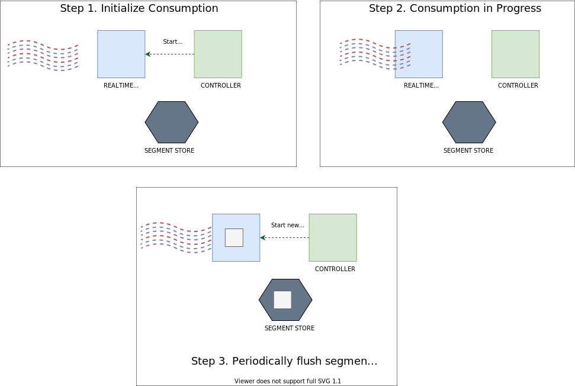
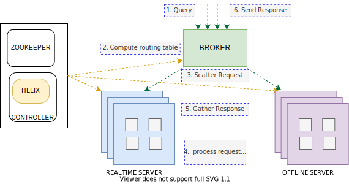

# Architecture

This page introduces you to the guiding principles behind the design of Apache Pinot. Here you will learn the distributed systems architecture that allows Pinot to scale the performance of queries linearly based on the number of nodes in a cluster. You'll also learn about the two different types of tables used to ingest and query data in offline (batch) or real-time (stream) mode.


We recommend that you read [Basic Concepts](concepts.md) to better understand the terms used in this guide.


## Guiding design principles

Engineers at LinkedIn and Uber designed Pinot to scale query performance based on the number of nodes in a cluster. As you add more nodes, query performance improves based on the expected query volume per second quota. To achieve horizontal scalability to an unbounded number of nodes and data storage, without performance degradation, we used the following principles:

* **Highly available**: Pinot is built to serve low latency analytical queries for customer-facing applications. By design, there is no single point of failure in Pinot. The system continues to serve queries when a node goes down.
* **Horizontally scalable**: Pinot scales by adding new nodes as a workload changes.
* **Latency vs. storage:** Pinot is built to provide low latency even at high-throughput. Features such as segment assignment strategy, routing strategy, star-tree indexing were developed to achieve this.
* **Immutable data**: Pinot assumes that all data stored is immutable. For GDPR compliance, we provide an add-on solution for purging data while maintaining performance guarantees.
* **Dynamic configuration changes**: Operations such as adding new tables, expanding a cluster, ingesting data, modifying indexing config, and re-balancing must not impact query availability or performance.

## Core components

As described in the [concepts](concepts.md), Pinot has multiple distributed system components:[ controller](components/cluster/controller.md), [broker](components/cluster/broker.md), [server](components/cluster/server.md), and [minion](components/cluster/minion.md).

Pinot uses [Apache Helix](http://helix.apache.org/) for cluster management. Helix is embedded as an agent within the different components and uses [Apache Zookeeper](https://zookeeper.apache.org/) for coordination and maintaining the overall cluster state and health.

.svg>)

### Apache Helix and Zookeeper

Helix, a generic cluster management framework to manage partitions and replicas in a distributed system, manages all Pinot [servers](components/cluster/server.md) and [brokers](components/cluster/broker.md). It's helpful to think of Helix as an event-driven discovery service with push and pull notifications that drives the state of a cluster to an ideal configuration. A finite-state machine maintains a contract of stateful operations that drives the health of the cluster towards its optimal configuration. Helix optimizes query load by updating routing configurations between nodes based on where data is stored in the cluster.

Helix divides nodes into three logical components based on their responsibilities:

* **Participant**: These are the nodes in the cluster that actually host the distributed storage resources.
* **Spectator**: These nodes observe the current state of each _**participant**_ and route requests accordingly. Routers, for example, need to know the instance on which a partition is hosted and its state to route the request to the appropriate endpoint. Routing is continually updated to optimize cluster performance as storage primitives are added and changed.
* **Controller**: The [controller](components/cluster/controller.md) observes and manages the state of _**participant**_ nodes. The controller is responsible for coordinating all state transitions in the cluster and ensures that state constraints are satisfied while maintaining cluster stability.

Helix uses Zookeeper to maintain cluster state. Each component in a Pinot cluster takes a Zookeeper address as a startup parameter. The various components distributed in a Pinot cluster watch Zookeeper notifications and issue updates via its embedded Helix-defined agent.

| Component  | Helix Mapping                                                                                                                                                                                       |
| ---------- | --------------------------------------------------------------------------------------------------------------------------------------------------------------------------------------------------- |
| Segment    | Modeled as a **Helix Partition.** Each [segment](components/table/segment/) can have multiple copies referred to as **replicas.**                                                                   |
| Table      | Modeled as a **Helix Resource.** Multiple segments are grouped into a [table](components/table/). All segments belonging to a Pinot Table have the same schema.                                     |
| Controller | Embeds the Helix agent that drives the overall state of the cluster                                                                                                                                 |
| Server     | Modeled as a **Helix Participant** and hosts [segments](components/table/segment/)                                                                                                                  |
| Broker     | Modeled as a **Helix Spectator** that observes the cluster for changes in the state of segments and servers. In order to support multi-tenancy, brokers are also modeled as **Helix Participants**. |
| Minion     | Modeled as a **Helix Participant**                                                                                                                                                                  |

Helix agents use Zookeeper to store and update configurations, as well as for distributed coordination. Zookeeper stores the following information about the cluster:

| Resource        | Stored Properties                                                                                                                                                          |
| --------------- | -------------------------------------------------------------------------------------------------------------------------------------------------------------------------- |
| Controller      | <ul><li>Controller that is assigned as the current leader</li></ul>                                                                                                        |
| Servers/Brokers | <ul><li>List of servers/brokers and their configuration</li><li>Health status</li></ul>                                                                                    |
| Tables          | <ul><li>List of tables</li><li>Table configurations</li><li>Table schema information</li><li>List of segments within a table</li></ul>                                     |
| Segment         | <ul><li>Exact server location(s) of a segment (routing table)</li><li>State of each segment (online/offline/error/consuming)</li><li>Metadata about each segment</li></ul> |

Knowing the `ZNode` layout structure in Zookeeper for Helix agents in a cluster is useful for operations and/or troubleshooting cluster state and health.


### Controller

Pinot's [controller](components/cluster/controller.md) acts as the driver of the cluster's overall state and health. Because of its role as a Helix participant and spectator, which drives the state of other components, it's the first component that is typically started after Zookeeper.&#x20;

Starting a controller requires two parameters: Zookeeper address and cluster name. The controller will automatically create a cluster via Helix if it does not yet exist.

#### Fault tolerance

To configure fault tolerance, start multiple controllers (typically three) and one of them will act as a leader. If the leader crashes or dies, another leader is automatically elected. Leader election is achieved using Apache Helix. Having at-least one controller is required to perform any DDL equivalent operation on the cluster, such as adding a table or a segment.

The controller does not interfere with query execution. Query execution is not impacted even when all controllers nodes are offline. If all controller nodes are offline, the state of the cluster will stay as it was when the last leader went down. When a new leader comes online, a cluster resumes rebalancing activity and can accept new tables or segments.

#### Controller REST interface

The controller provides a REST interface to perform CRUD operations on all logical storage resources (servers, brokers, tables, and segments).

See [Pinot Data Explorer](components/exploring-pinot.md) for more information on the web-based admin tool.

### Broker

The [broker's](components/cluster/broker.md) responsibility is to route a given query to an appropriate [server](components/cluster/server.md) instance. A broker collects and merges the responses from all servers into a final result, then sends it back to the requesting client. The broker provides HTTP endpoints that accept SQL queries and returns the response in JSON format.

Brokers need three key things to start:

* Cluster name
* Zookeeper address
* Broker instance name

Initially, the broker registers as a **Helix Participant** and waits for notifications from other Helix agents. The broker handles these notifications for table creation, a new segment being loaded, or a server starting up or going down, in addition to any configuration changes.

**Service Discovery/Routing Table**

Regardless of the kind of notification, the key responsibility of a broker is to maintain the query routing table. The query routing table is simply a mapping between segments and the servers that a segment resides on. Typically, a segment resides on more than one server. The broker computes multiple routing tables depending on the configured routing strategy for a table. The default strategy is to balance the query load across all available servers.


For special or generic cases that serve very high throughput queries, there are advanced routing strategies available such as ReplicaAware routing, partition-based routing, and minimal server selection routing.&#x20;


```javascript
//This is an example ZNode config for EXTERNAL VIEW in Helix
{
  "id" : "baseballStats_OFFLINE",
  "simpleFields" : {
    ...
  },
  "mapFields" : {
    "baseballStats_OFFLINE_0" : {
      "Server_10.1.10.82_7000" : "ONLINE"
    }
  },
  ...
}
```

**Query processing**

For every query, a cluster's broker performs the following:

* Fetches the routes that are computed for a query based on the routing strategy defined in a [table's](components/table/) configuration.
* Computes the list of segments to query from on each [server](components/cluster/server.md). To learn more about this, check out [routing](operators/tuning/routing.md).
* Scatter-gather: sends the requests to each server and gathers the responses.
* _Merge:_ merges the query results returned from each server.
* Sends the query result to the client.

```javascript
// Query: select count(*) from baseballStats limit 10

// RESPONSE
// ========
{
    "resultTable": {
        "dataSchema": {
            "columnDataTypes": ["LONG"],
            "columnNames": ["count(*)"]
        },
        "rows": [
            [97889]
        ]
    },
    "exceptions": [],
    "numServersQueried": 1,
    "numServersResponded": 1,
    "numSegmentsQueried": 1,
    "numSegmentsProcessed": 1,
    "numSegmentsMatched": 1,
    "numConsumingSegmentsQueried": 0,
    "numDocsScanned": 97889,
    "numEntriesScannedInFilter": 0,
    "numEntriesScannedPostFilter": 0,
    "numGroupsLimitReached": false,
    "totalDocs": 97889,
    "timeUsedMs": 5,
    "segmentStatistics": [],
    "traceInfo": {},
    "minConsumingFreshnessTimeMs": 0
}
```

**Fault tolerance**

Broker instances scale horizontally without an upper bound. In a majority of cases, only three brokers are required. If most query results that are returned to a client are less than 1 MB in size per query, you can run a broker and servers inside the same instance container. This lowers the overall footprint of a cluster deployment for use cases that don't need to guarantee a strict SLA on query performance in production.

### Server

[Servers](components/cluster/server.md) host [segments](components/table/segment/) and do most of the heavy lifting during query processing. Though the architecture shows that there are two kinds of servers, real-time and offline, a server doesn't really "know" if it's going to be a real-time server or an offline server. The server's responsibility depends on the [table](components/table/) assignment strategy.


In theory, a server can host both real-time segments and offline segments. However, in practice, we use different types of machine SKUs for real-time servers and offline servers. The advantage of separating real-time servers and offline servers is to allow each to scale independently.


**Offline servers**

Offline servers typically host segments that are immutable. In this case, segments are created outside of a cluster and uploaded via a shell-based [curl](https://curl.haxx.se/) request. Based on the replication factor and the segment assignment strategy, the controller picks one or more servers to host the segment. Helix notifies the servers about the new segments. Servers fetch the segments from deep store and load them. At this point, the cluster's [broker](components/cluster/broker.md) detects that new segments are available and starts including them in query responses.

**Real-time servers**

Unlike offline servers, real-time [server](components/cluster/server.md) nodes ingest data from streaming sources, such as Kafka, and generate the indexed segments in-memory while flushing segments to disk periodically. In-memory segments are also known as consuming segments. Consuming segments get flushed periodically based on completion threshold (calculated with number of rows, time or segment size). At this point, they become completed segments. Completed segments are similar to offline servers' segments. Queries go over the in-memory (consuming) segments and the completed segments.

### Minion

[Minion](components/cluster/minion.md) is an optional component used for purging data from a Pinot cluster. For example, you might need to purge data for GDPR compliance in the UK.

## Data ingestion overview

Within Pinot, a logical [table](components/table/) is modeled as one of two types of physical tables: offline or real-time. Each table type follows a different state model.

Real-time and offline tables provide different configuration options for indexing. For real-time tables, you can also configure the connector properties for the stream data source, like Kafka. The two table types also allow users to use different containers for real-time and offline [server](components/cluster/server.md) nodes. For instance, offline servers might use virtual machines with larger storage capacity, whereas real-time servers might need higher system memory or more CPU cores.

The two types of tables also scale differently.

* Real-time tables have a smaller retention period and scale query performance based on the ingestion rate.
* Offline tables have larger retention and scale performance based on the size of stored data.

When ingesting data from the same source, you can have two tables that ingest the same data that are configured differently for real-time and offline queries. Even though the two tables have the same data, performance will scale differently for queries based on your requirements. In this scenario, real-time and offline tables must share the same [schema](../configuration-reference/schema.md).

You can configure real-time an offline tables differently depending on usage requirements. For example, you might choose to enable star-tree indexing for an offline table, while the real-time table with the same schema may not need it.

### Batch data flow

.jpg>)

In batch mode, Pinot ingests data via an [ingestion job](data-import/batch-ingestion/), which works in the following way:

1. An ingestion job transforms a raw data source (such as a CSV file) into [segments](components/table/segment/).&#x20;
2. Once segments are generated for the imported data, the ingestion job stores them into the cluster's segment store (also known as deep store) and notifies the [controller](components/cluster/controller.md).&#x20;
3. The controller processes the notification, resulting in the Helix agent on the controller updating the ideal state configuration in Zookeeper.&#x20;
4. Helix then notifies the offline [server](components/cluster/server.md) that there are new segments available.&#x20;
5. In response to the notification from the controller, the offline server downloads the newly created segments directly from the cluster's segment store.&#x20;
6. The cluster's broker, which watches for state changes in Helix, detects the new segments and adds them to the list of segments to query (segment-to-server routing table).

### Real-time data flow

At table creation, a controller creates a new entry in Zookeeper for the consuming segment. Helix notices the new segment and notifies the real-time server, which starts consuming data from the streaming source. The broker, which watches for changes, detects the new segments and adds them to the list of segments to query (segment-to-server routing table).



Whenever the segment is complete (full), the real-time server notifies the controller, which checks with all replicas and picks a winner to commit the segment to. The winner commits the segment and uploads it to the cluster's segment store, updating the state of the segment from "consuming" to "online". The controller then prepares a new segment in a "consuming" state.

## Query overview

Queries are received by brokers, which check the request against the segment-to-server routing table and scatter the request between real-time and offline servers.



The two tables process the request by filtering and aggregating the queried data, which is then returned back to the broker. Finally, the broker gathers together all of the pieces of the query response and responds back to the client with the result.
