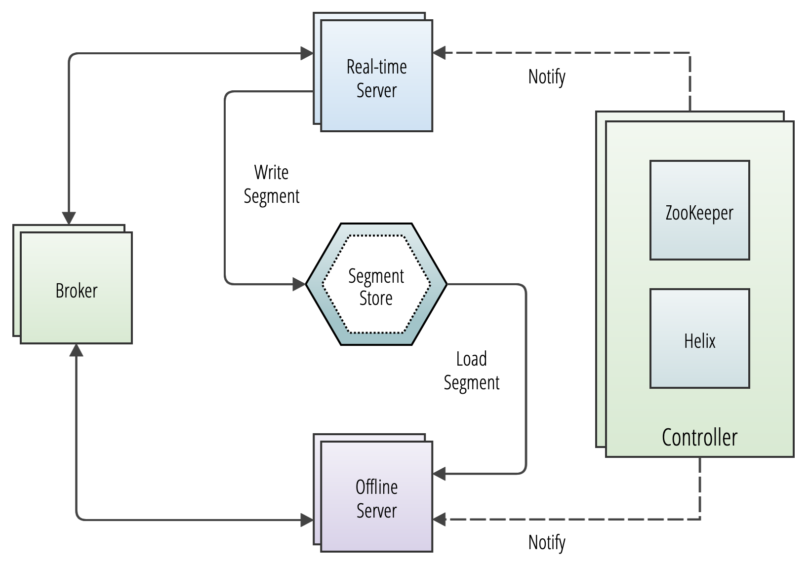

# Components

Pages in this section define and describe the major components and logical abstractions used in Pinot.&#x20;

For a general overview that ties all these components together, see [Basic Concepts](../concepts.md).

### Operator reference


[cluster](cluster/)



[controller.md](cluster/controller.md)



[broker.md](cluster/broker.md)



[server.md](cluster/server.md)



[minion.md](cluster/minion.md)



[tenant.md](cluster/tenant.md)


### Developer reference


[table](table/)



[schema.md](table/schema.md)



[segment](table/segment/)


