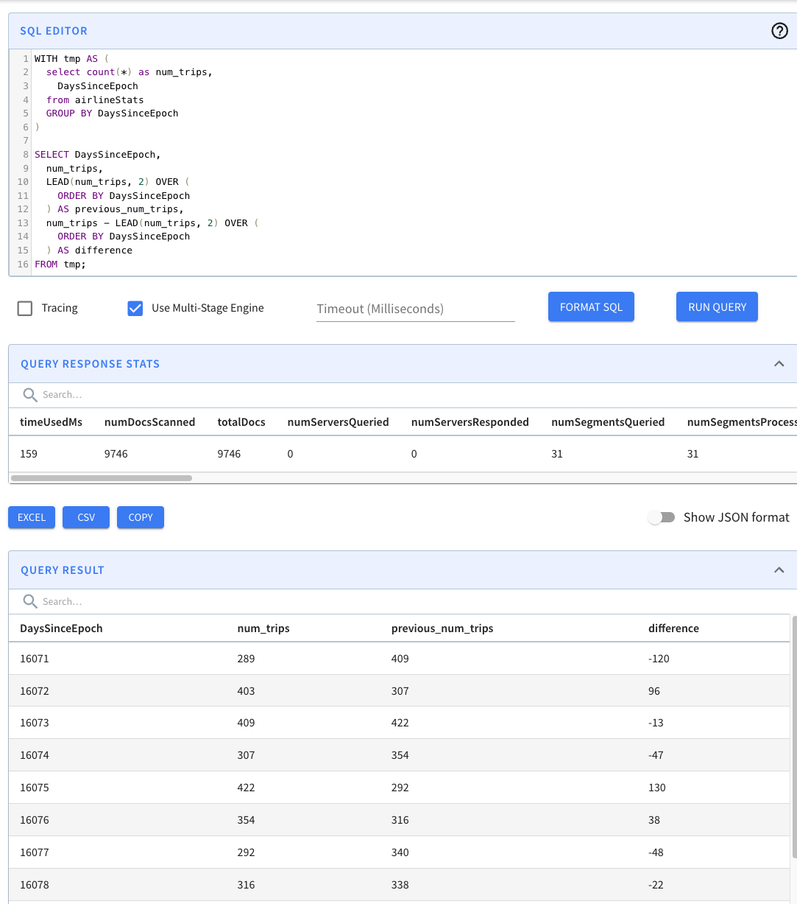

# Minion

A minion is a standby component that leverages the [Helix Task Framework](https://engineering.linkedin.com/blog/2019/01/managing-distributed-tasks-with-helix-task-framework) to offload computationally intensive tasks from other components.

It can be attached to an existing Pinot cluster and then execute tasks as provided by the controller. Custom tasks can be plugged via annotations into the cluster. Some typical minion tasks are:

* Segment creation
* Segment purge
* Segment merge

## Starting a Minion

Make sure you've [set up Zookeeper](./#setup-a-pinot-cluster). If you're using Docker, make sure to [pull the Pinot Docker image](./#setup-a-pinot-cluster). To start a minion:

```
Usage: StartMinion
    -help                                                   : Print this message. (required=false)
    -minionHost               <String>                      : Host name for minion. (required=false)
    -minionPort               <int>                         : Port number to start the minion at. (required=false)
    -zkAddress                <http>                        : HTTP address of Zookeeper. (required=false)
    -clusterName              <String>                      : Pinot cluster name. (required=false)
    -configFileName           <Config File Name>            : Minion Starter Config file. (required=false)
```



```
docker run \
    --network=pinot-demo \
    --name pinot-minion \
    -d ${PINOT_IMAGE} StartMinion \
    -zkAddress pinot-zookeeper:2181
```



```
bin/pinot-admin.sh StartMinion \
    -zkAddress localhost:2181
```



## Interfaces


### PinotTaskGenerator

PinotTaskGenerator interface defines the APIs for the controller to generate tasks for minions to execute.

```java
public interface PinotTaskGenerator {

  /**
   * Initializes the task generator.
   */
  void init(ClusterInfoAccessor clusterInfoAccessor);

  /**
   * Returns the task type of the generator.
   */
  String getTaskType();

  /**
   * Generates a list of tasks to schedule based on the given table configs.
   */
  List<PinotTaskConfig> generateTasks(List<TableConfig> tableConfigs);

  /**
   * Returns the timeout in milliseconds for each task, 3600000 (1 hour) by default.
   */
  default long getTaskTimeoutMs() {
    return JobConfig.DEFAULT_TIMEOUT_PER_TASK;
  }

  /**
   * Returns the maximum number of concurrent tasks allowed per instance, 1 by default.
   */
  default int getNumConcurrentTasksPerInstance() {
    return JobConfig.DEFAULT_NUM_CONCURRENT_TASKS_PER_INSTANCE;
  }

  /**
   * Performs necessary cleanups (e.g. remove metrics) when the controller leadership changes.
   */
  default void nonLeaderCleanUp() {
  }
}
```

### PinotTaskExecutorFactory

Factory for `PinotTaskExecutor` which defines the APIs for Minion to execute the tasks.

```java
public interface PinotTaskExecutorFactory {

  /**
   * Initializes the task executor factory.
   */
  void init(MinionTaskZkMetadataManager zkMetadataManager);

  /**
   * Returns the task type of the executor.
   */
  String getTaskType();

  /**
   * Creates a new task executor.
   */
  PinotTaskExecutor create();
}
```

```java
public interface PinotTaskExecutor {

  /**
   * Executes the task based on the given task config and returns the execution result.
   */
  Object executeTask(PinotTaskConfig pinotTaskConfig)
      throws Exception;

  /**
   * Tries to cancel the task.
   */
  void cancel();
}
```

### MinionEventObserverFactory

Factory for `MinionEventObserver` which defines the APIs for task event callbacks on minion.

```java
public interface MinionEventObserverFactory {

  /**
   * Initializes the task executor factory.
   */
  void init(MinionTaskZkMetadataManager zkMetadataManager);

  /**
   * Returns the task type of the event observer.
   */
  String getTaskType();

  /**
   * Creates a new task event observer.
   */
  MinionEventObserver create();
}
```

```java
public interface MinionEventObserver {

  /**
   * Invoked when a minion task starts.
   *
   * @param pinotTaskConfig Pinot task config
   */
  void notifyTaskStart(PinotTaskConfig pinotTaskConfig);

  /**
   * Invoked when a minion task succeeds.
   *
   * @param pinotTaskConfig Pinot task config
   * @param executionResult Execution result
   */
  void notifyTaskSuccess(PinotTaskConfig pinotTaskConfig, @Nullable Object executionResult);

  /**
   * Invoked when a minion task gets cancelled.
   *
   * @param pinotTaskConfig Pinot task config
   */
  void notifyTaskCancelled(PinotTaskConfig pinotTaskConfig);

  /**
   * Invoked when a minion task encounters exception.
   *
   * @param pinotTaskConfig Pinot task config
   * @param exception Exception encountered during execution
   */
  void notifyTaskError(PinotTaskConfig pinotTaskConfig, Exception exception);
}
```

## Built-in tasks

### SegmentGenerationAndPushTask

The PushTask can fetch files from an input folder e.g. from a S3 bucket and converts them into segments. The PushTask converts one file into one segment and keeps file name in segment metadata to avoid duplicate ingestion. Below is an example task config to put in TableConfig to enable this task. The task is scheduled every 10min to keep ingesting remaining files, with 10 parallel task at max and 1 file per task.

NOTE: You may want to simply omit "tableMaxNumTasks" due to this caveat: the task generates one segment per file, and derives segment name based on the time column of the file. If two files happen to have same time range and are ingested by tasks from different schedules, there might be segment name conflict. To overcome this issue for now, you can omit “tableMaxNumTasks” and by default it’s Integer.MAX\_VALUE, meaning to schedule as many tasks as possible to ingest all input files in a single batch. Within one batch, a sequence number suffix is used to ensure no segment name conflict. Because the sequence number suffix is scoped within one batch, tasks from different batches might encounter segment name conflict issue said above.


When performing ingestion at scale remember that Pinot will list all of the files contained in the \`inputDirURI\` every time a \`SegmentGenerationAndPushTask\` job gets scheduled. This could become a bottleneck when fetching files from a cloud bucket like GCS. To prevent this make \`inputDirURI\` point to the least number of files possible.


``` 
  "ingestionConfig": {
    "batchIngestionConfig": {
      "segmentIngestionType": "APPEND",
      "segmentIngestionFrequency": "DAILY",
      "batchConfigMaps": [
        {
          "input.fs.className": "org.apache.pinot.plugin.filesystem.S3PinotFS",
          "input.fs.prop.region": "us-west-2",
          "input.fs.prop.secretKey": "....",
          "input.fs.prop.accessKey": "....",
          "inputDirURI": "s3://my.s3.bucket/batch/airlineStats/rawdata/",
          "includeFileNamePattern": "glob:**/*.avro",
          "excludeFileNamePattern": "glob:**/*.tmp",
          "inputFormat": "avro"
        }
      ]
    }
  },
  "task": {
    "taskTypeConfigsMap": {
      "SegmentGenerationAndPushTask": {
        "schedule": "0 */10 * * * ?",
        "tableMaxNumTasks": "10"
      }
    }
  }
```

### RealtimeToOfflineSegmentsTask

See [Pinot managed Offline flows](../../../operators/operating-pinot/pinot-managed-offline-flows.md) for details.

### MergeRollupTask

See [Minion merge rollup task](../../../operators/operating-pinot/minion-merge-rollup-task.md) for details.

## Enable tasks

Tasks are enabled on a per-table basis. To enable a certain task type (e.g. `myTask`) on a table, update the table config to include the task type:

```javascript
{
  ...
  "task": {
    "taskTypeConfigsMap": {
      "myTask": {
        "myProperty1": "value1",
        "myProperty2": "value2"
      }
    }
  }
}
```

Under each enable task type, custom properties can be configured for the task type.

There are also two task configs to be set as part of cluster configs like below. One controls task's overall timeout (1hr by default) and one for how many tasks to run on a single minion worker (1 by default).

```
Using "POST /cluster/configs" API on CLUSTER tab in Swagger, with this payload
{
	"RealtimeToOfflineSegmentsTask.timeoutMs": "600000",
	"RealtimeToOfflineSegmentsTask.numConcurrentTasksPerInstance": "4"
}
```

## Schedule tasks

### Auto-schedule

There are 2 ways to enable task scheduling:

#### Controller level schedule for all minion tasks

Tasks can be scheduled periodically for all task types on all enabled tables. Enable auto task scheduling by configuring the schedule frequency in the controller config with the key `controller.task.frequencyPeriod`. This takes period strings as values, e.g. 2h, 30m, 1d.

#### Per table and task level schedule

Tasks can also be scheduled based on cron expressions. The cron expression is set in the `schedule` config for each task type separately. This config in the controller config, `controller.task.scheduler.enabled` should be set to `true` to enable cron scheduling.

As shown below, the RealtimeToOfflineSegmentsTask will be scheduled at the first second of every minute (following the syntax [defined here](http://www.quartz-scheduler.org/documentation/quartz-2.3.0/tutorials/crontrigger.html)).

```
  "task": {
    "taskTypeConfigsMap": {
      "RealtimeToOfflineSegmentsTask": {
        "bucketTimePeriod": "1h",
        "bufferTimePeriod": "1h",
        "schedule": "0 * * * * ?"
      }
    }
  },
```

### Manual schedule

Tasks can be manually scheduled using the following controller rest APIs:

| Rest API                                                             | Description                                                  |
| -------------------------------------------------------------------- | ------------------------------------------------------------ |
| **POST /tasks/schedule**                                             | Schedule tasks for all task types on all enabled tables      |
| **POST /tasks/schedule?taskType=myTask**                             | Schedule tasks for the given task type on all enabled tables |
| **POST /tasks/schedule?tableName=myTable\_OFFLINE**                  | Schedule tasks for all task types on the given table         |
| **POST /tasks/schedule?taskType=myTask\&tableName=myTable\_OFFLINE** | Schedule tasks for the given task type on the given table    |

## Plug-in custom tasks

To plug in a custom task, implement `PinotTaskGenerator`, `PinotTaskExecutorFactory` and `MinionEventObserverFactory` (optional) for the task type (all of them should return the same string for `getTaskType()`), and annotate them with the following annotations:

| Implementation             | Annotation            |
| -------------------------- | --------------------- |
| PinotTaskGenerator         | @TaskGenerator        |
| PinotTaskExecutorFactory   | @TaskExecutorFactory  |
| MinionEventObserverFactory | @EventObserverFactory |

After annotating the classes, put them under the package of name `org.apache.pinot.*.plugin.minion.tasks.*`, then they will be auto-registered by the controller and minion.

### Example

See [SimpleMinionClusterIntegrationTest](https://github.com/apache/pinot/blob/master/pinot-integration-tests/src/test/java/org/apache/pinot/integration/tests/SimpleMinionClusterIntegrationTest.java) where the `TestTask` is plugged-in.

## Task Manager UI

In the Pinot UI, there is **Minion Task Manager** tab under **Cluster Manager** page. From that minion task manager tab, one can find a lot of task related info for troubleshooting. Those info are mainly collected from the Pinot controller that schedules tasks or Helix that tracks task runtime status. There are also buttons to schedule tasks in an ad hoc way. Below are some brief introductions to some pages under the minion task manager tab.

This one shows which types of Minion Task have been used. Essentially which task types have created their task queues in Helix.

<figure><figcaption></figcaption></figure>

Clicking into a task type, one can see the tables using that task. And a few buttons to stop the task queue, cleaning up ended tasks etc.

<figure><figcaption></figcaption></figure>

Then clicking into any table in this list, one can see how the task is configured for that table. And the task metadata if there is one in ZK. For example, MergeRollupTask tracks a watermark in ZK. If the task is cron scheduled, the current and next schedules are also shown in this page like below.

<figure><figcaption></figcaption></figure>

<figure><figcaption></figcaption></figure>

At the bottom of this page is a list of tasks generated for this table for this specific task type. Like here, one MergeRollup task has been generated and completed.

Clicking into a task from that list, we can see start/end time for it, and the sub tasks generated for that task (as context, one minion task can have multiple sub-tasks to process data in parallel). In this example, it happened to have one sub-task here, and it shows when it starts and stops and which minion worker it's running.

<figure><figcaption></figcaption></figure>

Clicking into this subtask, one can see more details about it like the input task configs and error info if the task failed.

<figure><figcaption></figcaption></figure>

## Task-related metrics

There is a controller job that runs every 5 minutes by default and emits metrics about Minion tasks scheduled in Pinot. The following metrics are emitted for each task type:

* _**NumMinionTasksInProgress**_: Number of running tasks
* _**NumMinionSubtasksRunning**_: Number of running sub-tasks
* _**NumMinionSubtasksWaiting**_: Number of waiting sub-tasks (unassigned to a minion as yet)
* _**NumMinionSubtasksError**_: Number of error sub-tasks (completed with an error/exception)
* _**PercentMinionSubtasksInQueue**_: Percent of sub-tasks in waiting or running states
* _**PercentMinionSubtasksInError**_: Percent of sub-tasks in error

The controller also emits metrics about how tasks are cron scheduled:

* **cronSchedulerJobScheduled:** Number of current cron schedules registered to be triggered regularly according their cron expressions. It's a Gauge.
* **cronSchedulerJobTrigger:** Number of cron scheduled triggered, as a Meter.
* **cronSchedulerJobSkipped:** Number of late cron scheduled skipped, as a Meter.
* **cronSchedulerJobExecutionTimeMs:** Time used to complete task generation, as a Timer.

For each task, the minion will emit these metrics:

* _**TASK\_QUEUEING**_: Task queueing time (task\_dequeue\_time - task\_inqueue\_time), assuming the time drift between helix controller and pinot minion is minor, otherwise the value may be negative
* _**TASK\_EXECUTION**_: Task execution time, which is the time spent on executing the task
* _**NUMBER\_OF\_TASKS**_: number of tasks in progress on that minion. Whenever a Minion starts a task, increase the Gauge by 1, whenever a Minion completes (either succeeded or failed) a task, decrease it by 1
* **NUMBER\_TASKS**_**\_**_**EXECUTED:** Number of tasks executed, as a Meter.
* **NUMBER\_TASKS**_**\_**_**COMPLETED:** Number of tasks completed, as a Meter.
* **NUMBER\_TASKS**_**\_**_**CANCELLED:** Number of tasks cancelled, as a Meter.
* **NUMBER\_TASKS**_**\_**_**FAILED:** Number of tasks failed, as a Meter. Different from fatal failure, the task encountered an error which can not be recovered from this run, but it may still succeed by retrying the task.
* **NUMBER\_TASKS**_**\_**_**FATAL**_**\_**_**FAILED:** Number of tasks fatal failed, as a Meter. Different from failure, the task encountered an error, which will not be recoverable even with retrying the task.
