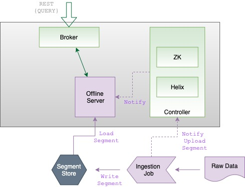
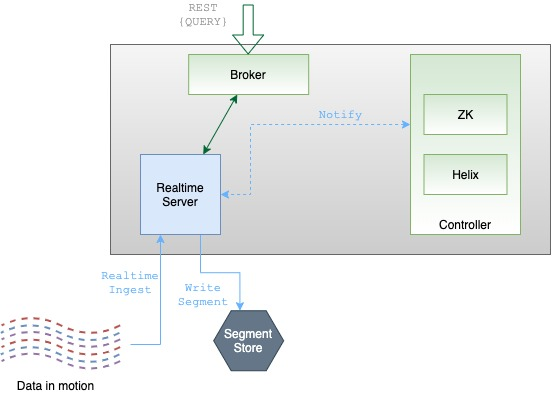

# Server

Pinot servers provide the primary storage for [segments](../table/segment/) and perform the computation required to execute queries. A production Pinot cluster contains many servers. In general, the more servers, the more data the cluster can retain in tables, the lower latency the cluster can deliver on queries, and the more concurrent queries the cluster can process.

Servers are typically segregated into real-time and offline workloads, with "real-time" servers hosting only real-time tables, and "offline" servers hosting only offline tables. This is a ubiquitous operational convention, not a difference or an explicit configuration in the server process itself. There are two types of servers:

## Offline

Offline servers are responsible for downloading segments from the segment store, to host and serve queries off. When a new segment is uploaded to the controller, the controller decides the servers (as many as replication) that will host the new segment and notifies them to download the segment from the segment store. On receiving this notification, the servers download the segment file and load the segment onto the server, to server queries off them.



## Real-time

Real-time servers directly ingest from a real-time stream (such as Kafka or EventHubs). Periodically, they make segments of the in-memory ingested data, based on certain thresholds. This segment is then persisted onto the segment store.



Pinot servers are modeled as Helix participants, hosting Pinot tables (referred to as _resources_ in Helix terminology). Segments of a table are modeled as Helix partitions (of a resource). Thus, a Pinot server hosts one or more Helix partitions of one or more helix resources (_i.e._ one or more segments of one or more tables).

## Starting a server

Make sure you've [set up Zookeeper](./#setup-a-pinot-cluster). If you're using Docker, make sure to [pull the Pinot Docker image](./#setup-a-pinot-cluster). To start a server:

```
Usage: StartServer
	-serverHost               <String>                      : Host name for controller. (required=false)
	-serverPort               <int>                         : Port number to start the server at. (required=false)
	-serverAdminPort          <int>                         : Port number to serve the server admin API at. (required=false)
	-dataDir                  <string>                      : Path to directory containing data. (required=false)
	-segmentDir               <string>                      : Path to directory containing segments. (required=false)
	-zkAddress                <http>                        : Http address of Zookeeper. (required=false)
	-clusterName              <String>                      : Pinot cluster name. (required=false)
	-configFileName           <Config File Name>            : Broker Starter Config file. (required=false)
	-help                                                   : Print this message. (required=false)
```



```
docker run \
    --network=pinot-demo \
    --name pinot-server \
    -d ${PINOT_IMAGE} StartServer \
    -zkAddress pinot-zookeeper:2181
```



```
bin/pinot-admin.sh StartServer \
    -zkAddress localhost:2181
```


