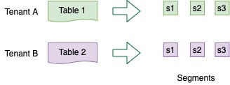

# Tenant

A tenant is a logical component defined as a **group of server/broker nodes with the same Helix tag**. &#x20;

In order to support multi-tenancy, Pinot has first-class support for tenants. Every table is associated with a server tenant and a broker tenant. This controls the nodes that will be used by this table as servers and brokers. This allows all tables belonging to a particular use case to be grouped under a single tenant name.&#x20;

The concept of tenants is very important when the multiple use cases are using Pinot and there is a need to provide quotas or some sort of isolation across tenants. For example, consider we have two tables `Table A` and `Table B` in the same Pinot cluster.



We can configure `Table A` with server tenant `Tenant A` and `Table B` with server tenant `Tenant B`. We can tag some of the server nodes for `Tenant A` and some for `Tenant B`. This will ensure that segments of `Table A` only reside on servers tagged with `Tenant A`, and segment of `Table B` only reside on servers tagged with `Tenant B`. The same isolation can be achieved at the broker level, by configuring broker tenants to the tables.


&#x20;No need to create separate clusters for every table or use case!&#x20;

## Tenant configuration

This tenant is defined in the [tenants](../table/#tenants) section of the table config.&#x20;

This section contains two main fields `broker` and `server` , which decide the tenants used for the broker and server components of this table.

```javascript
"tenants": {
  "broker": "brokerTenantName",
  "server": "serverTenantName"
}
```

In the above example:

* The table will be served by brokers that have been tagged as `brokerTenantName_BROKER` in Helix.
* If this were an offline table, the offline segments for the table will be hosted in Pinot servers tagged in Helix as `serverTenantName_OFFLINE`
* If this were a real-time table, the real-time segments (both consuming as well as completed ones) will be hosted in pinot servers tagged in Helix as `serverTenantName_REALTIME`.

## Create a tenant

### Broker tenant

Here's a sample broker tenant config. This will create a broker tenant `sampleBrokerTenant` by tagging three untagged broker nodes as `sampleBrokerTenant_BROKER`.&#x20;


```javascript
{
     "tenantRole" : "BROKER",
     "tenantName" : "sampleBrokerTenant",
     "numberOfInstances" : 3
}
```


To create this tenant use the following command. The creation will fail if number of untagged broker nodes is less than `numberOfInstances`.



Follow instructions in [Getting Pinot](../../getting-started/running-pinot-locally.md#getting-pinot) to get Pinot locally, and then

```bash
bin/pinot-admin.sh AddTenant \
    -name sampleBrokerTenant 
    -role BROKER 
    -instanceCount 3 -exec
```



```
curl -i -X POST -H 'Content-Type: application/json' -d @sample-broker-tenant.json localhost:9000/tenants
```



Check out the table config in the [Rest API](http://localhost:9000/help#!/Tenant/getAllTenants) to make sure it was successfully uploaded.&#x20;

### Server tenant

Here's a sample server tenant config. This will create a server tenant `sampleServerTenant` by tagging 1 untagged server node as `sampleServerTenant_OFFLINE` and 1 untagged server node as `sampleServerTenant_REALTIME`.&#x20;


```javascript
{
     "tenantRole" : "SERVER",
     "tenantName" : "sampleServerTenant",
     "offlineInstances" : 1,
     "realtimeInstances" : 1
}
```


To create this tenant use the following command. The creation will fail if number of untagged server nodes is less than `offlineInstances` + `realtimeInstances`.



Follow instructions in [Getting Pinot](../../getting-started/running-pinot-locally.md#getting-pinot) to get Pinot locally, and then

```bash
bin/pinot-admin.sh AddTenant \
    -name sampleServerTenant \
    -role SERVER \
    -offlineInstanceCount 1 \
    -realtimeInstanceCount 1 -exec
```



```
curl -i -X POST -H 'Content-Type: application/json' -d @sample-server-tenant.json localhost:9000/tenants
```



Check out the table config in the [Rest API](http://localhost:9000/help#!/Tenant/getAllTenants) to make sure it was successfully uploaded.&#x20;
