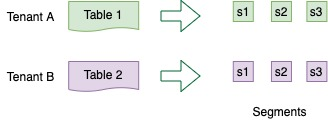
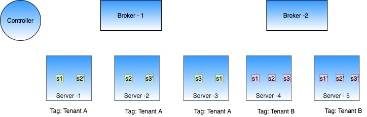

# Tenant

Every table is associated with a _tenant_, or a logical namespace that restricts where the cluster processes queries on the table. A Pinot tenant takes the form of a text tag in the logical tenant namespace. Physical cluster hardware resources (i.e., [brokers](broker.md) and [servers](server.md)) are also associated with a tenant tag in the common tenant namespace. Tables of a particular tenant tag will only be scheduled for storage and query processing on hardware resources that belong to the same tenant tag. This lets Pinot cluster operators assign specified workloads to certain hardware resources, preventing data in separate workloads from being stored or processed on the same physical hardware.

By default, all tables, brokers, and servers belong to a tenant called _DefaultTenant_, but you can configure multiple tenants in a Pinot cluster. If the cluster is planned to have multiple tenants, consider setting `cluster.tenant.isolation.enable=false` so that servers and brokers won't be tagged with _DefaultTenant_ automatically while added into the cluster.

To support multi-tenancy, Pinot has first-class support for tenants. Every table is associated with a server tenant and a broker tenant, which controls the nodes used by the table as servers and brokers. Multi-tenancy lets Pinot group all tables belonging to a particular use case under a single tenant name.

The concept of tenants is very important when the multiple use cases are using Pinot and there is a need to provide quotas or some sort of isolation across tenants. For example, consider we have two tables `Table A` and `Table B` in the same Pinot cluster.



We can configure `Table A` with server tenant `Tenant A` and `Table B` with server tenant `Tenant B`. We can tag some of the server nodes for `Tenant A` and some for `Tenant B`. This will ensure that segments of `Table A` only reside on servers tagged with `Tenant A`, and segment of `Table B` only reside on servers tagged with `Tenant B`. The same isolation can be achieved at the broker level, by configuring broker tenants to the tables.



No need to create separate clusters for every table or use case!

## Tenant configuration

This tenant is defined in the [tenants](../table/#tenants) section of the table config.

This section contains two main fields `broker` and `server` , which decide the tenants used for the broker and server components of this table.

```javascript
"tenants": {
  "broker": "brokerTenantName",
  "server": "serverTenantName"
}
```

In the above example:

* The table will be served by brokers that have been tagged as `brokerTenantName_BROKER` in Helix.
* If this were an offline table, the offline segments for the table will be hosted in Pinot servers tagged in Helix as `serverTenantName_OFFLINE`
* If this were a real-time table, the real-time segments (both consuming as well as completed ones) will be hosted in pinot servers tagged in Helix as `serverTenantName_REALTIME`.

## Create a tenant

`POST /tenants` creates a tenant by tagging **currently untagged** broker or server instances. The JSON body maps to the `Tenant` config:

| Field | Broker | Server | Notes |
| --- | --- | --- | --- |
| `tenantRole` | required (`BROKER`) | required (`SERVER`) | Role selects which instance pool is tagged. |
| `tenantName` | required | required | Logical tenant name (Helix tags use `_BROKER`, `_OFFLINE`, `_REALTIME` suffixes). |
| `numberOfInstances` | required | required | Total untagged instances to allocate for this tenant. Defaults to `0` if omitted, which causes server create to fail with errors such as `Cannot request more offline instances ... than total instances: 0`. |
| `offlineInstances` | n/a | required for server tenants | How many of the allocated servers receive the `{tenant}_OFFLINE` tag. |
| `realtimeInstances` | n/a | required for server tenants | How many of the allocated servers receive the `{tenant}_REALTIME` tag. |

For **server** tenants, Pinot validates:

* `numberOfInstances >= offlineInstances`
* `numberOfInstances >= realtimeInstances`

Those checks are **per tag type**, not against `offlineInstances + realtimeInstances`. When `offlineInstances + realtimeInstances > numberOfInstances` but each count still fits in `numberOfInstances`, Pinot co-locates tags: the same physical server can receive both `{tenant}_OFFLINE` and `{tenant}_REALTIME`. Creation still needs at least `numberOfInstances` **untagged** online servers (or brokers for broker tenants). Already-tagged instances are not reassigned by `POST /tenants`.

### Broker tenant

Here's a sample broker tenant config. This creates broker tenant `sampleBrokerTenant` by tagging three untagged broker nodes as `sampleBrokerTenant_BROKER`.


```javascript
{
  "tenantRole": "BROKER",
  "tenantName": "sampleBrokerTenant",
  "numberOfInstances": 3
}
```


Creation fails if the number of untagged broker nodes is less than `numberOfInstances`.



Follow instructions in [Getting Pinot](../../getting-started/install/local.md#1-download-or-build-apache-pinot) to get Pinot locally, and then:

```bash
bin/pinot-admin.sh AddTenant \
    -name sampleBrokerTenant \
    -role BROKER \
    -instanceCount 3 \
    -exec
```



```bash
curl -i -X POST -H 'Content-Type: application/json' \
  -d @sample-broker-tenant.json \
  http://localhost:9000/tenants
```



Check out the tenants list in the [Rest API](http://localhost:9000/help#!/Tenant/getAllTenants) to make sure the tenant was created.

### Server tenant

Here's a sample server tenant config. With `numberOfInstances: 2`, this tags one untagged server as `sampleServerTenant_OFFLINE` and another as `sampleServerTenant_REALTIME`.


```javascript
{
  "tenantRole": "SERVER",
  "tenantName": "sampleServerTenant",
  "numberOfInstances": 2,
  "offlineInstances": 1,
  "realtimeInstances": 1
}
```


**Co-located offline and realtime on one server** (one untagged server receives both tags):


```javascript
{
  "tenantRole": "SERVER",
  "tenantName": "sampleServerTenant",
  "numberOfInstances": 1,
  "offlineInstances": 1,
  "realtimeInstances": 1
}
```


Creation fails if there are fewer than `numberOfInstances` untagged server nodes, or if `offlineInstances` or `realtimeInstances` is greater than `numberOfInstances`.



Follow instructions in [Getting Pinot](../../getting-started/install/local.md#1-download-or-build-apache-pinot) to get Pinot locally, and then:

```bash
bin/pinot-admin.sh AddTenant \
    -name sampleServerTenant \
    -role SERVER \
    -instanceCount 2 \
    -offlineInstanceCount 1 \
    -realTimeInstanceCount 1 \
    -exec
```

`-instanceCount` is required for every `AddTenant` call. For `SERVER` role, `-offlineInstanceCount` and `-realTimeInstanceCount` are also required (note the capital `T` in `-realTimeInstanceCount`).



```bash
curl -i -X POST -H 'Content-Type: application/json' \
  -d @sample-server-tenant.json \
  http://localhost:9000/tenants
```



Check out the tenants list in the [Rest API](http://localhost:9000/help#!/Tenant/getAllTenants) to make sure the tenant was created.

### Tagging instances without untagged capacity

`POST /tenants` only consumes the untagged broker/server pools. If servers are already tagged (for example with `DefaultTenant_OFFLINE`) and you want to move or add tenant tags on those instances, update the instance tags directly instead of expecting `POST /tenants` to re-tag them:

```bash
curl -i -X PUT \
  "http://localhost:9000/instances/Server_host1_8098/updateTags?tags=sampleServerTenant_OFFLINE,sampleServerTenant_REALTIME"
```

You can also set tags when adding or updating an instance via the Instances APIs. A server may hold more than one tag (for example both `_OFFLINE` and `_REALTIME`, or tags for more than one tenant) when your isolation model allows it.

To grow or shrink an existing tenant after creation, use `PUT /tenants` with the same `Tenant` payload shape (including `numberOfInstances` for both roles, and offline/realtime counts for servers).
