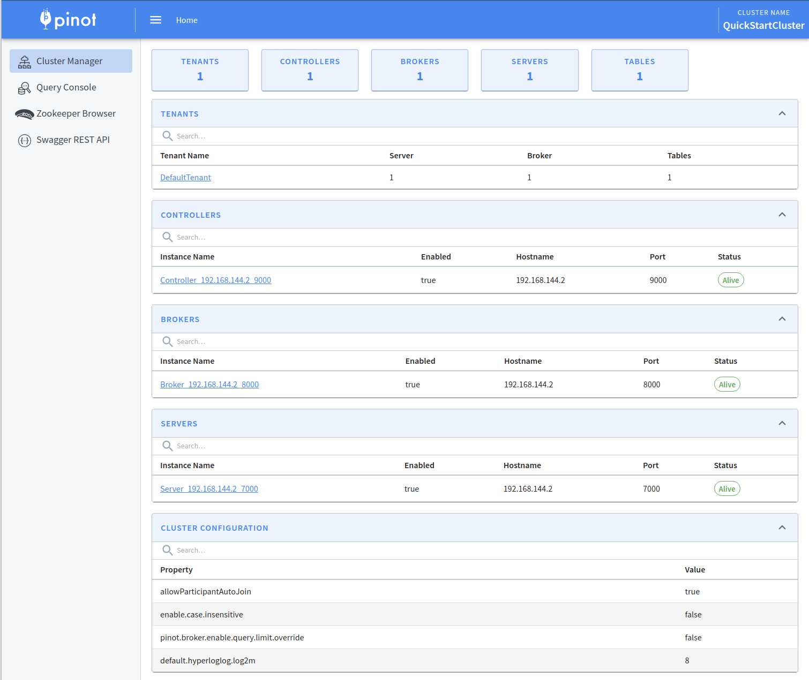
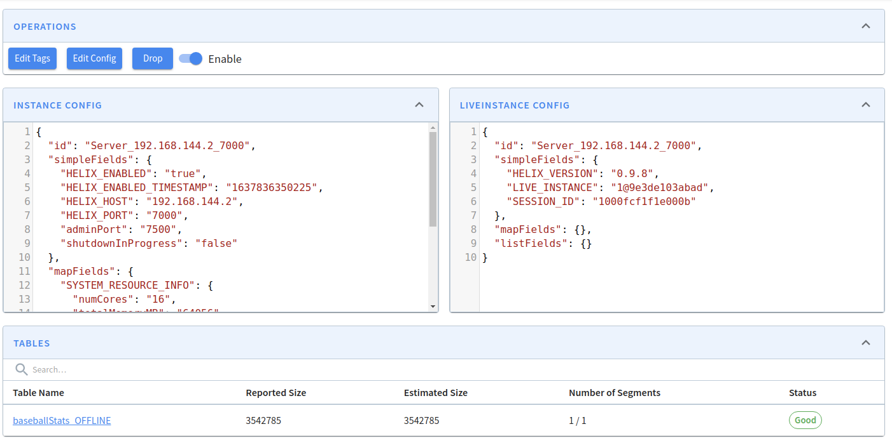
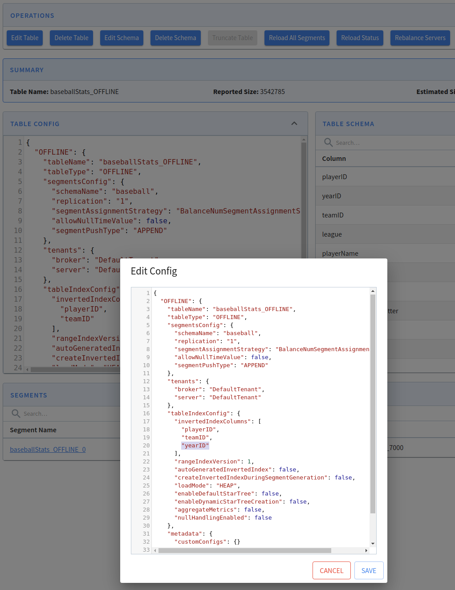
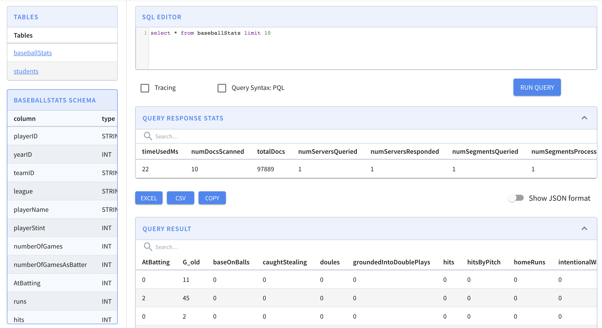
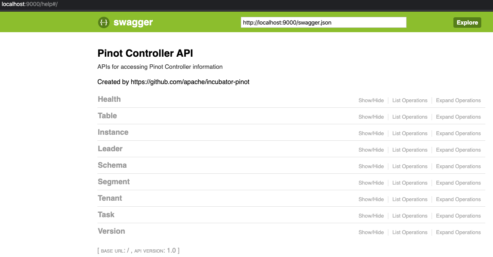
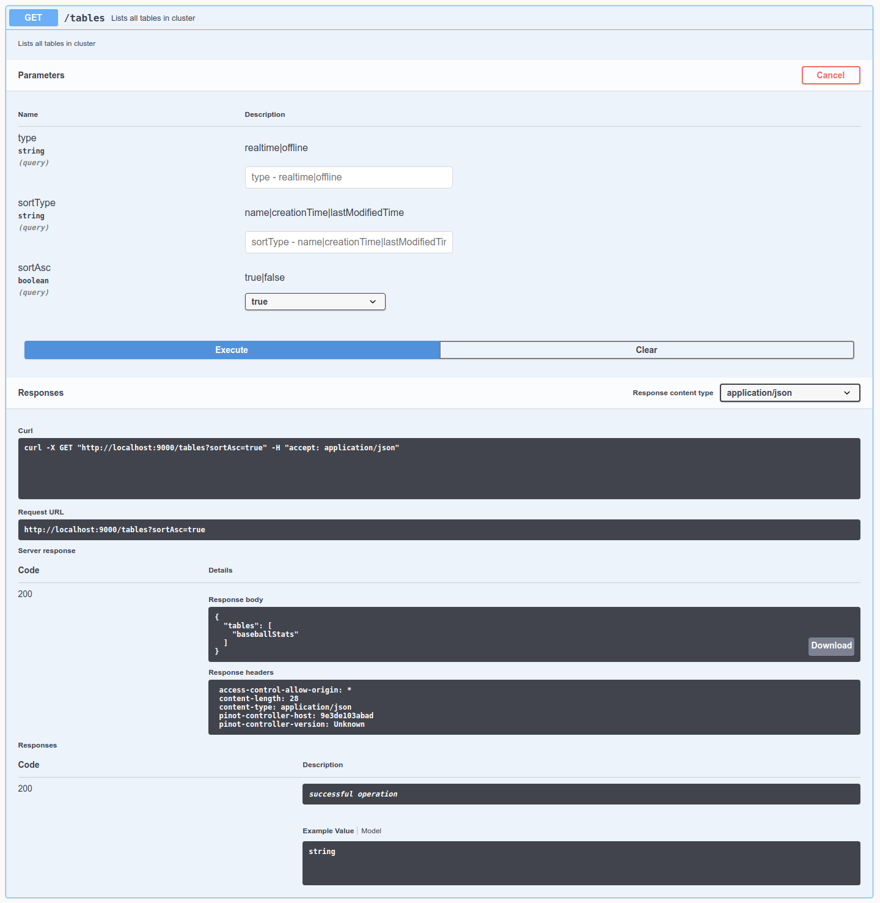
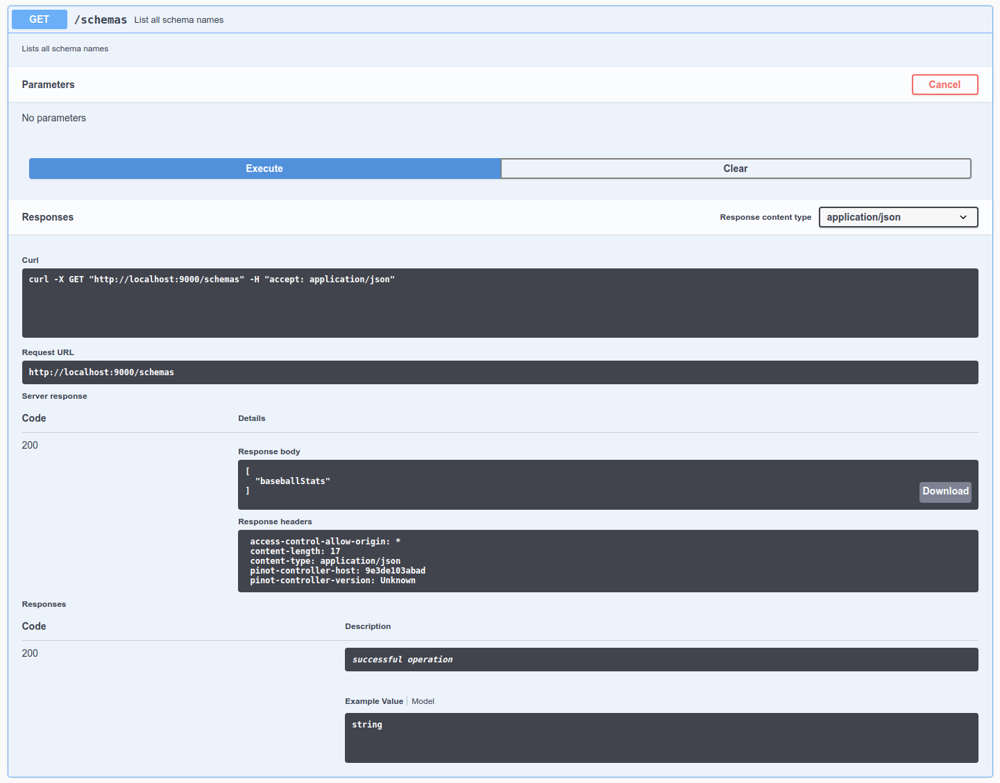
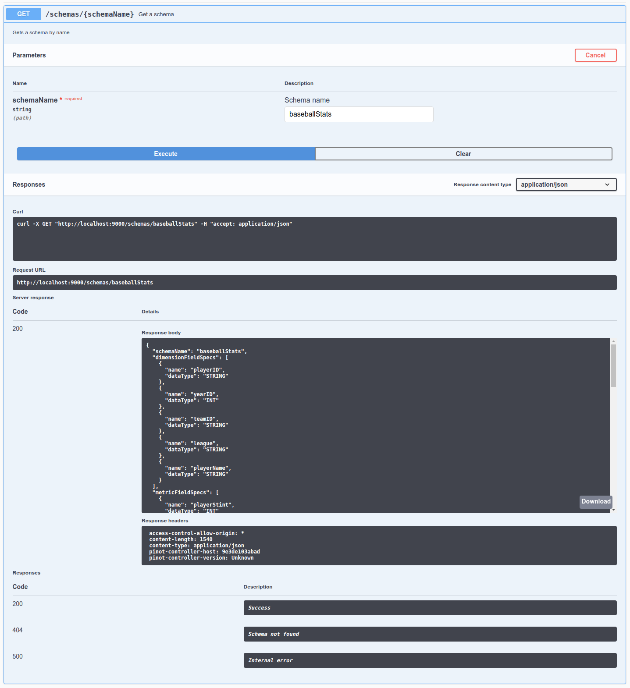

# Pinot Data Explorer

Once you have set up a cluster, you can start exploring the data and the APIs using the Pinot Data Explorer.

Navigate to [http://localhost:9000](http://localhost:9000) in your browser to open the Data Explorer UI.

## Cluster Manager

The first screen that you'll see when you open the Pinot Data Explorer is the Cluster Manager. The Cluster Manager provides a UI to operate and manage your cluster, giving you an overview of tenants, instances, tables, and their current status.



If you want to view the contents of a server, click on its instance name. You'll then see the following:



### Table management

To view a table, click on its name from the tables list. From the table detail screen, you can edit or delete the table, edit or adjust its schema, and perform several other operations.

.png>)

For example, if we want to add _yearID_ to the list of inverted indexes, click on **Edit Table,** add the extra column, and click **Save:**



#### Pause and resume consumption

For real-time tables, the table detail screen includes a **Pause/Resume Consumption** button ([#15657](https://github.com/apache/pinot/pull/15657)). This lets you pause ingestion on a real-time table directly from the UI without issuing REST API calls, and resume it when ready. This is useful during maintenance windows or when you need to temporarily halt data ingestion.

#### Consuming segments info

A **Consuming Segments Info** button ([#15623](https://github.com/apache/pinot/pull/15623)) is available on real-time tables, providing a quick view of all currently consuming segments. This shows details such as the partition, current offset, and consumption state, making it easier to monitor real-time ingestion health.

#### Reset segment

The UI now supports a **Reset Segment** operation ([#16078](https://github.com/apache/pinot/pull/16078)), allowing you to reset a segment directly from the table detail screen. This is helpful when a segment is stuck in an error state and needs to be re-processed.

#### Segment state filter

A segment state filter ([#16085](https://github.com/apache/pinot/pull/16085)) has been added to the table detail screen. You can filter segments by their state (e.g., ONLINE, CONSUMING, ERROR) to quickly locate segments that need attention, which is especially valuable for tables with a large number of segments.

#### Table rebalance

The table detail screen also provides access to table rebalance operations. Several UI fixes and improvements ([#15511](https://github.com/apache/pinot/pull/15511)) have been made to improve the reliability and usability of the rebalance workflow, including better parameter validation and progress display.

### Logical table management

Starting with Pinot 1.4 and later, the Data Explorer includes a logical table management UI ([#17878](https://github.com/apache/pinot/pull/17878)). Logical tables are collections of physical tables (REALTIME and OFFLINE) that can be queried as a single unified table.

The logical tables listing is accessible from the main **Tables** page, alongside physical tables and schemas. From there you can:

- **Browse** all logical tables in the cluster with search support.
- **View details** of a logical table, including its configuration, the list of physical tables it maps to, and metadata.
- **Edit** a logical table's configuration.
- **Delete** a logical table with a confirmation dialog.

For more information about logical tables, see the [Logical Table Support](../../reference/releases/1.4.0.md#logical-table-support-design) section in the 1.4.0 release notes.

## Query Console

Navigate to [Query Console](http://localhost:9000/#/query) to see the querying interface. The Query Console lets you run SQL queries against your Pinot cluster and view the results interactively.

We can see our `baseballStats` table listed on the left (you will see `meetupRSVP` or `airlineStats` if you used the streaming or the hybrid [quick start](../getting-started/quick-start.md)). Click on the table name to display all the names along with the data types of the columns of the table.

You can also execute a sample query `select * from baseballStats limit 10` by typing it in the text box and clicking the **Run Query** button.

`Cmd + Enter` can also be used to run the query when focused on the console.



Here are some sample queries you can try:

```sql
select playerName, max(hits)
from baseballStats
group by playerName
order by max(hits) desc
```

```sql
select sum(hits), sum(homeRuns), sum(numberOfGames)
from baseballStats
where yearID > 2010
```

```sql
select *
from baseballStats
order by league
```

Pinot uses SQL for querying. For the complete syntax reference, see the [SQL Syntax and Operators Reference](../../build-with-pinot/querying-and-sql/sql-reference.md). For query options, examples, and engine details, see [Querying Pinot](../../users/user-guide-query/querying-pinot.md).

### Time-series query execution

The Query Console also supports time-series query execution ([#16305](https://github.com/apache/pinot/pull/16305)), introduced as part of the Time Series Engine beta. This feature provides a dedicated interface for running and visualizing time-series queries using languages such as PromQL. It connects to a Prometheus-compatible `/query_range` endpoint ([#16286](https://github.com/apache/pinot/pull/16286)) exposed by the Pinot controller, letting you explore time-series data and inspect query execution plans directly from the UI.

## REST API

The [Pinot Admin UI](http://localhost:9000/help) contains all the APIs that you will need to operate and manage your cluster. It provides a set of APIs for Pinot cluster management including health check, instances management, schema and table management, data segments management.



Let's check out the tables in this cluster by going to [Table -> List all tables in cluster](http://localhost:9000/help#/Table/listTables), click **Try it out**, and then click **Execute**. We can see the`baseballStats` table listed here. We can also see the exact cURL call made to the controller API.



You can look at the configuration of this table by going to [Tables -> Get/Enable/Disable/Drop a table](http://localhost:9000/help#!/Table/alterTableStateOrListTableConfig), click **Try it out**, type `baseballStats` in the table name, and then click **Execute**.

Let's check out the schemas in the cluster by going to [Schema -> List all schemas in the cluster](http://localhost:9000/help#!/Schema/listSchemaNames), click **Try it out**, and then click **Execute**. We can see a schema called `baseballStats` in this list.



Take a look at the schema by going to [Schema -> Get a schema](http://localhost:9000/help#!/Schema/getSchema), click **Try it out**, type `baseballStats` in the schema name, and then click **Execute**.



Finally, let's check out the data segments in the cluster by going to [Segment -> List all segments](http://localhost:9000/help#!/Segment/getSegments), click **Try it out**, type in `baseballStats` in the table name, and then click **Execute**. There's 1 segment for this table, called `baseballStats_OFFLINE_0`.

To learn how to upload your own data and schema, see [Batch Ingestion](../../manage-data/data-import/batch-ingestion/) or [Stream ingestion](../../manage-data/data-import/pinot-stream-ingestion/).
