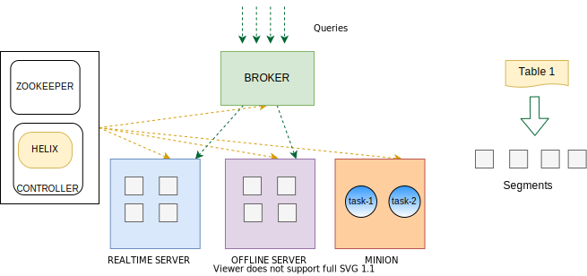

# Apache Pinot™ Concepts

Apache Pinot™ is a database designed to deliver highly concurrent, ultra-low-latency queries on large datasets through a set of data model abstractions familiar to most developers. Delivering on these goals requires several foundational architectural commitments:

* Storing data in columnar form to allow for high-performance scanning
* Sharding of data to scale both storage and computation
* A distributed architecture designed to scale capacity linearly
* A tabular data model read by SQL queries

## Pinot storage model

Pinot stores data in [_tables_](https://docs.pinot.apache.org/pinot-components/table). Tables are physically represented on disk as a collection of [_segments_](https://docs.pinot.apache.org/pinot-components/segment). Client processes query tables with [SQL](https://docs.pinot.apache.org/user-guide/user-guide-query/pinot-query-language). Tables optionally belong to one or more logical [_tenants_](components/cluster/tenant.md). Tables and tenants reside in a Pinot [_cluster_](components/cluster/).

### Table

Pinot stores data in [_tables_](components/table/). While databases always differ in their details, a table in Pinot is conceptually identical to a table in any commonly-used relational database. A table is a collection of rows, and all of the rows in the table have columns of the same name and data type. The set of column names and their data types is the table's [schema](components/table/schema.md).

Pinot schemas are defined using a custom JSON file. Because that schema definition is in a file all its own, separate from the command to configure and create the table itself, multiple tables can share a single schema, with each table free to have its own name, indexing strategies, partitioning, data sources, and other metadata.

Pinot tables can either be _real-time_, meaning they ingest data from a streaming source like Apache Kafka®, _offline_, meaning they are loaded with data from a batch source, or _hybrid_, meaning they are loaded with batch and streaming data together.

### Segment

Pinot tables are stored physically in one or more independent shards called [_segments_](components/table/segment/). A small table may be contained by a single segment, but because Pinot is designed to allow tables to grow to arbritrarily large row counts, it imposes no practical upper bound on the number of segments used to store a table. There are different processes for creating segments (see [_ingestion_]()), but each process creates segments that are fundamentally time-based partitions of the table data. Segments are stored on physical Pinot components called [_servers_](components/cluster/server.md), which lend horizontal scalability to both the storage and computation required to query tables.

### Tenant

Every table is associated with a [_tenant_](components/cluster/tenant.md), or a logical namespace that restricts where the cluster stores and performs query processing on the table. A Pinot tenant takes the form of a text tag in the logical tenant namespace. Physical cluster hardware resources (i.e., [brokers](components/cluster/broker.md) and [servers](components/cluster/server.md)) are also associated with a tenant tag in the common tenant namespace. Tables of a particular tenant tag will only be scheduled for storage and query processing on hardware resources that belong to the same tenant tag. This allows operators of a Pinot cluster to assign certain workloads to certain hardware resources, and to prevent data from separate workloads from being stored or processed on the same physical hardware.

Multitenancy is an optional feature in Pinot. All tables, brokers, and servers belong to a tenant called _DefaultTenant_ in the absence of explicit tenant configuration.

### Cluster

A Pinot [_cluster_](components/cluster/) is a complete collection of the software processes and hardware resources required for Pinot to ingest data, store it, and process queries. The components of a cluster are described in more detail under _Physical Architecture_ below.

## Physical Architecture

A Pinot cluster consists of the following processes, which are typically deployed on separate hardware resources in production. In development, they can fit comfortably into Docker containers on a typical laptop.

* **Controller**. Maintains cluster metadata and orchestrates cluster resources.
* **Zookeeper**. Fault-tolerant, persistent storage on behalf of the controller.
* **Broker**. Accepts queries from client processes and forwards them to servers for processing.
* **Server**. Provides storage for segment files and compute for query processing.
* **Minion** (optional). Distributed compute for cluster tasks other than query processing.

The simplest possible Pinot cluster consists of four processes: a server, a broker, a controller, and a Zookeeper node. In production environments, these are typically run on separate server instances, and scaled out as data volume, concurrent load, availability, and latency targets dictate. Production clusters exist at sizes of fewer than ten total instances to more than 1,000.

Pinot uses [Apache Zookeeper](https://zookeeper.apache.org/) as a distributed metadata store and and [Apache Helix](http://helix.apache.org/) for cluster management.

Helix is a cluster management solution created by the authors of Pinot. Helix maintains a persistent, fault-tolerant map of the intended state of the Pinot cluster. It constantly monitors the cluster to ensure that the right hardware resources are allocated to implement the present configuration. When the configuration changes, it schedules or decomissions hardware resources to reflect the new configuration. When elements of the cluster change state catastrophically, it schedules hardware resources to keep the actual cluster consistent with the ideal represented in the metadata. From a physical perspective, Helix takes the form of a controller process plus agents running on servers and brokers.

### Controller

The Pinot [controller](components/cluster/controller.md) is responsible for orchestrating the resources of a Pinot cluster in the presence of constantly evolving metadata changes and occasional node failure. As an Apache Helix Controller, it schedules the hardware resources that comprise the cluster and orchestrates connections between certain external processes and cluster components (e.g., ingest of [real-time tables](data-import/pinot-stream-ingestion) and [offline tables](data-import/batch-ingestion)). It can be deployed as a single process on its own server or as a group of redundant servers in an active/passive configuration. 

The controller exposes a REST API endpoint for cluster-wide administrative operations as well as a web-based query console to execute interactive SQL queries and perform simple administrative tasks.

### Server

Pinot [servers](components/cluster/server.md) provide the primary storage for [segments](components/table/segment/) and perform the computation required to execute queries over them. A production Pinot cluster contains many servers. In general, the more servers, the more data the cluster can retain in tables, the lower latency it can deliver on queries, and the more concurrent queries it can process.

 Servers are typically segregated into real-time and offline workloads, with "real-time" servers hosting only real-time tables, and "offline" servers hosting only offline tables. This is a ubiquitous operational convention, not a difference or an explicit configuration in the server process itself.

### Broker

Pinot [brokers](components/cluster/broker.md) take query requests from client processes, scatter them to applicable servers, gather the results, and return them to the client. The controller shares cluster metadata with the brokers that allows the brokers to create a plan for executing the query involving a minimal subset of servers with the source data and, when required, other servers to shuffle and consolidate results. 

A production Pinot cluster contains many brokers. In general, the more brokers, the more concurrent queries a cluster can process, and the lower latency it can deliver on queries.

### Minion

Pinot [minions](components/cluster/minion.md) are an optional cluster component that executes background tasks on table data apart from the normal query mechanism performed by brokers and servers. Minions are processes that run on independent hardware resources, and are responsible for exeucting _minion tasks_ as directed by the controller. Examples of minon tasks are converting of batch data in a standard format like Avro or JSON into segment files to be loaded into an offline table, or rewriting existing segment files to purge records as required by data privacy laws like GDPR. Minion tasks can run once or be scheduled to run periodically.

The minion mechanism exists to isolate the computational burden of out-of-band data processing from the servers. A production Pinot cluster can function with zero minions, but in practice there are a few several minion instances to manage the typical minion task workload. 
