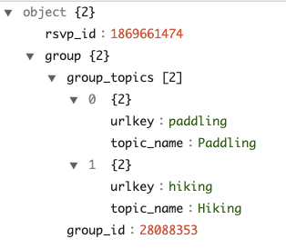
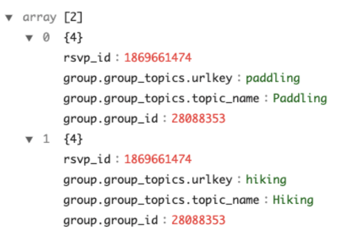

# Complex type (array, map) handling

Commonly, ingested data has a complex structure. For example, Avro schemas have [records](https://avro.apache.org/docs/current/specification/_print/#schema-record) and [arrays](https://avro.apache.org/docs/current/specification/_print/#arrays) while JSON supports [objects](https://json-schema.org/understanding-json-schema/reference/object.html) and [arrays](https://json-schema.org/understanding-json-schema/reference/array.html).

Apache Pinot's data model supports primitive data types (including int, long, float, double, BigDecimal, string, bytes), and limited multi-value types, such as an array of primitive types. Simple data types allow Pinot to build fast indexing structures for good query performance, but does require some handling of the complex structures.


There are two options for complex type handling:

* Convert the complex-type data into a JSON string and then build a JSON index.
* Use the built-in complex-type handling rules in the ingestion configuration.

On this page, we'll show how to handle these complex-type structures with each of these two approaches. We will process some example data, consisting of the field `group` from the [Meetup events Quickstart example](https://github.com/apache/pinot/tree/master/pinot-tools/src/main/resources/examples/stream/meetupRsvp).

This object has two child fields and the child `group` is a nested array with elements of object type.



## JSON indexing

Apache Pinot provides a powerful [JSON index](../indexing/json-index.md) to accelerate the value lookup and filtering for the column. To convert an object `group` with complex type to JSON, add the following to your table configuration.


```javascript
{
    "ingestionConfig":{
      "transformConfigs": [
        {
          "columnName": "group_json",
          "transformFunction": "jsonFormat(\"group\")"
        }
      ],
    },
    ...
    "tableIndexConfig": {
    "loadMode": "MMAP",
    "noDictionaryColumns": [
      "group_json"
    ],
    "jsonIndexColumns": [
      "group_json"
    ]
  },

}
```


The config `transformConfigs` transforms the object `group` to a JSON string `group_json`, which then creates the JSON indexing with configuration `jsonIndexColumns`. To read the full spec, see [json\_meetupRsvp\_realtime\_table\_config.json](https://github.com/apache/pinot/blob/master/pinot-tools/src/main/resources/examples/stream/meetupRsvp/json\_meetupRsvp\_realtime\_table\_config.json).

Also, note that `group` is a reserved keyword in SQL and therefore needs to be quoted in `transformFunction`.


The `columnName` can't use the same name as any of the fields in the source JSON data, for example, if our source data contains the field `group` and we want to transform the data in that field before persisting it, the destination column name would need to be something different, like `group_json`.



Note that you do _not_ need to worry about the `maxLength` of the field `group_json` on the schema, because `"JSON"` data type does not have a `maxLength` and will not be truncated. This is true even though `"JSON"` is stored as a string internally.


The schema will look like this:


```javascript
{
  {
      "name": "group_json",
      "dataType": "JSON",
    }
    ...
}
```



For the full specification, see [json\_meetupRsvp\_schema.json](https://github.com/apache/pinot/blob/master/pinot-tools/src/main/resources/examples/stream/meetupRsvpJson/meetupRsvpJson_schema.json).


With this, you can start to query the nested fields under `group`. For more details about the supported JSON function, see [guide](../indexing/json-index.md)).

## Ingestion configurations

Though JSON indexing is a handy way to process the complex types, there are some limitations:

* It’s not performant to group by or order by a JSON field, because `JSON_EXTRACT_SCALAR` is needed to extract the values in the GROUP BY and ORDER BY clauses, which invokes the function evaluation.
* It does not work with Pinot's [multi-column functions](https://docs.pinot.apache.org/users/user-guide-query/supported-aggregations#multi-value-column-functions) such as `DISTINCTCOUNTMV`.

Alternatively, from Pinot 0.8, you can use the complex-type handling in ingestion configurations to flatten and unnest the complex structure and convert them into primitive types. Then you can reduce the complex-type data into a flattened Pinot table, and query it via SQL. With the built-in processing rules, you do not need to write ETL jobs in another compute framework such as Flink or Spark.

To process this complex type, you can add the configuration `complexTypeConfig` to the `ingestionConfig`. For example:


```javascript
{
  "ingestionConfig": {    
    "complexTypeConfig": {
      "delimiter": '.',
      "fieldsToUnnest": ["group.group_topics"],
      "collectionNotUnnestedToJson": "NON_PRIMITIVE"
    }
  }
}
```


With the `complexTypeConfig` , all the map objects will be flattened to direct fields automatically. And with `unnestFields` , a record with the nested collection will unnest into multiple records. For instance, the example at the beginning will transform into two rows with this configuration example.



Note that:

* The nested field `group_id` under `group` is flattened to `group.group_id`. The default value of the delimiter is `.` You can choose another delimiter by specifying the configuration `delimiter` under `complexTypeConfig`. This flattening rule also applies to maps in the collections to be unnested.
* The nested array `group_topics` under `group` is unnested into the top-level, and converts the output to a collection of two rows. Note the handling of the nested field within `group_topics`, and the eventual top-level field of `group.group_topics.urlkey`. All the collections to unnest shall be included in the configuration `fieldsToUnnest`.
* Collections not specified in `fieldsToUnnest`will be serialized into JSON string, except for the array of primitive values, which will be ingested as a multi-value column by default. The behavior is defined by the `collectionNotUnnestedToJson` config, which takes the following values:
  * `NON_PRIMITIVE`- Converts the array to a multi-value column. _(default)_
  * `ALL`- Converts the array of primitive values to JSON string.
  * `NONE`- Does not do any conversion.

You can find the full specifications of the table config [here](https://github.com/apache/pinot/blob/master/pinot-tools/src/main/resources/examples/stream/meetupRsvp/complexTypeHandling\_meetupRsvp\_realtime\_table\_config.json) and the table schema [here](https://github.com/apache/pinot/blob/master/pinot-tools/src/main/resources/examples/stream/meetupRsvp/complexTypeHandling\_meetupRsvp\_schema.json).

You can then query the table with primitive values using the following SQL query:

```sql
SELECT "group.group_topics.urlkey", 
       "group.group_topics.topic_name", 
       "group.group_id" 
FROM meetupRsvp
LIMIT 10
```


`.` is a reserved character in SQL, so you need to quote the flattened columns in the query.


### Infer the Pinot schema from the Avro schema and JSON data

When there are complex structures, it can be challenging and tedious to figure out the Pinot schema manually. To help with schema inference, Pinot provides utility tools to take the Avro schema or JSON data as input and output the inferred Pinot schema.

To infer the Pinot schema from Avro schema, you can use a command like this:

```bash
bin/pinot-admin.sh AvroSchemaToPinotSchema \
  -timeColumnName fields.hoursSinceEpoch \
  -avroSchemaFile /tmp/test.avsc \
  -pinotSchemaName myTable \
  -outputDir /tmp/test \
  -fieldsToUnnest entries
```

Note you can input configurations like `fieldsToUnnest` similar to the ones in `complexTypeConfig`. And this will simulate the complex-type handling rules on the Avro schema and output the Pinot schema in the file specified in `outputDir`.

Similarly, you can use the command like the following to infer the Pinot schema from a file of JSON objects.

```bash
bin/pinot-admin.sh JsonToPinotSchema \
  -timeColumnName hoursSinceEpoch \
  -jsonFile /tmp/test.json \
  -pinotSchemaName myTable \
  -outputDir /tmp/test \
  -fieldsToUnnest payload.commits
```

You can check out an example of this run in this [PR](https://github.com/apache/pinot/pull/6930).
