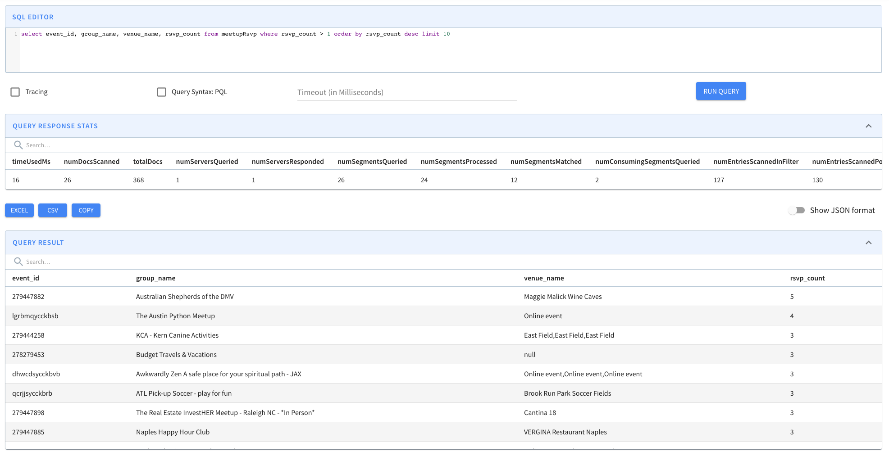

# Stream Ingestion with Upsert

Pinot provides native support of upsert during real-time ingestion. There are scenarios where records need modifications, such as correcting a ride fare or updating a delivery status.

Partial upsert is convenient as you only need to specify the columns where values change, and you ignore the rest.

To enable upsert on a Pinot table, make some configuration changes in the table configurations and on the input stream.

## Define the primary key in the schema

To update a record, you need a primary key to uniquely identify the record. To define a primary key, add the field `primaryKeyColumns` to the schema definition. For example, the schema definition of `UpsertMeetupRSVP` in the quick start example has this definition.


```javascript
{
    "primaryKeyColumns": ["event_id"]
}
```


Note this field expects a list of columns, as the primary key can be a composite.

When two records of the same primary key are ingested, _the record with the greater comparison value (timeColumn by default) is used_. When records have the same primary key and event time, then the order is not determined. In most cases, the later ingested record will be used, but this may not be true in cases where the table has a column to sort by.


**Partition the input stream by the primary key**

\
An important requirement for the Pinot upsert table is to partition the input stream by the primary key. For Kafka messages, this means the producer shall set the key in the [`send`](https://kafka.apache.org/20/javadoc/index.html?org/apache/kafka/clients/producer/KafkaProducer.html) API. If the original stream is not partitioned, then a streaming processing job (such as with Flink) is needed to shuffle and repartition the input stream into a partitioned one for Pinot's ingestion.


## Enable upsert in the table configurations

To enable upsert, make the following configurations in the table configurations.

### Upsert modes

**Full upsert**

The upsert mode defaults to `NONE` for real-time tables. To enable the full upsert, set the `mode` to `FULL` for the full update. FULL upsert means that a new record will replace the older record completely if they have same primary key. Example config:

```json
{
  "upsertConfig": {
    "mode": "FULL"
  }
}
```

**Partial upserts**

Partial upsert lets you choose to update only specific columns and ignore the rest.

To enable the partial upsert, set the `mode` to `PARTIAL` and specify `partialUpsertStrategies` for partial upsert columns. Since `release-0.10.0`, `OVERWRITE` is used as the default strategy for columns without a specified strategy. `defaultPartialUpsertStrategy` is also introduced to change the default strategy for all columns. For example:


```json
{
  "upsertConfig": {
    "mode": "PARTIAL",
    "partialUpsertStrategies":{
      "rsvp_count": "INCREMENT",
      "group_name": "IGNORE",
      "venue_name": "OVERWRITE"
    }
  }
}
```



```javascript
{
  "upsertConfig": {
    "mode": "PARTIAL",
    "defaultPartialUpsertStrategy": "OVERWRITE",
    "partialUpsertStrategies":{
      "rsvp_count": "INCREMENT",
      "group_name": "IGNORE"
    }
  }
}
```


Pinot supports the following partial upsert strategies:

| Strategy  | Description                                                               |
| --------- | ------------------------------------------------------------------------- |
| OVERWRITE | Overwrite the column of the last record                                   |
| INCREMENT | Add the new value to the existing values                                  |
| APPEND    | Add the new item to the Pinot unordered set                               |
| UNION     | Add the new item to the Pinot unordered set if not exists                 |
| IGNORE    | Ignore the new value, keep the existing value (v0.10.0+)                  |
| MAX       | Keep the maximum value betwen the existing value and new value (v0.12.0+) |
| MIN       | Keep the minimum value betwen the existing value and new value (v0.12.0+) |


With partial upsert, if the value is `null` in either the existing record or the new coming record, Pinot will ignore the upsert strategy and the `null` value:

(`null`, _newValue_) -> _newValue_

(_oldValue_, `null`) -> _oldValue_

(`null`, `null`) -> `null`


### Comparison column

By default, Pinot uses the value in the time column (`timeColumn` in tableConfig) to determine the latest record. That means, for two records with the same primary key, the record with the larger value of the time column is picked as the latest update. However, there are cases when users need to use another column to determine the order. In such case, you can use option `comparisonColumn` to override the column used for comparison. For example,

```json
{
  "upsertConfig": {
    "mode": "FULL",
    "comparisonColumn": "anotherTimeColumn",
    "hashFunction": "NONE"
  }
}
```

For partial upsert table, the out-of-order events won't be consumed and indexed. For example, for two records with the same primary key, if the record with the smaller value of the comparison column came later than the other record, it will be skipped.

#### Multiple comparison columns

In some cases, especially where partial upsert might be employed, there may be multiple producers of data each writing to a mutually exclusive set of columns, sharing only the primary key. In such a case, it may be helpful to use one comparison column per producer group so that each group can manage its own specific versioning semantics without the need to coordinate versioning across other producer groups.

```json
{
  "upsertConfig": {
    "mode": "PARTIAL",
    "defaultPartialUpsertStrategy": "OVERWRITE",
    "partialUpsertStrategies":{},
    "comparisonColumns": ["secondsSinceEpoch", "otherComparisonColumn"],
    "hashFunction": "NONE"
  }
}
```

Documents written to Pinot are expected to have exactly 1 non-null value out of the set of comparisonColumns; if more than 1 of the columns contains a value, the document will be rejected. When new documents are written, whichever comparison column is non-null will be compared against only that same comparison column seen in prior documents with the same primary key. Consider the following examples, where the documents are assumed to arrive in the order specified in the array.

```json
[
  {
    "event_id": "aa",
    "orderReceived": 1,
    "description" : "first",
    "secondsSinceEpoch": 1567205394
  },
  {
    "event_id": "aa",
    "orderReceived": 2,
    "description" : "update",
    "secondsSinceEpoch": 1567205397
  },
  {
    "event_id": "aa",
    "orderReceived": 3,
    "description" : "update",
    "secondsSinceEpoch": 1567205396
  },
  {
    "event_id": "aa",
    "orderReceived": 4,
    "description" : "first arrival, other column",
    "otherComparisonColumn": 1567205395
  },
  {
    "event_id": "aa",
    "orderReceived": 5,
    "description" : "late arrival, other column",
    "otherComparisonColumn": 1567205392
  },
  {
    "event_id": "aa",
    "orderReceived": 6,
    "description" : "update, other column",
    "otherComparisonColumn": 1567205398
  }
]
```

The following would occur:

1. `orderReceived: 1`

* Result: persisted
* Reason: first doc seen for primary key "aa"

2. `orderReceived: 2`

* Result: persisted (replacing `orderReceived: 1`)
* Reason: comparison column (`secondsSinceEpoch`) larger than that previously seen

3. `orderReceived: 3`

* Result: rejected
* Reason: comparison column (`secondsSinceEpoch`) smaller than that previously seen

4. `orderReceived: 4`

* Result: persisted (replacing `orderReceived: 2`)
* Reason: comparison column (`otherComparisonColumn`) larger than previously seen (never seen previously), despite the value being smaller than that seen for `secondsSinceEpoch`

5. `orderReceived: 5`

* Result: rejected
* Reason: comparison column (`otherComparisonColumn`) smaller than that previously seen

6. `orderReceived: 6`

* Result: persist (replacing `orderReceived: 4`)
* Reason: comparison column (`otherComparisonColumn`) larger than that previously seen

### Delete column

Upsert Pinot table can support soft-deletes of primary keys. This requires the incoming record to contain a dedicated boolean single-field column that serves as a delete marker for a primary key. Once the real-time engine encounters a record with delete column set to `true` , the primary key will no longer be part of the queryable set of documents. This means the primary key will not be visible in the queries, unless explicitly requested via query option `skipUpsert=true`.&#x20;

```json
{ 
    "upsertConfig": {  
        ... 
        "deleteRecordColumn": <column_name>
    } 
}
```

Note that the `delete` column has to be a single-value boolean column.&#x20;

<pre class="language-json"><code class="lang-json">// In the Schema
{
    ...
    {
      "name": "&#x3C;delete_column_name>",
      "dataType": "BOOLEAN"
    },
    ...
<strong>}
</strong></code></pre>


Note that when `deleteRecordColumn` is added to an existing table, it will require a server restart to actually pick up the upsert config changes.&#x20;


A deleted primary key can be revived by ingesting a record with the same primary, but with higher comparison column value(s).&#x20;

Note that when reviving a primary key in a partial upsert table, the revived record will be treated as the source of truth for all columns. This means any previous updates to the columns will be ignored and overwritten with the new record's values.&#x20;

### Use strictReplicaGroup for routing

The upsert Pinot table can use only the low-level consumer for the input streams. As a result, it uses the [partitioned replica-group assignment](../../operators/operating-pinot/segment-assignment.md#partitioned-replica-group-segment-assignment) for the segments. Moreover, upsert poses the additional requirement that all segments of the same partition must be served from the same server to ensure the data consistency across the segments. Accordingly, it requires to use `strictReplicaGroup` as the routing strategy. To use that, configure `instanceSelectorType` in `Routing` as the following:

```json
{
  "routing": {
    "instanceSelectorType": "strictReplicaGroup"
  }
}
```

### Enable validDocIds snapshots for upsert metadata recovery

Upsert snapshot support is also added in `release-0.12.0`. To enable the snapshot, set the `enableSnapshot` to `true`. For example:

```json
{
  "upsertConfig": {
    "mode": "FULL",
    "hashFunction": "NONE",
    "enableSnapshot": true
  }
}
```

Upsert maintains metadata in memory containing which docIds are valid in a particular segment (ValidDocIndexes). This metadata gets lost during server restarts and needs to be recreated again.\
\
ValidDocIndexes can not be recovered easily after out-of-TTL primary keys get removed. Enabling snapshots addresses this problem by adding functions to store and recover validDocIds snapshot for Immutable Segments\
\
We recommend that you enable this feature so as to speed up server boot times during restarts.


The lifecycle for validDocIds snapshots are shows as follows,

1. If snapshot is enabled, load validDocIds from snapshot during add segments.
2. If snapshot is not enabled, delete validDocIds snapshots during add segments if exists.
3. If snapshot is enabled, persist validDocIds snapshot for immutable segments when removing segment.


### Upsert table limitations

There are some limitations for the upsert Pinot tables.

* The high-level consumer is not allowed for the input stream ingestion, which means `stream.[consumerName].consumer.type` must always be `lowLevel`.
* The star-tree index cannot be used for indexing, as the star-tree index performs pre-aggregation during the ingestion.
* Unlike append-only tables, out-of-order events (with comparison value in incoming record less than the latest available value) won't be consumed and indexed by Pinot partial upsert table, these late events will be skipped.

### Best practices

Unlike other real-time tables, Upsert table takes up more memory resources as it needs to bookkeep the record locations in memory. As a result, it's important to plan the capacity beforehand, and monitor the resource usage. Here are some recommended practices of using Upsert table.

#### Create the topic/stream with more partitions.

The number of partitions in input streams determines the partition numbers of the Pinot table. The more partitions you have in input topic/stream, more Pinot servers you can distribute the Pinot table to and therefore more you can scale the table horizontally. Do note that you can't increase the partitions in future for upsert enabled tables so you need to start with good enough partitions (atleast 2-3X the number of pinot servers)

#### Memory usage

Upsert table maintains an in-memory map from the primary key to the record location. **So it's recommended to use a simple primary key type and avoid composite primary keys to save the memory cost**. In addition, consider the `hashFunction` config in the Upsert config, which can be `MD5` or `MURMUR3`, to store the 128-bit hashcode of the primary key instead. This is useful when your primary key takes more space. But keep in mind, this hash may introduce collisions, though the chance is very low.

#### Monitoring

Set up a dashboard over the metric `pinot.server.upsertPrimaryKeysCount.tableName` to watch the number of primary keys in a table partition. It's useful for tracking its growth which is proportional to the memory usage growth. \*\*\*\* The total memory usage by upsert is roughly `(primaryKeysCount * (sizeOfKeyInBytes + 24))`

#### Capacity planning

It's useful to plan the capacity beforehand to ensure you will not run into resource constraints later. A simple way is to measure the rate of the primary keys in the input stream per partition and extrapolate the data to a specific time period (based on table retention) to approximate the memory usage. A heap dump is also useful to check the memory usage so far on an upsert table instance.

### Example

Putting these together, you can find the table configurations of the quick start example as the following:

```json
{
  "tableName": "meetupRsvp",
  "tableType": "REALTIME",
  "segmentsConfig": {
    "timeColumnName": "mtime",
    "timeType": "MILLISECONDS",
    "retentionTimeUnit": "DAYS",
    "retentionTimeValue": "1",
    "segmentPushType": "APPEND",
    "segmentAssignmentStrategy": "BalanceNumSegmentAssignmentStrategy",
    "schemaName": "meetupRsvp",
    "replicasPerPartition": "1"
  },
  "tenants": {},
  "tableIndexConfig": {
    "loadMode": "MMAP",
    "streamConfigs": {
      "streamType": "kafka",
      "stream.kafka.consumer.type": "lowLevel",
      "stream.kafka.topic.name": "meetupRSVPEvents",
      "stream.kafka.decoder.class.name": "org.apache.pinot.plugin.stream.kafka.KafkaJSONMessageDecoder",
      "stream.kafka.hlc.zk.connect.string": "localhost:2191/kafka",
      "stream.kafka.consumer.factory.class.name": "org.apache.pinot.plugin.stream.kafka20.KafkaConsumerFactory",
      "stream.kafka.zk.broker.url": "localhost:2191/kafka",
      "stream.kafka.broker.list": "localhost:19092",
      "realtime.segment.flush.threshold.rows": 30
    }
  },
  "metadata": {
    "customConfigs": {}
  },
  "routing": {
    "instanceSelectorType": "strictReplicaGroup"
  },
  "upsertConfig": {
    "mode": "FULL"
  }
}
```


Pinot server maintains a primary key to record location map across all the segments served in an upsert-enabled table. As a result, when updating the config for an existing upsert table (e.g. change the columns in the primary key, change the comparison column), servers need to be restarted in order to apply the changes and rebuild the map.


## Quick Start

To illustrate how the full upsert works, the Pinot binary comes with a quick start example. Use the following command to creates a real-time upsert table `meetupRSVP`.

```bash
# stop previous quick start cluster, if any
bin/quick-start-upsert-streaming.sh
```

You can also run partial upsert demo with the following command

```bash
# stop previous quick start cluster, if any
bin/quick-start-partial-upsert-streaming.sh
```

As soon as data flows into the stream, the Pinot table will consume it and it will be ready for querying. Head over to the Query Console to checkout the real-time data.


For partial upsert you can see only the value from configured column changed based on specified partial upsert strategy.



An example for partial upsert is shown below, each of the event\_id kept being unique during ingestion, meanwhile the value of rsvp\_count incremented.


To see the difference from the non-upsert table, you can use a query option `skipUpsert` to skip the upsert effect in the query result.


### FAQ

**Can I change primary key columns in existing upsert table?**

Yes, you can add or delete columns to primary keys as long as input stream is partitioned on one of the primary key columns. However, you need to restart all Pinot servers so that it can rebuild the primary key to record location map with the new columns.
