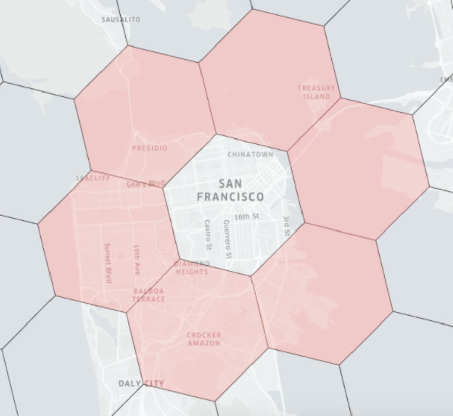
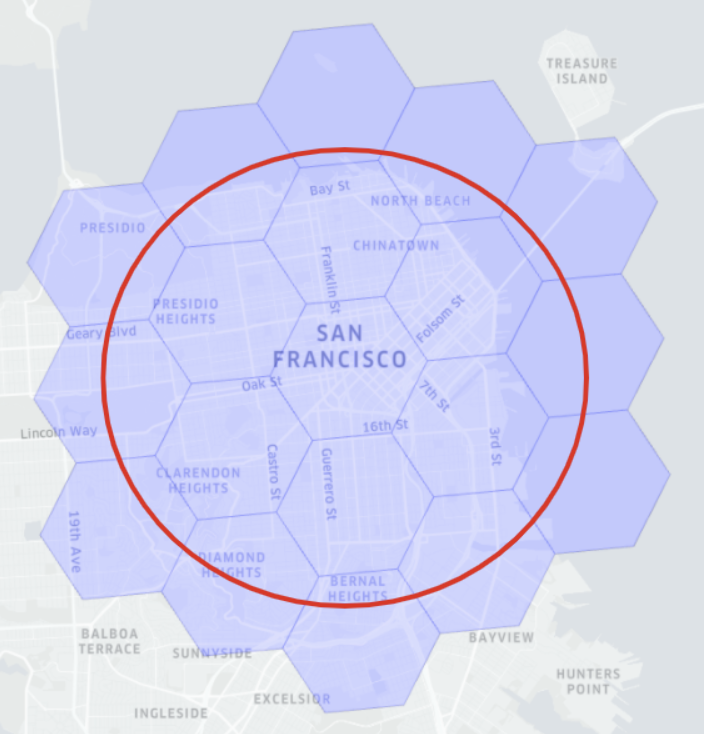

# Geospatial

Pinot supports SQL/MM geospatial data and is compliant with the [Open Geospatial Consortium’s (OGC) OpenGIS Specifications](https://www.ogc.org/standards/sfs/). This includes:

* Geospatial data types, such as point, line and polygon;
* Geospatial functions, for querying of spatial properties and relationships.
* Geospatial indexing, used for efficient processing of spatial operations

## Geospatial data types

Geospatial data types abstract and encapsulate spatial structures such as boundary and dimension. In many respects, spatial data types can be understood simply as shapes. Pinot supports the Well-Known Text (WKT) and Well-Known Binary (WKB) form of geospatial objects, for example:

* `POINT (0, 0)`
* `LINESTRING (0 0, 1 1, 2 1, 2 2)`
* `POLYGON (0 0, 10 0, 10 10, 0 10, 0 0),(1 1, 1 2, 2 2, 2 1, 1 1)`
* `MULTIPOINT (0 0, 1 2)`
* `MULTILINESTRING ((0 0, 1 1, 1 2), (2 3, 3 2, 5 4))`
* `MULTIPOLYGON (((0 0, 4 0, 4 4, 0 4, 0 0), (1 1, 2 1, 2 2, 1 2, 1 1)), ((-1 -1, -1 -2, -2 -2, -2 -1, -1 -1)))`
* `GEOMETRYCOLLECTION(POINT(2 0),POLYGON((0 0, 1 0, 1 1, 0 1, 0 0)))`

### Geometry vs Geography

It is common to have data in which the coordinates are `geographics` or `latitude/longitude.` Unlike coordinates in Mercator or UTM, geographic coordinates are not Cartesian coordinates.

* Geographic coordinates do not represent a linear distance from an origin as plotted on a plane. Rather, these spherical coordinates describe angular coordinates on a globe.&#x20;
* Spherical coordinates specify a point by the angle of rotation from a reference meridian (longitude), and the angle from the equator (latitude). &#x20;

You can treat geographic coordinates as approximate Cartesian coordinates and continue to do spatial calculations. However, measurements of distance, length and area will be nonsensical. Since spherical coordinates measure angular distance, the units are in **degrees**.

Pinot supports both geometry and geography types, which can be constructed by the corresponding functions as shown in [section](geospatial-support.md#constructors). And for the geography types, the measurement functions such as `ST_Distance` and `ST_Area` calculate the spherical distance and area on earth respectively.

## Geospatial functions

For manipulating geospatial data, Pinot provides a set of functions for analyzing geometric components, determining spatial relationships, and manipulating geometries. In particular, geospatial functions that begin with the `ST_` prefix support the SQL/MM specification.

Following geospatial functions are available out of the box in Pinot-

### Aggregations

**ST\_Union(geometry\[] g1\_array) → Geometry**\
This aggregate function returns a MULTI geometry or NON-MULTI geometry from a set of geometries. it ignores NULL geometries.

### Constructors

* **ST\_GeomFromText(String wkt) → Geometry**   Returns a geometry type object from WKT representation, with the optional spatial system reference.&#x20;
* **ST\_GeomFromWKB(bytes wkb) → Geometry**   Returns a geometry type object from WKB representation.&#x20;
* [**ST\_Point(double x, double y)](../../configuration-reference/functions/stpoint.md)    → Point**   Returns a geometry type point object with the given coordinate values.&#x20;
* **ST\_Polygon(String wkt) → Polygon**   Returns a geometry type polygon object from [WKT representation](https://en.wikipedia.org/wiki/Well-known\_text\_representation\_of\_geometry).&#x20;
* **ST\_GeogFromWKB(bytes wkb) → Geography**   Creates a geography instance from a [Well-Known Binary geometry representation (WKB)](https://en.wikipedia.org/wiki/Well-known\_text\_representation\_of\_geometry#Well-known\_binary)&#x20;
* **ST\_GeogFromText(String wkt) → Geography**   Return a specified geography value from [Well-Known Text representation or extended (WKT)](https://en.wikipedia.org/wiki/Well-known\_text\_representation\_of\_geometry).&#x20;

### Measurements

* **ST\_Area(Geometry/Geography g) → double**   For geometry type, it returns the 2D Euclidean area of a geometry. For geography, returns the area of a polygon or multi-polygon in square meters using a spherical model for Earth.&#x20;
* **ST\_Distance(Geometry/Geography g1, Geometry/Geography g2) → double**   For geometry type, returns the 2-dimensional cartesian minimum distance (based on spatial ref) between two geometries in projected units. For geography, returns the great-circle distance in meters between two SphericalGeography points. Note that g1, g2 shall have the same type.&#x20;
* **ST\_GeometryType(Geometry g) → String**   Returns the type of the geometry as a string. e.g.: `ST_Linestring`, `ST_Polygon`,`ST_MultiPolygon` etc.

### Outputs

* **ST\_AsBinary(Geometry/Geography g) → bytes**   Returns the WKB representation of the geometry.&#x20;
* **ST\_AsText(Geometry/Geography g) → string**   Returns the WKT representation of the geometry/geography.

### Relationship

* **ST\_Contains(Geometry, Geometry) → boolean**   Returns true if and only if no points of the second geometry/geography lie in the exterior of the first geometry/geography, and at least one point of the interior of the first geometry lies in the interior of the second geometry.&#x20;
* **ST\_Equals(Geometry, Geometry) → boolean**   Returns true if the given geometries represent the same geometry/geography.&#x20;
* **ST\_Within(Geometry, Geometry) → boolean**   Returns true if first geometry is completely inside second geometry.

## Geospatial index

Geospatial functions are typically expensive to evaluate, and using geoindex can greatly accelerate the query evaluation. Geoindexing in Pinot is based on Uber’s [H3](https://h3geo.org/#/), a hexagon-based hierarchical gridding.&#x20;

A given geospatial location (longitude, latitude) can map to one hexagon (represented as H3Index). And its neighbors in H3 can be approximated by a ring of hexagons. To quickly identify the distance between any given two geospatial locations, we can convert the two locations in the H3Index, and then check the H3 distance between them. H3 distance is measured as the number of hexagons.&#x20;

For example, in the diagram below, the red hexagons are within the 1 distance of the central hexagon. The size of the hexagon is determined by the resolution of the indexing. Please check this table for the level of [resolutions](https://h3geo.org/#/documentation/core-library/resolution-table) and the corresponding precision (measured in km).



### How to use Geoindex

To use the geoindex, first declare the geolocation field as bytes in the schema, as in the example of the [QuickStart example](https://github.com/apache/pinot/blob/master/pinot-tools/src/main/resources/examples/batch/starbucksStores/starbucksStores\_schema.json#L25).


```javascript
{
      "dataType": "BYTES",
      "name": "location_st_point",
      "transformFunction": "toSphericalGeography(stPoint(lon,lat))"
}
```


Note the use of `transformFunction` that converts the created point into `SphericalGeography` format, which is needed by the `ST_Distance` function.

Next, declare the geospatial index in the [table config](../../configuration-reference/table.md):


```javascript
{
  "fieldConfigList": [
  {
    "name": "location_st_point",
    "encodingType":"RAW",
    "indexType":"H3",
    "properties": {
    "resolutions": "5"
     }
    }
  ],
  "tableIndexConfig": {
    "loadMode": "MMAP",
    "noDictionaryColumns": [
      "location_st_point"
    ]
  },
}
```


The query below will use the geoindex to filter the Starbucks stores within 5km of the given point in the bay area.

```sql
SELECT address, ST_DISTANCE(location_st_point, ST_Point(-122, 37, 1))
FROM starbucksStores
WHERE ST_DISTANCE(location_st_point, ST_Point(-122, 37, 1)) < 5000
limit 1000
```

### How Geoindex works

Geoindex in Pinot accelerates the query evaluation without compromising the correctness of the query result. Currently, geoindex supports the `ST_Distance` function used in the range predicates in the `WHERE` clause, as shown in the query example in the previous section.

At the high level, geoindex is used for retrieving the records within the nearby hexagons of the given location, and then use `ST_Distance` to accurately filter the matched results.



As in the example diagram above, if we want to find all relevant points within a given distance at San Francisco (represented in the area within the red circle), then the algorithm with geoindex works as the following:

* Find the H3 distance `x` that contains the range (i.e. red circle)
* For the points within the H3 distance (i.e. covered by the hexagons within [`kRing(x)`](https://h3geo.org/docs/api/traversal)), we can directly take those points without filtering
* For the points falling into the H3 distance (i.e. in the hexagons of `kRing(x)`), we do filtering on them by evaluating the condition `ST_Distance(loc1, loc2) < x`
