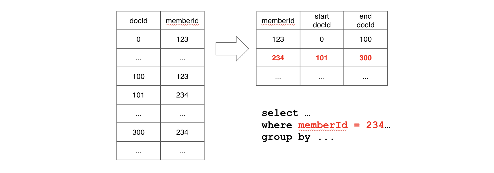

# Inverted index

The [forward index](forward-index.md) maps document IDs (rows) to values. An inverted index reverses this mapping: it maps values to the set of document IDs that contain them. When you frequently filter on a column with predicates like EQ, IN, GT, LT, or BETWEEN, adding an inverted index can significantly improve query performance.

Pinot supports two types of inverted indexes: bitmap inverted indexes and sorted inverted indexes.

## When to use

Use an inverted index on columns that appear frequently in `WHERE` clause filters, especially for equality and membership predicates. An inverted index is a good starting point for performance tuning.

- Use a **bitmap inverted index** on unsorted columns that are filtered frequently.
- Use a **sorted inverted index** (automatic when a column is sorted) when most queries filter on the same column.

## Supported column types

Bitmap inverted indexes are supported on all data types except MAP: INT, LONG, FLOAT, DOUBLE, BIG_DECIMAL, BOOLEAN, TIMESTAMP, STRING, JSON, BYTES. Both single-value and multi-value columns are supported.

## Bitmap inverted index

When an inverted index is enabled for an unsorted column, Pinot maintains a mapping from each value to a bitmap of document IDs. This makes value lookup take constant time O(1).

### Configuration

The recommended way to enable a bitmap inverted index:


```json
{
  "fieldConfigList": [
    {
      "name": "playerName",
      "indexes": {
        "inverted": {}
      }
    }
  ]
}
```


<details>

<summary>Older configuration</summary>


```json
{
  "tableIndexConfig": {
    "invertedIndexColumns": [
      "playerName"
    ]
  }
}
```


</details>

### When the index is created

By default, bitmap inverted indexes are not generated during segment creation. They are created when the segment is loaded by Pinot. This behavior is controlled by the table configuration option `indexingConfig.createInvertedIndexDuringSegmentGeneration`, which defaults to `false`.

## Sorted inverted index

When a column is both sorted and dictionary-encoded, Pinot uses a sorted forward index with run-length encoding that also serves as an inverted index. This happens automatically and requires no extra configuration. The sorted inverted index provides `O(log n)` lookup time and benefits from data locality.

For example, if a query filters on a sorted `memberId` column, Pinot performs a binary search to find the range of document IDs matching the filter value. Subsequent column scans for those documents benefit from data locality because the matching rows are stored contiguously.



A sorted inverted index offers better performance than a bitmap inverted index but can only apply to columns whose data is physically sorted within each segment.

## Query examples

Equality filter:

```sql
SELECT COUNT(*)
FROM baseballStats
WHERE playerName = 'Barry Bonds'
```

IN filter:

```sql
SELECT yearID, hits, homeRuns
FROM baseballStats
WHERE teamID IN ('NYA', 'BOS', 'LAD')
ORDER BY yearID
```

Filter with aggregation:

```sql
SELECT teamID, SUM(hits) AS totalHits
FROM baseballStats
WHERE league = 'NL'
GROUP BY teamID
ORDER BY totalHits DESC
LIMIT 10
```

## Limitations

- Bitmap inverted indexes require [dictionary encoding](dictionary-index.md) to be enabled on the column.
- Sorted inverted indexes only work on columns whose data is physically sorted within each segment.
- MAP columns are not supported.
