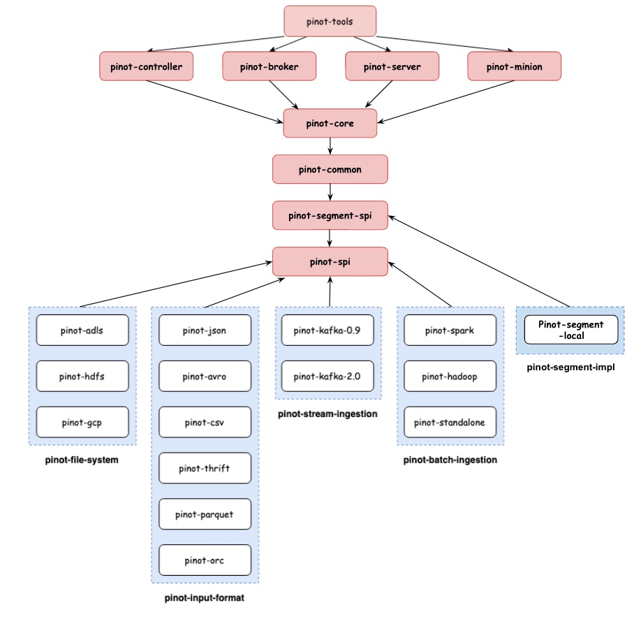

# 0.10.0

## Summary

This release introduces some new great features, performance enhancements, UI improvements, and bug fixes which are described in details in the following sections.\
The release was cut from this commit [fd9c58a](https://github.com/apache/pinot/commit/fd9c58a11ed16d27109baefcee138eea30132ad3).

### Dependency Graph

The dependency graph for plug-and-play architecture that was introduced in release [0.3.0](https://docs.pinot.apache.org/basics/releases/0.3.0) has been extended and now it contains new nodes for Pinot Segment SPI.

### SQL Improvements

* Implement NOT Operator [(#8148)](https://github.com/apache/pinot/pull/8148)
* Add DistinctCountSmartHLLAggregationFunction which automatically store distinct values in Set or HyperLogLog based on cardinality [(#8189)](https://github.com/apache/pinot/pull/8189)
* Add LEAST and GREATEST functions [(#8100)](https://github.com/apache/pinot/pull/8100)
* Handle SELECT \* with extra columns [(#7959)](https://github.com/apache/pinot/pull/7959)
* Add FILTER clauses for aggregates [(#7916)](https://github.com/apache/pinot/pull/7916)
* Add ST\_Within function [(#7990)](https://github.com/apache/pinot/pull/7990)
* Handle semicolon in query [(#7861)](https://github.com/apache/pinot/pull/7861)
* Add EXPLAIN PLAN [(#7568)](https://github.com/apache/pinot/pull/7568)

### UI Enhancements

* Show Reported Size and Estimated Size in human readable format in UI [(#8199)](https://github.com/apache/pinot/pull/8199)
* Make query console state URL based [(#8194)](https://github.com/apache/pinot/pull/8194)
* Improve query console to not show query result when multiple columns have the same name [(#8131)](https://github.com/apache/pinot/pull/8131)
* Improve Pinot dashboard tenant view to show correct amount of servers and brokers [(#8115)](https://github.com/apache/pinot/pull/8115)
* Fix issue with opening new tabs from Pinot Dashboard [(#8021)](https://github.com/apache/pinot/pull/8021)
* Fix issue with Query console going blank on syntax error [(#8006)](https://github.com/apache/pinot/pull/8006)
* Make query stats always show even there's error [(#7981)](https://github.com/apache/pinot/pull/7981)
* Implement OIDC auth workflow in UI [(#7121)](https://github.com/apache/pinot/pull/7121)
* Add tooltip and modal for table status [(#7899)](https://github.com/apache/pinot/pull/7899)
* Add option to wrap lines in custom code mirror [(#7857)](https://github.com/apache/pinot/pull/7857)
* Add ability to comment out queries with cmd + / [(#7841)](https://github.com/apache/pinot/pull/7841)
* Return exception when unavailable segments on empty broker response [(#7823)](https://github.com/apache/pinot/pull/7823)
* Properly handle the case where segments are missing in externalview [(#7803)](https://github.com/apache/pinot/pull/7803)
* Add TIMESTAMP to datetime column Type [(#7746)](https://github.com/apache/pinot/pull/7746)

### Performance Improvements

* Reuse regex matcher in dictionary based LIKE queries [(#8261)](https://github.com/apache/pinot/pull/8261)
* Early terminate orderby when columns already sorted [(#8228)](https://github.com/apache/pinot/pull/8228)
* Do not do another pass of Query Automaton Minimization [(#8237)](https://github.com/apache/pinot/pull/8237)
* Improve RangeBitmap by upgrading RoaringBitmap [(#8206)](https://github.com/apache/pinot/pull/8206)
* Optimize geometry serializer usage when literal is available [(#8167)](https://github.com/apache/pinot/pull/8167)
* Improve performance of no-dictionary group by [(#8195)](https://github.com/apache/pinot/pull/8195)
* Allocation free `DataBlockCache` lookups [(#8140)](https://github.com/apache/pinot/pull/8140)
* Prune unselected THEN statements in CaseTransformFunction [(#8138)](https://github.com/apache/pinot/pull/8138)
* Aggregation delay conversion to double [(#8139)](https://github.com/apache/pinot/pull/8139)
* Reduce object allocation rate in ExpressionContext or FunctionContext [(#8124)](https://github.com/apache/pinot/pull/8124)
* Lock free DimensionDataTableManager [(#8102)](https://github.com/apache/pinot/pull/8102)
* Improve json path performance during ingestion by upgrading JsonPath [(#7819)](https://github.com/apache/pinot/pull/7819)
* Reduce allocations and speed up StringUtil.sanitizeString [(#8013)](https://github.com/apache/pinot/pull/8013)
* Faster metric scans - ForwardIndexReader [(#7920)](https://github.com/apache/pinot/pull/7920)
* Unpeel group by 3 ways to enable vectorization [(#7949)](https://github.com/apache/pinot/pull/7949)
* Power of 2 fixed size chunks [(#7934)](https://github.com/apache/pinot/pull/7934)
* Don't use mmap for compression except for huge chunks [(#7931)](https://github.com/apache/pinot/pull/7931)
* Exit group-by marking loop early [(#7935)](https://github.com/apache/pinot/pull/7935)
* Improve performance of base chunk forward index write [(#7930)](https://github.com/apache/pinot/pull/7930)
* Cache JsonPaths to prevent compilation per segment [(#7826)](https://github.com/apache/pinot/pull/7826)
* Use `LZ4` as default compression mode [(#7797)](https://github.com/apache/pinot/pull/7797)
* Peel off special case for 1 dimensional groupby [(#7777)](https://github.com/apache/pinot/pull/7777)
* Bump roaringbitmap version to improve range queries performance [(#7734)](https://github.com/apache/pinot/pull/7734)

### Other Notable Features

* Adding NoopPinotMetricFactory and corresponding changes [(#8270)](https://github.com/apache/pinot/pull/8270)
* Allow to specify fixed segment name for SegmentProcessorFramework [(#8269)](https://github.com/apache/pinot/pull/8269)
* Move all prestodb dependencies into a separated module [(#8266)](https://github.com/apache/pinot/pull/8266)
* Include docIds in Projection and Transform block [(#8262)](https://github.com/apache/pinot/pull/8262)
* Automatically update broker resource on broker changes [(#8249)](https://github.com/apache/pinot/pull/8249)
* Update ScalarFunction annotation from name to names to support function alias. [(#8252)](https://github.com/apache/pinot/pull/8252)
* Implemented BoundedColumnValue partition function [(#8224)](https://github.com/apache/pinot/pull/8224)
* Add copy recursive API to pinotFS [(#8200)](https://github.com/apache/pinot/pull/8200)
* Add Support for Getting Live Brokers for a Table (without type suffix) [(#8188)](https://github.com/apache/pinot/pull/8188)
* Pinot docker image - cache prometheus rules [(#8241)](https://github.com/apache/pinot/pull/8241)
* In BrokerRequestToQueryContextConverter, remove unused filterExpressionContext [(#8238)](https://github.com/apache/pinot/pull/8238)
* Adding retention period to segment delete REST API [(#8122)](https://github.com/apache/pinot/pull/8122)
* Pinot docker image - upgrade prometheus and scope rulesets to components [(#8227)](https://github.com/apache/pinot/pull/8227)
* Allow segment name postfix for SegmentProcessorFramework [(#8230)](https://github.com/apache/pinot/pull/8230)
* Superset docker image - update pinotdb version in superset image [(#8231)](https://github.com/apache/pinot/pull/8231)
* Add retention period to deleted segment files and allow table level overrides [(#8176)](https://github.com/apache/pinot/pull/8176)
* Remove incubator from pinot and superset [(#8223)](https://github.com/apache/pinot/pull/8223)
* Adding table config overrides for disabling groovy [(#8196)](https://github.com/apache/pinot/pull/8196)
* Optimise sorted docId iteration order in mutable segments [(#8213)](https://github.com/apache/pinot/pull/8213)
* Adding secure grpc query server support [(#8207)](https://github.com/apache/pinot/pull/8207)
* Move Tls configs and utils from pinot-core to pinot-common [(#8210)](https://github.com/apache/pinot/pull/8210)
* Reduce allocation rate in LookupTransformFunction [(#8204)](https://github.com/apache/pinot/pull/8204)
* Allow subclass to customize what happens pre/post segment uploading [(#8203)](https://github.com/apache/pinot/pull/8203)
* Enable controller service auto-discovery in Jersey framework [(#8193)](https://github.com/apache/pinot/pull/8193)
* Add support for pushFileNamePattern in pushJobSpec [(#8191)](https://github.com/apache/pinot/pull/8191)
* Add additionalMatchLabels to helm chart [(#7177)](https://github.com/apache/pinot/pull/7177)
* Simulate rsvps after meetup.com retired the feed [(#8180)](https://github.com/apache/pinot/pull/8180)
* Adding more checkstyle rules [(#8197)](https://github.com/apache/pinot/pull/8197)
* Add persistence.extraVolumeMounts and persistence.extraVolumes to Kubernetes statefulsets [(#7486)](https://github.com/apache/pinot/pull/7486)
* Adding scala profile for kafka 2.x build and remove root pom scala dependencies [(#8174)](https://github.com/apache/pinot/pull/8174)
* Allow real-time data providers to accept non-kafka producers [(#8190)](https://github.com/apache/pinot/pull/8190)
* Enhance revertReplaceSegments api [(#8166)](https://github.com/apache/pinot/pull/8166)
* Adding broker level config for disabling Pinot queries with Groovy [(#8159)](https://github.com/apache/pinot/pull/8159)
* Make presto driver query pinot server with SQL [(#8186)](https://github.com/apache/pinot/pull/8186)
* Adding controller config for disabling Groovy in ingestionConfig [(#8169)](https://github.com/apache/pinot/pull/8169)
* Adding main method for LaunchDataIngestionJobCommand for spark-submit command [(#8168)](https://github.com/apache/pinot/pull/8168)
* Add auth token for segment replace rest APIs [(#8146)](https://github.com/apache/pinot/pull/8146)
* Add allowRefresh option to UploadSegment [(#8125)](https://github.com/apache/pinot/pull/8125)
* Add Ingress to Broker and Controller helm charts [(#7997)](https://github.com/apache/pinot/pull/7997)
* Improve progress reporter in SegmentCreationMapper [(#8129)](https://github.com/apache/pinot/pull/8129)
* St\_\* function error messages + support literal transform functions [(#8001)](https://github.com/apache/pinot/pull/8001)
* Add schema and segment crc to SegmentDirectoryContext [(#8127)](https://github.com/apache/pinot/pull/8127)
* Extend enableParallePushProtection support in UploadSegment API [(#8110)](https://github.com/apache/pinot/pull/8110)
* Support BOOLEAN type in Config Recommendation Engine [(#8055)](https://github.com/apache/pinot/pull/8055)
* Add a broker metric to distinguish exception happens when acquire channel lock or when send request to server [(#8105)](https://github.com/apache/pinot/pull/8105)
* Add pinot.minion prefix on minion configs for consistency [(#8109)](https://github.com/apache/pinot/pull/8109)
* Enable broker service auto-discovery in Jersey framework [(#8107)](https://github.com/apache/pinot/pull/8107)
* Timeout if waiting server channel lock takes a long time [(#8083)](https://github.com/apache/pinot/pull/8083)
* Wire EmptySegmentPruner to routing config [(#8067)](https://github.com/apache/pinot/pull/8067)
* Support for TIMESTAMP data type in Config Recommendation Engine [(#8087)](https://github.com/apache/pinot/pull/8087)
* Listener TLS customization [(#8082)](https://github.com/apache/pinot/pull/8082)
* Add consumption rate limiter for LLConsumer [(#6291)](https://github.com/apache/pinot/pull/6291)
* Implement Real Time Mutable FST [(#8016)](https://github.com/apache/pinot/pull/8016)
* Allow quickstart to get table files from filesystem [(#8093)](https://github.com/apache/pinot/pull/8093)
* Add support for instant segment deletion [(#8077)](https://github.com/apache/pinot/pull/8077)
* Add a config file to override quickstart configs [(#8059)](https://github.com/apache/pinot/pull/8059)
* Add pinot server grpc metadata acl [(#8030)](https://github.com/apache/pinot/pull/8030)
* Move compatibility verifier to a separate module [(#8049)](https://github.com/apache/pinot/pull/8049)
* Move hadoop and spark ingestion libs from plugins directory to external-plugins [(#8048)](https://github.com/apache/pinot/pull/8048)
* Add global strategy for partial upsert [(#7906)](https://github.com/apache/pinot/pull/7906)
* Upgrade kafka to 2.8.1 [(#7883)](https://github.com/apache/pinot/pull/7883)
* Created EmptyQuickstart command [(#8024)](https://github.com/apache/pinot/pull/8024)
* Allow SegmentPushUtil to push real-time segment [(#8032)](https://github.com/apache/pinot/pull/8032)
* Add ignoreMerger for partial upsert [(#7907)](https://github.com/apache/pinot/pull/7907)
* Make task timeout and concurrency configurable [(#8028)](https://github.com/apache/pinot/pull/8028)
* Return 503 response from health check on shut down [(#7892)](https://github.com/apache/pinot/pull/7892)
* Pinot-druid-benchmark: set the multiValueDelimiterEnabled to false when importing TPC-H data [(#8012)](https://github.com/apache/pinot/pull/8012)
* Cleanup: Remove remaining occurrences of `incubator`. [(#8023)](https://github.com/apache/pinot/pull/8023)
* Refactor segment loading logic in BaseTableDataManager to decouple it with local segment directory [(#7969)](https://github.com/apache/pinot/pull/7969)
* Improving segment replacement/revert protocol [(#7995)](https://github.com/apache/pinot/pull/7995)
* PinotConfigProvider interface [(#7984)](https://github.com/apache/pinot/pull/7984)
* Enhance listSegments API to exclude the provided segments from the output [(#7878)](https://github.com/apache/pinot/pull/7878)
* Remove outdated broker metric definitions [(#7962)](https://github.com/apache/pinot/pull/7962)
* Add skip key for realtimeToOffline job validation [(#7921)](https://github.com/apache/pinot/pull/7921)
* Upgrade async-http-client [(#7968)](https://github.com/apache/pinot/pull/7968)
* Allow Reloading Segments with Multiple Threads [(#7893)](https://github.com/apache/pinot/pull/7893)
* Ignore query options in commented out queries [(#7894)](https://github.com/apache/pinot/pull/7894)
* Remove TableConfigCache which does not listen on ZK changes [(#7943)](https://github.com/apache/pinot/pull/7943)
* Switch to zookeeper of helm 3.0x [(#7955)](https://github.com/apache/pinot/pull/7955)
* Use a single react hook for table status modal [(#7952)](https://github.com/apache/pinot/pull/7952)
* Add debug logging for real-time ingestion [(#7946)](https://github.com/apache/pinot/pull/7946)
* Separate the exception for transform and indexing for consuming records [(#7926)](https://github.com/apache/pinot/pull/7926)
* Disable JsonStatementOptimizer [(#7919)](https://github.com/apache/pinot/pull/7919)
* Make index readers/loaders pluggable [(#7897)](https://github.com/apache/pinot/pull/7897)
* Make index creator provision pluggable [(#7885)](https://github.com/apache/pinot/pull/7885)
* Support loading plugins from multiple directories [(#7871)](https://github.com/apache/pinot/pull/7871)
* Update helm charts to honour readinessEnabled probes flags on the Controller, Broker, Server and Minion StatefulSets [(#7891)](https://github.com/apache/pinot/pull/7891)
* Support non-selection-only GRPC server request handler [(#7839)](https://github.com/apache/pinot/pull/7839)
* GRPC broker request handler [(#7838)](https://github.com/apache/pinot/pull/7838)
* Add validator for SDF [(#7804)](https://github.com/apache/pinot/pull/7804)
* Support large payload in zk put API [(#7364)](https://github.com/apache/pinot/pull/7364)
* Push JSON Path evaluation down to storage layer [(#7820)](https://github.com/apache/pinot/pull/7820)
* When upserting new record, index the record before updating the upsert metadata [(#7860)](https://github.com/apache/pinot/pull/7860)
* Add Post-Aggregation Gapfilling functionality. [(#7781)](https://github.com/apache/pinot/pull/7781)
* Clean up deprecated fields from segment metadata [(#7853)](https://github.com/apache/pinot/pull/7853)
* Remove deprecated method from StreamMetadataProvider [(#7852)](https://github.com/apache/pinot/pull/7852)
* Obtain replication factor from tenant configuration in case of dimension table [(#7848)](https://github.com/apache/pinot/pull/7848)
* Use valid bucket end time instead of segment end time for merge/rollup delay metrics [(#7827)](https://github.com/apache/pinot/pull/7827)
* Make pinot start components command extensible [(#7847)](https://github.com/apache/pinot/pull/7847)
* Make upsert inner segment update atomic [(#7844)](https://github.com/apache/pinot/pull/7844)
* Clean up deprecated ZK metadata keys and methods [(#7846)](https://github.com/apache/pinot/pull/7846)
* Add extraEnv, envFrom to statefulset help template [(#7833)](https://github.com/apache/pinot/pull/7833)
* Make openjdk image name configurable [(#7832)](https://github.com/apache/pinot/pull/7832)
* Add getPredicate() to PredicateEvaluator interface [(#7840)](https://github.com/apache/pinot/pull/7840)
* Make split commit the default commit protocol [(#7780)](https://github.com/apache/pinot/pull/7780)
* Pass Pinot connection properties from JDBC driver [(#7822)](https://github.com/apache/pinot/pull/7822)
* Add Pinot client connection config to allow skip fail on broker response exception [(#7816)](https://github.com/apache/pinot/pull/7816)
* Change default range index version to v2 [(#7815)](https://github.com/apache/pinot/pull/7815)
* Put thread timer measuring inside of wall clock timer measuring [(#7809)](https://github.com/apache/pinot/pull/7809)
* Add getRevertReplaceSegmentRequest method in FileUploadDownloadClient [(#7796)](https://github.com/apache/pinot/pull/7796)
* Add JAVA\_OPTS env var in docker image [(#7799)](https://github.com/apache/pinot/pull/7799)
* Split thread cpu time into three metrics [(#7724)](https://github.com/apache/pinot/pull/7724)
* Add config for enabling real-time offset based consumption status checker [(#7753)](https://github.com/apache/pinot/pull/7753)
* Add timeColumn, timeUnit and totalDocs to the json segment metadata [(#7765)](https://github.com/apache/pinot/pull/7765)
* Set default Dockerfile CMD to -help [(#7767)](https://github.com/apache/pinot/pull/7767)
* Add getName() to PartitionFunction interface [(#7760)](https://github.com/apache/pinot/pull/7760)
* Support Native FST As An Index Subtype for FST Indices [(#7729)](https://github.com/apache/pinot/pull/7729)
* Add forceCleanup option for 'startReplaceSegments' API [(#7744)](https://github.com/apache/pinot/pull/7744)
* Add config for keystore types, switch tls to native implementation, and add authorization for server-broker tls channel [(#7653)](https://github.com/apache/pinot/pull/7653)
* Extend FileUploadDownloadClient to send post request with json body [(#7751)](https://github.com/apache/pinot/pull/7751)

### Major Bug Fixes

* Fix string comparisons [(#8253)](https://github.com/apache/pinot/pull/8253)
* Bugfix for order-by all sorted optimization [(#8263)](https://github.com/apache/pinot/pull/8263)
* Fix dockerfile [(#8239)](https://github.com/apache/pinot/pull/8239)
* Ensure partition function never return negative partition [(#8221)](https://github.com/apache/pinot/pull/8221)
* Handle indexing failures without corrupting inverted indexes [(#8211)](https://github.com/apache/pinot/pull/8211)
* Fixed broken HashCode partitioning [(#8216)](https://github.com/apache/pinot/pull/8216)
* Fix segment replace test [(#8209)](https://github.com/apache/pinot/pull/8209)
* Fix filtered aggregation when it is mixed with regular aggregation [(#8172)](https://github.com/apache/pinot/pull/8172)
* Fix FST Like query benchmark to remove SQL parsing from the measurement [(#8097)](https://github.com/apache/pinot/pull/8097)
* Do not identify function types by throwing exceptions [(#8137)](https://github.com/apache/pinot/pull/8137)
* Fix regression bug caused by sharing TSerializer across multiple threads [(#8160)](https://github.com/apache/pinot/pull/8160)
* Fix validation before creating a table [(#8103)](https://github.com/apache/pinot/pull/8103)
* Check cron schedules from table configs after subscribing child changes [(#8113)](https://github.com/apache/pinot/pull/8113)
* Disallow duplicate segment name in tar file [(#8119)](https://github.com/apache/pinot/pull/8119)
* Fix storage quota checker NPE for Dimension Tables [(#8132)](https://github.com/apache/pinot/pull/8132)
* Fix TraceContext NPE issue [(#8126)](https://github.com/apache/pinot/pull/8126)
* Update gcloud libraries to fix underlying issue with api's with CMEK [(#8121)](https://github.com/apache/pinot/pull/8121)
* Fix error handling in jsonPathArray [(#8120)](https://github.com/apache/pinot/pull/8120)
* Fix error handling in json functions with default values [(#8111)](https://github.com/apache/pinot/pull/8111)
* Fix controller config validation failure for customized TLS listeners [(#8106)](https://github.com/apache/pinot/pull/8106)
* Validate the numbers of input and output files in HadoopSegmentCreationJob [(#8098)](https://github.com/apache/pinot/pull/8098)
* Broker Side validation for the query with aggregation and col but without group by [(#7972)](https://github.com/apache/pinot/pull/7972)
* Improve the proactive segment clean-up for REVERTED [(#8071)](https://github.com/apache/pinot/pull/8071)
* Allow JSON forward indexes [(#8073)](https://github.com/apache/pinot/pull/8073)
* Fix the PinotLLCRealtimeSegmentManager on segment name check [(#8058)](https://github.com/apache/pinot/pull/8058)
* Always use smallest offset for new partitionGroups [(#8053)](https://github.com/apache/pinot/pull/8053)
* Fix RealtimeToOfflineSegmentsTaskExecutor to handle time gap [(#8054)](https://github.com/apache/pinot/pull/8054)
* Refine segment consistency checks during segment load [(#8035)](https://github.com/apache/pinot/pull/8035)
* Fixes for various JDBC issues [(#7784)](https://github.com/apache/pinot/pull/7784)
* Delete tmp- segment directories on server startup [(#7961)](https://github.com/apache/pinot/pull/7961)
* Fix ByteArray datatype column metadata getMaxValue NPE bug and expose maxNumMultiValues [(#7918)](https://github.com/apache/pinot/pull/7918)
* Fix the issues that Pinot upsert table's uploaded segments get deleted when a server restarts. [(#7979)](https://github.com/apache/pinot/pull/7979)
* Fixed segment upload error return [(#7957)](https://github.com/apache/pinot/pull/7957)
* Fix QuerySchedulerFactory to plug in custom scheduler [(#7945)](https://github.com/apache/pinot/pull/7945)
* Fix the issue with grpc broker request handler not started correctly [(#7950)](https://github.com/apache/pinot/pull/7950)
* Fix real-time ingestion when an entire batch of messages is filtered out [(#7927)](https://github.com/apache/pinot/pull/7927)
* Move decode method before calling acquireSegment to avoid reference count leak [(#7938)](https://github.com/apache/pinot/pull/7938)
* Fix semaphore issue in consuming segments [(#7886)](https://github.com/apache/pinot/pull/7886)
* Add bootstrap mode for PinotServiceManager to avoid glitch for health check [(#7880)](https://github.com/apache/pinot/pull/7880)
* Fix the broker routing when segment is deleted [(#7817)](https://github.com/apache/pinot/pull/7817)
* Fix obfuscator not capturing secretkey and keytab [(#7794)](https://github.com/apache/pinot/pull/7794)
* Fix segment merge delay metric when there is empty bucket [(#7761)](https://github.com/apache/pinot/pull/7761)
* Fix QuickStart by adding types for invalid/missing type [(#7768)](https://github.com/apache/pinot/pull/7768)
* Use oldest offset on newly detected partitions [(#7756)](https://github.com/apache/pinot/pull/7756)
* Fix javadoc to compatible with jdk8 source [(#7754)](https://github.com/apache/pinot/pull/7754)
* Handle null segment lineage ZNRecord for getSelectedSegments API [(#7752)](https://github.com/apache/pinot/pull/7752)
* Handle fields missing in the source in ParquetNativeRecordReader [(#7742)](https://github.com/apache/pinot/pull/7742)

### Backward Incompatible Changes

* Fix the issue with HashCode partitioning function [(#8216)](https://github.com/apache/pinot/pull/8216)
* Fix the issue with validation on table creation [(#8103)](https://github.com/apache/pinot/pull/8103)
* Change PinotFS API's [(#8603)](https://github.com/apache/pinot/pull/8063)
