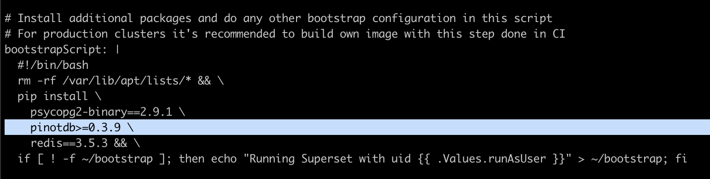
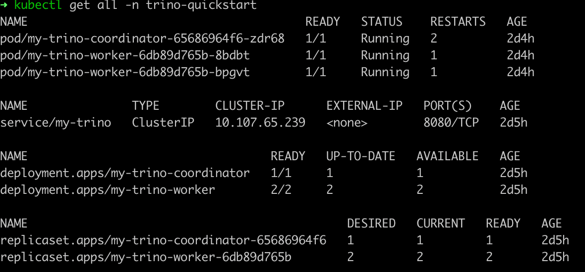

# Query engines (Kubernetes)

After deploying Pinot in Kubernetes and loading data, you can connect external query engines for richer analytics and visualization.

## Query Pinot with Superset

### Bring up Superset using Helm

1. Install the SuperSet Helm repository:

```bash
helm repo add superset https://apache.github.io/superset
```

2. Get the Helm values configuration file:

```bash
helm inspect values superset/superset > /tmp/superset-values.yaml
```

3. For Superset to install Pinot dependencies, edit `/tmp/superset-values.yaml` file to add a`pinotdb` pip dependency into `bootstrapScript` field.
4. You can also build your own image with this dependency or use the image `apachepinot/pinot-superset:latest` instead.



5. Replace the default admin credentials inside the `init` section with a meaningful user profile and stronger password.
6. Install Superset using Helm:

```bash
kubectl create ns superset
helm upgrade --install --values /tmp/superset-values.yaml superset superset/superset -n superset
```

7. Ensure your cluster is up by running:

```bash
kubectl get all -n superset
```

### Access the Superset UI

1. Run the below command to port forward Superset to your `localhost:18088`.

```bash
kubectl port-forward service/superset 18088:8088 -n superset
```

2. Navigate to Superset in your browser with the admin credentials you set in the previous section.
3. Create a new database connection with the following URI: `pinot+http://pinot-broker.pinot-quickstart:8099/query?controller=http://pinot-controller.pinot-quickstart:9000/`
4. Once the database is added, you can add more data sets and explore the dashboard options.

## Access Pinot with Trino

### Deploy Trino

1. Deploy Trino with the Pinot plugin installed:

```bash
helm repo add trino https://trinodb.github.io/charts/
```

2. See the charts in the Trino Helm chart repository:

```bash
helm search repo trino
```

3. In order to connect Trino to Pinot, you'll need to add the Pinot catalog, which requires extra configurations. Run the below command to get all the configurable values.

```bash
helm inspect values trino/trino > /tmp/trino-values.yaml
```

4. To add the Pinot catalog, edit the `additionalCatalogs` section by adding:

```
additionalCatalogs:
  pinot: |
    connector.name=pinot
    pinot.controller-urls=pinot-controller.pinot-quickstart:9000
```


Pinot is deployed at namespace `pinot-quickstart`, so the controller serviceURL is `pinot-controller.pinot-quickstart:9000`


5. After modifying the `/tmp/trino-values.yaml` file, deploy Trino with:

```bash
kubectl create ns trino-quickstart
helm install my-trino trino/trino --version 0.2.0 -n trino-quickstart --values /tmp/trino-values.yaml
```

6. Once you've deployed Trino, check the deployment status:

```bash
kubectl get pods -n trino-quickstart
```



### Query Pinot with the Trino CLI

Once Trino is deployed, run the below command to get a runnable Trino CLI.

1. Download the Trino CLI:

```bash
curl -L https://repo1.maven.org/maven2/io/trino/trino-cli/363/trino-cli-363-executable.jar -o /tmp/trino && chmod +x /tmp/trino
```

2. Port forward Trino service to your local if it's not already exposed:

```bash
echo "Visit http://127.0.0.1:18080 to use your application"
kubectl port-forward service/my-trino 18080:8080 -n trino-quickstart
```

3. Use the Trino console client to connect to the Trino service:

```bash
/tmp/trino --server localhost:18080 --catalog pinot --schema default
```

4. Query Pinot data using the Trino CLI, like in the sample queries below.

### Sample queries to execute

#### List all catalogs

```
trino:default> show catalogs;
```

```
  Catalog
---------
 pinot
 system
 tpcds
 tpch
(4 rows)

Query 20211025_010256_00002_mxcvx, FINISHED, 2 nodes
Splits: 36 total, 36 done (100.00%)
0.70 [0 rows, 0B] [0 rows/s, 0B/s]
```

#### List all tables

```
trino:default> show tables;
```

```
    Table
--------------
 airlinestats
(1 row)

Query 20211025_010326_00003_mxcvx, FINISHED, 3 nodes
Splits: 36 total, 36 done (100.00%)
0.28 [1 rows, 29B] [3 rows/s, 104B/s]
```

#### Show schema

```
trino:default> DESCRIBE airlinestats;
```

```
        Column        |      Type      | Extra | Comment
----------------------+----------------+-------+---------
 flightnum            | integer        |       |
 origin               | varchar        |       |
 quarter              | integer        |       |
 lateaircraftdelay    | integer        |       |
 divactualelapsedtime | integer        |       |
 divwheelsons         | array(integer) |       |
 divwheelsoffs        | array(integer) |       |
......

Query 20211025_010414_00006_mxcvx, FINISHED, 3 nodes
Splits: 36 total, 36 done (100.00%)
0.37 [79 rows, 5.96KB] [212 rows/s, 16KB/s]
```

#### Count total documents

```
trino:default> select count(*) as cnt from airlinestats limit 10;
```

```
 cnt
------
 9746
(1 row)

Query 20211025_015607_00009_mxcvx, FINISHED, 2 nodes
Splits: 17 total, 17 done (100.00%)
0.24 [1 rows, 9B] [4 rows/s, 38B/s]
```
