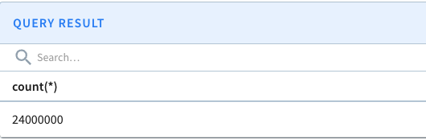
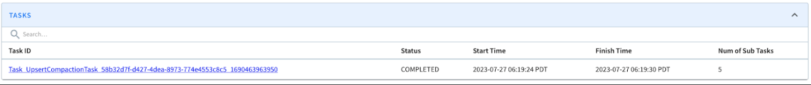
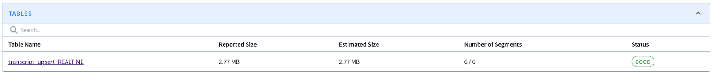

# Segment compaction on upserts

## Overview of segment compaction

Compacting a segment replaces the completed segment with a compacted segment that only contains the latest version of records. For more information about how to use upserts on a real-time table in Pinot, see [Stream Ingestion with Upsert](upsert.md).

The Pinot upsert feature stores all versions of the record ingested into immutable segments on disk. Even though the previous versions are not queried, they continue to add to the storage overhead. To remove older records (no longer used in query results) and reclaim storage space, we need to compact Pinot segments periodically. Segment compaction is done via a new minion task. To schedule Pinot tasks periodically, see the [Minion documentation](../../../basics/components/cluster/minion.md).

## Compact segments on upserts in a real-time table

To compact segments on upserts, complete the following steps:

1. Ensure task scheduling is enabled and a minion is available.
2. Add the following to your table configuration. These configurations (except `schedule)`determine which segments to compact.

```
"task": {
  "taskTypeConfigsMap": {
    "UpsertCompactionTask": {
      "schedule": "0 */5 * ? * *",
      "bufferTimePeriod": "7d",
      "invalidRecordsThresholdPercent": "30",
      "invalidRecordsThresholdCount": "100000",
      "tableMaxNumTasks": "100",
      "validDocIdsType": "SNAPSHOT"
    }
  }
}
```

* `bufferTimePeriod:` To compact segments once they are complete, set to `“0d”`. To delay compaction (as the configuration above shows by 7 days (`"7d"`)), specify the number of days to delay compaction after a segment completes.
* `invalidRecordsThresholdPercent` (Optional) Limits the older records allowed in the completed segment as a percentage of the total number of records in the segment. In the example above, the completed segment may be selected for compaction when 30% of the records in the segment are old.
* `invalidRecordsThresholdCount` (Optional) Limits the older records allowed in the completed segment by record count. In the example above, if the segment contains more than 100K records, it may be selected for compaction.
* `tableMaxNumTasks` (Optional) Limits the number of tasks allowed to be scheduled.
* `validDocIdsType` (Optional) Specifies the source of validDocIds to fetch when running data compaction. Valid values are `SNAPSHOT`, `SNAPSHOT_WITH_DELETE`, `IN_MEMORY`, and `IN_MEMORY_WITH_DELETE`. `SNAPSHOT` remains the default even when `upsertConfig.deleteRecordColumn` is configured, and Pinot honors the configured value as-is.
  * `SNAPSHOT`: Default validDocIds type. Loads the `validDocIds` snapshot from the Pinot segment. `upsertConfig.snapshot` must not be `DISABLE` for this type.
  * `SNAPSHOT_WITH_DELETE`: Loads the delete-aware `queryableDocIds` snapshot from the Pinot segment. `upsertConfig.snapshot` must not be `DISABLE`, and `upsertConfig.deleteRecordColumn` must be set.
  * `IN_MEMORY`: Loads the `validDocIds` bitmap from the real-time server's memory.&#x20;
  * `IN_MEMORY_WITH_DELETE`: Loads the delete-aware `queryableDocIds` bitmap from the real-time server's memory. `upsertConfig.deleteRecordColumn` must be set for this type.


When using the two in-memory types, if the server gets restarted, the upsert view gets back consistent once server re-ingests the data it has ingested before starting. The in-memory bitmaps are updated when server ingests data into consuming segment, even before the consuming segment gets committed. So if server gets restarted whlie still consuming data, the upsert view gets back consistent once it catches up the previously ingested data. Instead, the bitmap snapshots are only taken after committing the segment, thus can be more consistent on server restarts, but is eventually consistent as well if server gets restarted while ingesting data.



Because segment compaction is an expensive operation, we **do not recommend** setting `invalidRecordsThresholdPercent and invalidRecordsThresholdCount` too low (close to 1). By default, all configurations above are `0`, so no thresholds are applied.


## Example

The following example includes a dataset with 24M records and 240K unique keys that have each been duplicated 100 times. After ingesting the data, there are 6 segments (5 completed segments and 1 consuming segment) with a total estimated size of 22.8MB.

.png>)

*Example dataset*

Submitting the query `“set skipUpsert=true; select count(*) from transcript_upsert”` before compaction produces 24,000,000 results:



*Results before segment compaction*

After the compaction tasks are complete, the [Minion Task Manager UI](../../../basics/components/cluster/minion.md#task-manager-ui) reports the following.



*Minion compaction task completed*

Segment compactions generates a task for each segment to compact. Five tasks were generated in this case because 90% of the records (3.6–4.5M records) are considered ready for compaction in the completed segments, exceeding the configured thresholds.


If a completed segment only contains old records, Pinot immediately deletes the segment (rather than creating a task to compact it).


Submitting the query again shows the count matches the set of 240K unique keys.



*Results after segment compaction*

Once segment compaction has completed, the total number of segments remain the same and the total estimated size drops to 2.77MB.


To further improve query latency, merge small segments into larger one.

