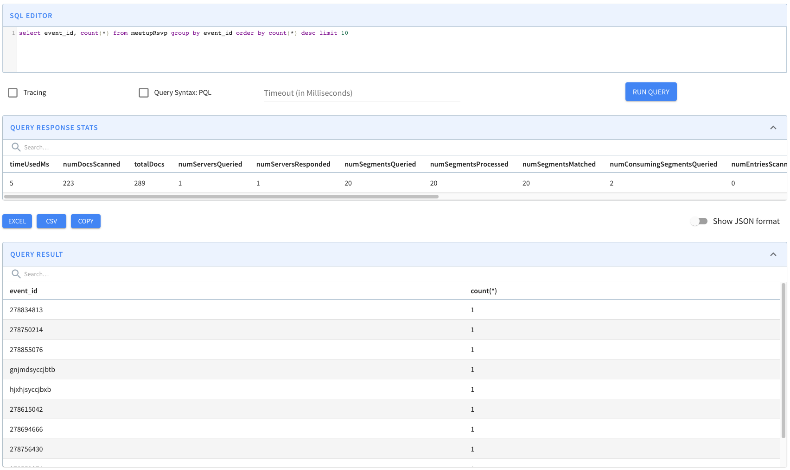
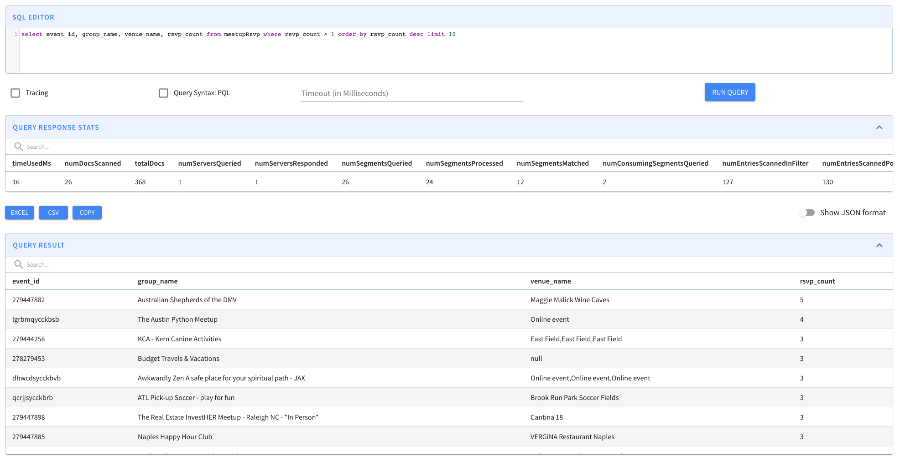
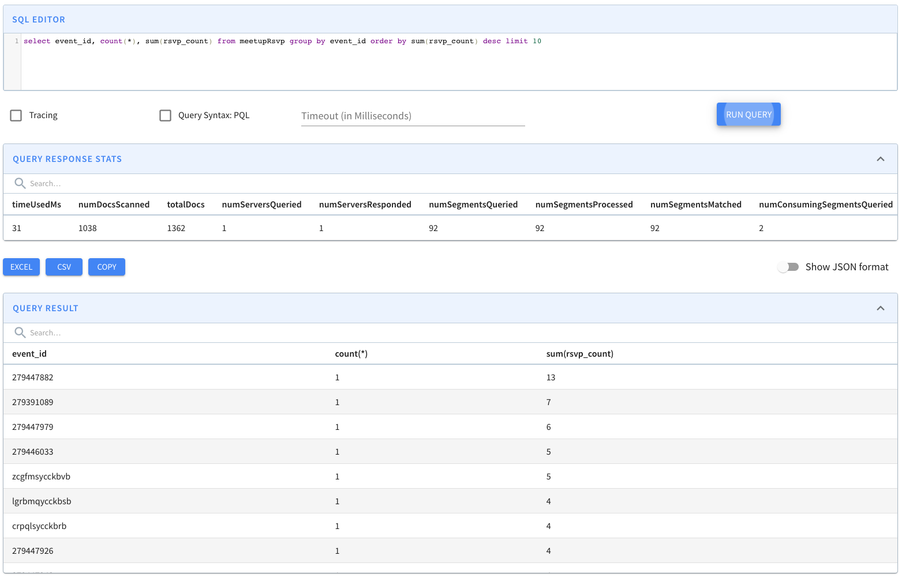

# Upsert

Pinot provides native upsert support during ingestion. There are scenarios where records need modifications, such as correcting a ride fare or updating a delivery status.

Partial upserts are convenient as you only need to specify the columns where values change, and you ignore the rest.

## Table type support

Upsert is supported across REALTIME, OFFLINE, and HYBRID table types. The available modes depend on the table type:

| Table type | FULL upsert | PARTIAL upsert | Notes |
| ---------- | ----------- | -------------- | ----- |
| REALTIME   | Yes         | Yes            | Stream-based ingestion with full upsert feature set |
| OFFLINE    | Yes         | No             | Batch ingestion; replaces full rows only |
| HYBRID     | Yes         | No             | Avoid overlapping time ranges between offline and realtime |

For OFFLINE table upsert configuration details, see [Offline Table Upsert](offline-table-upsert.md).

## Overview of upserts in Pinot

See an overview of how upserts work in Pinot.


Apache Pinot 1.0 Upserts overview


## Enable upserts in Pinot

To enable upserts on a Pinot table, do the following:

1. [Define the primary key in the schema](upsert.md#define-the-primary-key-in-the-schema)
2. [Enable upserts in the table configurations](upsert.md#enable-upsert-in-the-table-configurations)

### Define the primary key in the schema

To update a record, you need a primary key to uniquely identify the record. To define a primary key, add the field `primaryKeyColumns` to the schema definition. For example, the schema definition of `UpsertMeetupRSVP` in the quick start example has this definition.


```javascript
{
    "primaryKeyColumns": ["event_id"]
}
```


Note this field expects a list of columns, as the primary key can be a composite.

When two records of the same primary key are ingested, _the record with the greater comparison value (timeColumn by default) is used_. When records have the same primary key and event time, then the order is not determined. In most cases, the later ingested record will be used, but this may not be true in cases where the table has a column to sort by.


**Partition the input stream by the primary key**

\
An important requirement for the Pinot upsert table is to partition the input stream by the primary key. For Kafka messages, this means the producer shall set the key in the [`send`](https://kafka.apache.org/20/javadoc/index.html?org/apache/kafka/clients/producer/KafkaProducer.html) API. If the original stream is not partitioned, then a streaming processing job (such as with Flink) is needed to shuffle and repartition the input stream into a partitioned one for Pinot's ingestion.

Additionally if using <mark style="color:orange;">`segmentPartitionConfig`</mark>to leverage Broker segment pruning then it's important to ensure that the partition function used matches both on the Kafka producer side as well as Pinot. In Kafka default for Java client is 32-bit **murmur2** hash and for all other languages such as Python its **CRC32** (Cyclic Redundancy Check 32-bit).


### Enable upsert in the table configurations

To enable upsert, make the following configurations in the table configurations.

### Upsert modes

**Full upsert**

The upsert mode defaults to `FULL` . FULL upsert means that a new record will replace the older record completely if they have same primary key. Example config:

```json
{
  "upsertConfig": {
    "mode": "FULL"
  }
}
```

**Partial upserts**

Partial upsert lets you choose to update only specific columns and ignore the rest.

To enable the partial upsert, set the `mode` to `PARTIAL` and specify `partialUpsertStrategies` for partial upsert columns. Since `release-0.10.0`, `OVERWRITE` is used as the default strategy for columns without a specified strategy. `defaultPartialUpsertStrategy` is also introduced to change the default strategy for all columns.


Note that **null handling** must be enabled for partial upsert to work.


For example:


```json
{
  "upsertConfig": {
    "mode": "PARTIAL",
    "partialUpsertStrategies":{
      "rsvp_count": "INCREMENT",
      "group_name": "IGNORE",
      "venue_name": "OVERWRITE"
    }
  },
  "tableIndexConfig": {
    "nullHandlingEnabled": true
  }
}
```



```javascript
{
  "upsertConfig": {
    "mode": "PARTIAL",
    "defaultPartialUpsertStrategy": "OVERWRITE",
    "partialUpsertStrategies":{
      "rsvp_count": "INCREMENT",
      "group_name": "IGNORE"
    }
  },
  "tableIndexConfig": {
    "nullHandlingEnabled": true
  }
}
```


### Custom row merger for partial upsert

If column-level `partialUpsertStrategies` are not expressive enough, you can provide a custom row merger class with `upsertConfig.partialUpsertMergerClass`.

```json
{
  "upsertConfig": {
    "mode": "PARTIAL",
    "partialUpsertMergerClass": "org.apache.pinot.segment.local.upsert.merger.PartialUpsertMyCustomMerger"
  },
  "tableIndexConfig": {
    "nullHandlingEnabled": true
  }
}
```

When `partialUpsertMergerClass` is set, Pinot instantiates that `PartialUpsertMerger` implementation instead of the built-in columnar partial-upsert merger. The custom merger class must be available on the server classpath and expose a constructor with `(List<String> primaryKeyColumns, List<String> comparisonColumns, UpsertConfig upsertConfig)`.

`partialUpsertMergerClass` is mutually exclusive with `partialUpsertStrategies`. Pinot rejects table configs that try to set both at the same time.

Pinot supports the following partial upsert strategies:

| Strategy  | Description                                                               |
| --------- | ------------------------------------------------------------------------- |
| OVERWRITE | Overwrite the column of the last record                                   |
| INCREMENT | Add the new value to the existing values                                  |
| APPEND    | Add the new item to the Pinot unordered set                               |
| UNION     | Add the new item to the Pinot unordered set if not exists                 |
| IGNORE    | Ignore the new value, keep the existing value (v0.10.0+)                  |
| MAX       | Keep the maximum value betwen the existing value and new value (v0.12.0+) |
| MIN       | Keep the minimum value betwen the existing value and new value (v0.12.0+) |
| FORCE_OVERWRITE | Always replace the existing value with the incoming value, including `null` (v1.4.0+) |


For partial upsert strategies other than `FORCE_OVERWRITE`, if the value is `null` in either the existing record or the incoming record, Pinot ignores the upsert strategy and keeps the non-null value:

(`null`, _newValue_) -> _newValue_

(_oldValue_, `null`) -> _oldValue_

(`null`, `null`) -> `null`


Use `FORCE_OVERWRITE` when an incoming `null` should clear the previously stored value:

(_oldValue_, `null`) -> `null`

### Post-Partial-Upsert Transforms (Derived Columns)

When using partial upserts, you may have derived columns that need to be recomputed after the row is merged from the incoming record and the existing record. The `postPartialUpsertTransformConfigs` feature allows you to apply transformation functions to compute derived columns from the fully merged row.

**Use Case**

Consider an e-commerce table tracking orders:

- `order_id`: Primary key
- `score`: Points earned from the order
- `bonus`: Bonus points awarded
- `total`: Derived column that should equal `score + bonus`

With partial upserts, incoming records may only contain updated values for `score` or `bonus`. The ingestion-time transforms only see the incoming record, so they cannot correctly compute `total` from a partially merged row. The `postPartialUpsertTransformConfigs` feature allows you to recompute `total` from the complete merged row after the partial upsert merge happens.

**Configuration**

To enable post-partial-upsert transforms, add the `postPartialUpsertTransformConfigs` configuration to your table's `upsertConfig`:


```json
{
  "upsertConfig": {
    "mode": "PARTIAL",
    "defaultPartialUpsertStrategy": "OVERWRITE",
    "partialUpsertStrategies": {
      "score": "OVERWRITE",
      "bonus": "OVERWRITE"
    },
    "postPartialUpsertTransformConfigs": [
      {
        "columnName": "total",
        "transformFunction": "plus(score,bonus)"
      }
    ]
  },
  "tableIndexConfig": {
    "nullHandlingEnabled": true
  }
}
```


`postPartialUpsertTransformConfigs` uses the same `TransformConfig` shape as ingestion-time transforms: each entry provides a destination `columnName` and a `transformFunction`.

Pinot validates these configs before accepting the table:

- They are only supported for `PARTIAL` upsert tables.
- The destination column must exist in the schema.
- The destination column cannot be a primary key, comparison column, `deleteRecordColumn`, or `outOfOrderRecordColumn`.
- Each destination column can appear at most once.
- The transform function cannot reference its own destination column.

**Evaluation Semantics**

- Post-partial-upsert transforms are evaluated **after** the partial upsert merge completes
- They operate on the **complete merged row**, not just the incoming record
- Both incoming and existing column values are available for the transform expression
- The transforms use the same [function syntax as ingestion-time transforms](../../../build-with-pinot/ingestion/ingestion-level-transformations.md)
- Transform results are stored in the derived columns as part of the final record

**Interaction with Ingestion Transforms**

Ingestion-time transforms and post-partial-upsert transforms serve different purposes:

| Aspect | Ingestion Transforms | Post-Partial-Upsert Transforms |
| --- | --- | --- |
| Execution timing | Before ingestion into Pinot | After partial upsert merge, during ingestion |
| Input record | Incoming source record | Merged row (incoming + existing) |
| Use case | Normalize/clean raw input data | Recompute derived columns from merged state |
| Applies to | All table types (upsert and non-upsert) | Partial upsert tables only |
| Example | Convert timestamp format | `total = plus(score, bonus)` where `score` and `bonus` come from merged row |

Both can be used together:

1. Ingestion transforms normalize the incoming record
2. The normalized incoming record participates in partial upsert merge
3. Post-partial-upsert transforms recompute derived columns from the complete merged row

**Example Workflow**

Given a partial upsert table with this configuration:

```json
{
  "upsertConfig": {
    "mode": "PARTIAL",
    "partialUpsertStrategies": {
      "score": "OVERWRITE",
      "bonus": "OVERWRITE"
    },
    "postPartialUpsertTransformConfigs": [
      {
        "columnName": "total",
        "transformFunction": "plus(score,bonus)"
      }
    ]
  },
  "tableIndexConfig": {
    "nullHandlingEnabled": true
  }
}
```

Processing these records:

1. **Initial record** (order_id=123):
   - Incoming: `{order_id: 123, score: 100, bonus: 10}`
   - Merge: (first record, no existing row)
   - Post-transform: `total = plus(100, 10) = 110`
   - Final: `{order_id: 123, score: 100, bonus: 10, total: 110}`

2. **Update record** (order_id=123):
   - Incoming: `{order_id: 123, score: 150}` (only score updated)
   - Merge: `{order_id: 123, score: 150, bonus: 10}` (bonus preserved from existing row)
   - Post-transform: `total = plus(150, 10) = 160`
   - Final: `{order_id: 123, score: 150, bonus: 10, total: 160}`

3. **Another update** (order_id=123):
   - Incoming: `{order_id: 123, bonus: 25}` (only bonus updated)
   - Merge: `{order_id: 123, score: 150, bonus: 25}` (score preserved from existing row)
   - Post-transform: `total = plus(150, 25) = 175`
   - Final: `{order_id: 123, score: 150, bonus: 25, total: 175}`


The derived columns computed by post-partial-upsert transforms can be queried like any other column. If you need to use these derived columns in further upsert strategies or transforms, ensure they are defined in your schema.



**None upserts**

If set mode to `NONE`, the upsert is disabled.

### Comparison column

By default, Pinot uses the value in the time column (`timeColumn` in tableConfig) to determine the latest record. That means, for two records with the same primary key, the record with the larger value of the time column is picked as the latest update. However, there are cases when users need to use another column to determine the order. In such case, you can use option `comparisonColumn` to override the column used for comparison. For example,

```json
{
  "upsertConfig": {
    "mode": "FULL",
    "comparisonColumn": "anotherTimeColumn"
  }
}
```

For partial upsert table, the out-of-order events won't be consumed and indexed. For example, for two records with the same primary key, if the record with the smaller value of the comparison column came later than the other record, it will be skipped.


NOTE: Please use `comparisonColumns` for single comparison column instead of `comparisonColumn` as it is currently deprecated. You may see unrecognizedProperties when using the old config, but it's converted to comparisonColumns automatically when adding the table.


#### Multiple comparison columns

In some cases, especially where partial upsert might be employed, there may be multiple producers of data each writing to a mutually exclusive set of columns, sharing only the primary key. In such a case, it may be helpful to use one comparison column per producer group so that each group can manage its own specific versioning semantics without the need to coordinate versioning across other producer groups.

```json
{
  "upsertConfig": {
    "mode": "PARTIAL",
    "defaultPartialUpsertStrategy": "OVERWRITE",
    "partialUpsertStrategies":{},
    "comparisonColumns": ["secondsSinceEpoch", "otherComparisonColumn"]
  }
}
```

Documents written to Pinot are expected to have exactly 1 non-null value out of the set of comparisonColumns; if more than 1 of the columns contains a value, the document will be rejected. When new documents are written, whichever comparison column is non-null will be compared against only that same comparison column seen in prior documents with the same primary key. Consider the following examples, where the documents are assumed to arrive in the order specified in the array.

```json
[
  {
    "event_id": "aa",
    "orderReceived": 1,
    "description" : "first",
    "secondsSinceEpoch": 1567205394
  },
  {
    "event_id": "aa",
    "orderReceived": 2,
    "description" : "update",
    "secondsSinceEpoch": 1567205397
  },
  {
    "event_id": "aa",
    "orderReceived": 3,
    "description" : "update",
    "secondsSinceEpoch": 1567205396
  },
  {
    "event_id": "aa",
    "orderReceived": 4,
    "description" : "first arrival, other column",
    "otherComparisonColumn": 1567205395
  },
  {
    "event_id": "aa",
    "orderReceived": 5,
    "description" : "late arrival, other column",
    "otherComparisonColumn": 1567205392
  },
  {
    "event_id": "aa",
    "orderReceived": 6,
    "description" : "update, other column",
    "otherComparisonColumn": 1567205398
  }
]
```

The following would occur:

1. `orderReceived: 1`

* Result: persisted
* Reason: first doc seen for primary key "aa"

2. `orderReceived: 2`

* Result: persisted (replacing `orderReceived: 1`)
* Reason: comparison column (`secondsSinceEpoch`) larger than that previously seen

3. `orderReceived: 3`

* Result: rejected
* Reason: comparison column (`secondsSinceEpoch`) smaller than that previously seen

4. `orderReceived: 4`

* Result: persisted (replacing `orderReceived: 2`)
* Reason: comparison column (`otherComparisonColumn`) larger than previously seen (never seen previously), despite the value being smaller than that seen for `secondsSinceEpoch`

5. `orderReceived: 5`

* Result: rejected
* Reason: comparison column (`otherComparisonColumn`) smaller than that previously seen

6. `orderReceived: 6`

* Result: persist (replacing `orderReceived: 4`)
* Reason: comparison column (`otherComparisonColumn`) larger than that previously seen

### Metadata time-to-live (TTL)

In Pinot, the metadata map is stored in heap memory. To decrease in-memory data and improve performance, minimize the time primary key entries are stored in the metadata map (metadata time-to-live (TTL)). Limiting the TTL is especially useful for primary keys with high cardinality and frequent updates.

Since the metadata TTL is applied on the first comparison column, the time unit of upsert TTL is the same as the first comparison column.

#### Configure how long primary keys are stored in metadata

To configure how long primary keys are stored in metadata, specify the length of time in `metadataTTL.` For example:

```
{
  "upsertConfig": {
    "mode": "FULL",
    "snapshot": "ENABLE",
    "preload": "ENABLE",
    "metadataTTL": 86400
  }
}
```

In this example, Pinot will retain primary keys in metadata for 1 day.

Note that enabling upsert snapshot is required for metadata TTL for in-memory validDocsIDs recovery.

### Delete column

Upsert Pinot table can support soft-deletes of primary keys. This requires the incoming record to contain a dedicated boolean single-field column that serves as a delete marker for a primary key. Once the real-time engine encounters a record with delete column set to `true` , the primary key will no longer be part of the queryable set of documents. This means the primary key will not be visible in the queries, unless explicitly requested via query option `skipUpsert=true`.

```json
{ 
    "upsertConfig": {  
        ... 
        "deleteRecordColumn": <column_name>
    } 
}
```

Note that the `delete` column has to be a single-value boolean column.

```json
// In the Schema
{
    ...
    {
      "name": "<delete_column_name>",
      "dataType": "BOOLEAN"
    },
    ...
}
```


Note that when `deleteRecordColumn` is added to an existing table, it will require a server restart to actually pick up the upsert config changes.


A deleted primary key can be revived by ingesting a record with the same primary, but with higher comparison column value(s).

Note that when reviving a primary key in a partial upsert table, the revived record will be treated as the source of truth for all columns. This means any previous updates to the columns will be ignored and overwritten with the new record's values.

### Deleted Keys time-to-live (TTL)

The above config `deleteRecordColumn` only soft-deletes the primary key. To decrease in-memory data and improve performance, minimize the time deleted-primary-key entries are stored in the metadata map (deletedKeys time-to-live (TTL)). Limiting the TTL is especially useful for deleted-primary-keys where there are no future updates foreseen.

#### Configure how long deleted-primary-keys are stored in metadata

To configure how long primary keys are stored in metadata, specify the length of time in `deletedKeysTTL` For example:

```
  "upsertConfig": {
    "mode": "FULL",
    "deleteRecordColumn": <column_name>,
    "deletedKeysTTL": 86400
  }
}
```

In this example, Pinot will retain the deleted-primary-keys in metadata for 1 day.


Note that the value of this field `deletedKeysTTL` should be the same as the unit of comparison column. If your comparison column is having values which corresponds to seconds, this config should also have values in seconds (see above example). `metadataTTL` and `deletedKeysTTL` do not work with multiple comparison columns and comparison/time column must be of `NUMERIC` type.


### Data consistency with deletes and compaction together

When using `deletedKeysTTL` together with `UpsertCompactionTask`, there can be a scenario where a segment containing deleted-record (where `deleteRecordColumn` = true was set for the primary key) gets compacted first and a previous old record is not yet compacted. During server restart, now the old record is added to the metadata manager map and is treated as non-deleted. To prevent data inconsistencies in this scenario, we have added a new config `enableDeletedKeysCompactionConsistency` which when set to true, will ensure that the deleted records are not compacted until all the previous records from all other segments are compacted for the deleted primary-key.

```json
{
  "upsertConfig": {
    "mode": "FULL",
    "deleteRecordColumn": <column_name>,
    "deletedKeysTTL": 86400,
    "enableDeletedKeysCompactionConsistency": true
  }
}
```

### Data consistency when queries and upserts happen concurrently

Upserts in Pinot enable real-time updates and ensure that queries always retrieve the latest version of a record, making them a powerful feature for managing mutable data efficiently. However, in applications with extremely high QPS and high ingestion rates, queries and upserts happening concurrently can sometimes lead to inconsistencies in query results.

For example, consider a table with 1 million primary keys. A distinct count query should always return 1 million, regardless of how new records are ingested and older records are invalidated. However, at high ingestion and query rates, the query may occasionally return a count slightly above or below 1 million. This happens because queries determine valid records by acquiring _validDocIds_ bitmaps from multiple segments, which indicate which documents are currently valid. Since acquiring these bitmaps is not atomic with respect to ongoing upserts, a query may capture an inconsistent view of the data, leading to overcounting or undercounting of valid records.

This is a classic concurrency issue where reads and writes happen simultaneously, leading to temporary inconsistencies. Typically, such issues are resolved using locks or snapshots to maintain a stable view of the data during query execution. To address this, two new consistency modes - **SYNC** and **SNAPSHOT** - have been introduced for upsert enabled tables to ensure consistent query results even when queries and upserts occur concurrently and at very high throughput.

By default, the consistency mode is **NONE**, meaning the system operates as before. The **SYNC** mode ensures consistency by blocking upserts while queries execute, guaranteeing that queries always see a stable upserted data view. However, this can introduce write latency. Alternatively, the **SNAPSHOT** mode creates a consistent snapshot of _validDocIds_ bitmaps for queries to use. This allows upserts to continue without blocking queries, making it more suitable for workloads with both high query and write rates.\
These new consistency modes provide flexibility, allowing applications to balance consistency guarantees against performance trade-offs based on their specific requirements.

```
{
  "upsertConfig": {
    "consistencyMode": "SYNC", // or "SNAPSHOT", "NONE"
...
  }
}
```

For **SNAPSHOT** mode, one can configure how often the upsert view should be refreshed via a upsertConfig called `upsertViewRefreshIntervalMs`, which is 3000ms by default. Both the write and query threads can refresh the upsert view when it gets stale according to this config. Changing this config requires server restarts.

Pinot also tracks newly added segments on the server for a bounded time via `newSegmentTrackingTimeMs` (default `10000`). During that window, Pinot can include those newly added segments as optional segments while broker routing catches up, which helps queries see a more complete upserted view immediately after segment addition. Setting `newSegmentTrackingTimeMs` to `0` disables this tracking. When `consistencyMode` is `SYNC` or `SNAPSHOT`, `newSegmentTrackingTimeMs` must stay positive.

One can further adjust the view's freshness during query time without restarting servers via a query option called `upsertViewFreshnessMs` . By default, this query option matches with that upsertConfig `upsertViewRefreshIntervalMs` , but if a query sets it to a smaller value, the upsert view may get refreshed sooner for the query; and if set to 0, the query simply forces to refresh upsert view every time.

For debugging purposes, there's a query option called `skipUpsertView`. If set to `true`, it bypasses the consistent upsert view maintained by SYNC or SNAPSHOT modes. This effectively executes the query as if it were in NONE mode.

### Use strictReplicaGroup for routing

The upsert Pinot table can use only the low-level consumer for the input streams. As a result, it uses the [partitioned replica-group assignment](../../../operate-pinot/segment-assignment.md#partitioned-replica-group-segment-assignment) implicitly for the segments. Moreover, upsert poses the additional requirement that **all segments of the same partition must be served from the same server** to ensure the data consistency across the segments. Accordingly, it requires to use `strictReplicaGroup` as the routing strategy. To use that, configure `instanceSelectorType` in `Routing` as the following:

```json
{
  "routing": {
    "instanceSelectorType": "strictReplicaGroup"
  }
}
```


Using implicit partitioned replica-group assignment from low-level consumer won't persist the instance assignment (mapping from partition to servers) to the ZooKeeper, and new added servers will be automatically included without explicit reassigning instances (usually through rebalance). This can cause new segments of the same partition assigned to a different server and break the requirement of upsert.

To prevent this, we recommend using explicit [partitioned replica-group instance assignment](../../../operate-pinot/instance-assignment.md#partitioned-replica-group-instance-assignment) to ensure the instance assignment is persisted. Note that `numInstancesPerPartition` should always be `1` in `replicaGroupPartitionConfig`.


### Enable validDocIds snapshots for upsert metadata recovery

Upsert snapshot support is also added in `release-0.12.0`. To enable the snapshot, set `snapshot` to `ENABLE`. For example:

```json
{
  "upsertConfig": {
    "mode": "FULL",
    "snapshot": "ENABLE"
  }
}
```

Upsert maintains metadata in memory containing which docIds are valid in a particular segment (ValidDocIndexes). This metadata gets lost during server restarts and needs to be recreated again.\
\
ValidDocIndexes can not be recovered easily after out-of-TTL primary keys get removed. Enabling snapshots addresses this problem by adding functions to store and recover validDocIds snapshot for Immutable Segments

The snapshots are taken on every segment commit to ensure that they are consistent with the persisted data in case of abrupt shutdown.\
\
We recommend that you enable this feature so as to speed up server boot times during restarts.


The lifecycle for validDocIds snapshots are shows as follows,

1. If snapshot is enabled, snapshots for existing segments are taken or refreshed when the next consuming segment gets started.
2. The snapshot files are kept on disk until the segments get removed, e.g. due to data retention or manual deletion.
3. If snapshot is disabled, the existing snapshot for a segment is cleaned up when the segment gets loaded by the server, e.g. when the server restarts.


### Enable preload for faster server restarts

Upsert preload feature can make it faster to restore the upsert states when server restarts. To enable the preload feature, set `preload` to `ENABLE`. Snapshot must also be enabled. For example:

```json
{
  "upsertConfig": {
    "mode": "FULL",
    "snapshot": "ENABLE",
    "preload": "ENABLE"
  }
}
```

\
Under the hood, it uses the validDocIds snapshots to identify the valid docs and restore their upsert metadata quickly instead of performing a whole upsert comparison flow. The flow is triggered before the server is marked as ready, after which the server starts to load the remaining segments without snapshots (hence the name preload).

The feature also requires you to specify `pinot.server.instance.max.segment.preload.threads: N` in the server config where N should be replaced with the number of threads that should be used for preload. It's 0 by default to disable the preloading feature.


A bug was introduced in v1.2.0 that when snapshot and preload recovery are enabled but `max.segment.preload.threads` is left as `0`, the preloading mechanism is still enabled but segments fail to load because there are no threads for preloading. This was fixed in newer versions, but for v1.2.0, remember to set `max.segment.preload.threads` to a positive value as well. Server restart is needed for the config change to take effect.


#### Enable commit time compaction for storage optimization


If you are enabling commit time compaction for an existing table, it is recommended to first pause the ingestion for that table, enable this feature by updating the table-config, and then resume ingestion.


Many Upsert use-cases have a lot of Update events within the segment commit window. For instance, if we had an Upsert table for order status of Uber Eats orders, we would expect a lot of update events for the same order within a 1 hour window. For such use-cases, the committed segments end up with a lot of dead tuples, and you have to wait for the Segment Compaction tasks to prune them, which can take hours.

Commit time compaction is a performance optimization feature for upsert tables that removes invalid and obsolete records during the segment commit process itself. This not only reduces the storage bloat of the table immediately, but it can also bring down the segment commit time.

To enable commit time compaction, set the `enableCommitTimeCompaction` to `true` in the upsert configuration. For example:

```json
{
  "upsertConfig": {
    "mode": "FULL",
    "enableCommitTimeCompaction": true
  }
}
```

**How it works**

During segment commit, commit time compaction:

* Filters out invalid document IDs. Retains valid records and soft-deleted records.
* Generates accurate column statistics for compacted segments
* Maintains correct document order while removing obsolete data
* Reduces segment size immediately without requiring minion tasks

**Configuration requirements**

* The feature is enabled per table by setting `enableCommitTimeCompaction=true` in the upsert configuration
* Changes take effect after one segment commit cycle (the current consuming segment will be committed without compaction)
* Compatible with all types of upsert tables

### Handle out-of-order events

There are 2 configs added related to handling out-of-order events.

#### dropOutOfOrderRecord

To enable dropping of out-of-order record, set the `dropOutOfOrderRecord` to `true`. For example:

```json
{
  "upsertConfig": {
    ...,
    "dropOutOfOrderRecord": true
  }
}
```

This feature doesn't persist any out-of-order event to the consuming segment. If not specified, the default value is `false`.

* When `false`, the out-of-order record gets persisted to the consuming segment, but the MetadataManager mapping is not updated thus this record is not referenced in query or in any future updates. You can still see the records when using `skipUpsert` query option.
* When `true`, the out-of-order record doesn't get persisted at all and the MetadataManager mapping is not updated so this record is not referenced in query or in any future updates. You **cannot** see the records when using `skipUpsert` query option.

#### outOfOrderRecordColumn

This is to identify out-of-order events programmatically. To enable this config, add a boolean field in your table schema, say `isOutOfOrder` and enable via this config. For example:

```json
{
  "upsertConfig": {
    ...,
    "outOfOrderRecordColumn": "isOutOfOrder"
  }
}
```

This feature persists a `true` / `false` value to the `isOutOfOrder` field based on the orderness of the event. You can filter out out-of-order events while using `skipUpsert` to avoid any confusion. For example:

```json
select key, val from tbl1 where isOutOfOrder = false option(skipUpsert=false)
```


Note that `dropOutOfOrderRecord` and `outOfOrderRecordColumn` are only supported when no consistencyMode is set (i.e., `consistencyMode = NONE`). This is because, when a consistencyMode is enabled, rows are added before the valid documents are updated. As a result, out-of-order records cannot be dropped or marked in upsert tables, defeating the purpose of these options.


### Use custom metadata manager

Pinot supports custom PartitionUpsertMetadataManager that handle records and segments updates.

```json
{
  "upsertConfig": {
    "metadataManagerClass": org.apache.pinot.segment.local.upsert.CustomPartitionUpsertMetadataManager
  }
}
```

#### Adding custom upsert managers

You can add custom PartitionUpsertMetadataManager as follows:

* Create a new java project. Make sure you keep the package name as `org.apache.pinot.segment.local.upsert.xxx`
* In your java project include the dependency



```
<dependency>
  <groupId>org.apache.pinot</groupId>
  <artifactId>pinot-segment-local</artifactId>
  <version>1.0.0</version>
 </dependency>
```



```
include 'org.apache.pinot:pinot-common:1.0.0'
```



* Add your custom partition manager that implements PartitionUpsertMetadataManager interface

```
//Example custom partition manager

class CustomPartitionUpsertMetadataManager implements PartitionUpsertMetadataManager {}
```

* Add your custom TableUpsertMetadataManager that implements BaseTableUpsertMetadataManager interface

```
//Example custom table upsert metadata manager

public class CustomTableUpsertMetadataManager extends BaseTableUpsertMetadataManager {}
```

* Place the compiled JAR in the `/plugins` directory in pinot. You will need to restart all Pinot instances if they are already running.
* Now, you can use the custom upsert manager in table configs as follows:

```
{
  "upsertConfig": {
    "metadataManagerClass": org.apache.pinot.segment.local.upsert.CustomPartitionUpsertMetadataManager
  }
}
```

:warning: The upsert manager class name is case-insensitive as well.

### Immutable upsert configuration fields


**Certain upsert and schema configuration fields cannot be modified after table creation.**

Changing these fields on an existing upsert table can lead to data inconsistencies or data loss, particularly when servers restart and commit segments. Pinot validates and invalidates documents based on these configurations, so altering them after data has been ingested will cause the existing validDocId snapshots to become inconsistent with the new configuration.

The following fields are immutable after table creation:

**Schema fields:**
* `primaryKeyColumns`

**upsertConfig fields:**
* `mode` (FULL, PARTIAL, NONE)
* `hashFunction`
* `comparisonColumns`
* `timeColumnName` (when used as the default comparison column)
* `dropOutOfOrderRecord`
* `outOfOrderRecordColumn`

Attempting to update these fields will return an error:

```
Failed to update table '<tableName>': Cannot modify [<field>] as it may lead to data inconsistencies. Please create a new table instead.
```

**Recommended workaround:** Create a new table with the desired configuration and reingest all data.

**Alternative (use with caution):** If you must modify these fields without recreating the table, you can use the `force=true` query parameter on the table config update API. Before doing so, disable SNAPSHOT mode in upsertConfig, pause consumption, and restart all servers. Note that this approach only guarantees consistency for newly ingested keys; existing data may remain inconsistent.



For `PARTIAL` upsert tables, Pinot now allows `partialUpsertStrategies` and `defaultPartialUpsertStrategy` to be updated on an existing table through the controller update APIs.

These updates are not retroactive:

* Existing merged values stay as they are already stored.
* The new strategy only applies after each consuming server restarts and rebuilds its partial-upsert handler.
* During a rolling restart, replicas can temporarily consume with different strategy versions and diverge on newly merged rows.

If you observe row-value drift after the rollout, reset the affected consuming segments so Pinot can rebuild them from the common segment data. See [Segment Lifecycle and Repair](../../../operate-pinot/segment-lifecycle-and-repair.md).


### Upsert table limitations

There are some limitations for the upsert Pinot tables.

* Partial upsert is supported for REALTIME tables only. OFFLINE tables support FULL upsert only. See [Offline Table Upsert](offline-table-upsert.md) for details.
* The star-tree index cannot be used for indexing, as the star-tree index performs pre-aggregation during the ingestion.
* Unlike append-only tables, out-of-order events (with comparison value in incoming record less than the latest available value) won't be consumed and indexed by Pinot partial upsert table, these late events will be skipped.
* We cannot change the number of partitions in the source topic after the upsert/dedup table is created (start with a relatively high number of partitions as mentioned in best practices).

#### Handling Inconsistencies
When a consuming segment commits, the server replaces the mutable segment with a new immutable segment. 
During this transition, there is a chance that the in-memory upsert metadata (primary key → latest record location) can diverge across replicas.

This divergence is generally safe for FULL Upsert tables because replicas eventually converge, but it is unsafe for:

- Partial upsert tables: Merge correctness depends on the accurate “latest” record location; wrong pointers can introduce incorrect values for new entries.

- Full upsert tables with dropOutOfOrderRecord=true or outOfOrderRecordColumn: Out-of-order detection relies on the current location; wrong metadata can cause incorrect acceptance or rejection.

To mitigate that, we added a server config: `pinot.server.consuming.segment.consistency.mode` which has three modes:

#### RESTRICTED (default)

Blocks force-commit and reload for Partial Upsert and DropOutOfOrder tables.
Consuming segment can only commit naturally.
Guarantees consistency

#### PROTECTED

Allows force-commit/reload with post-replacement reconciliation using a temporary map which track the previous immutable segment location of the key.

Reconciliation:
- Keys still pointing to replaced segment → revert to prior immutable location.
- Keys without prior location → removed.
- Un reconcilable keys → logged, and metrics emitted for the user to take action.
Make sure ParallelSegmentConsumptionPolicy is always ∈ {`DISALLOW_ALWAYS`, `ALLOW_DURING_BUILD_ONLY`}.

#### UNSAFE

Allows force-commit/reload with no reconciliation.
Chances of inconsistencies during commit. This mode is unsafe and not recommended in production settings.

#### Monitoring

- `pinot.server.tableName.realtimeUpsertInconsistentRows` :	Number of primary keys that have inconsistent metadata with other replicas for Upsert tables with dropOutOfOrderRecord=true or outOfOrderRecordColumn set.
- `pinot.server.tableName.partialUpsertKeysNotReplaced`	    Number of primary keys that have inconsistent metadata with other replicas for Partial upsert tables.

### Best practices

Unlike other real-time tables, Upsert table takes up more memory resources as it needs to bookkeep the record locations in memory. As a result, it's important to plan the capacity beforehand, and monitor the resource usage. Here are some recommended practices of using Upsert table.

#### Create the topic/stream with more partitions.

The number of partitions in input streams determines the partition numbers of the Pinot table. The more partitions you have in input topic/stream, more Pinot servers you can distribute the Pinot table to and therefore more you can scale the table horizontally. **Do note that** you can't increase the partitions in future for upsert enabled tables so you need to start with good enough partitions (atleast 2-3X the number of pinot servers)

#### Memory usage

Upsert table maintains an in-memory map from the primary key to the record location. **So it's recommended to use a simple primary key type and avoid composite primary keys to save the memory cost. Beware when using `JSON` column as primary key, same key-values in different order would be considered as different primary keys**. In addition, consider the `hashFunction` config in the Upsert config, which can be `UUID`, `MD5` or `MURMUR3`.

If your primary key column is a valid UUID and you are running out of memory due to a high number of primary keys, the `UUID` hash function can lower memory requirements by up to 35% without bringing in any hash collision risks.\
If the primary key is not a valid UUID, this hash function stores the primary key as is and skips the UUID based compression.

`MD5` and `MURMUR3` can also help lower memory requirements. They work for all types of primary key values, but bring in a small risk of hash collision. The generated hash from `MD5` and `MURMUR3` is a 128-bit hash, so this is beneficial when your primary key values are larger than 128-bits.

#### Monitoring

Set up a dashboard over the metric `pinot.server.upsertPrimaryKeysCount.tableName` to watch the number of primary keys in a table partition. It's useful for tracking its growth which is proportional to the memory usage growth. \*\*\*\* The total memory usage by upsert is roughly `(primaryKeysCount * (sizeOfKeyInBytes + 24))`

#### Capacity planning

It's useful to plan the capacity beforehand to ensure you will not run into resource constraints later. A simple way is to measure the rate of the primary keys in the input stream per partition and extrapolate the data to a specific time period (based on table retention) to approximate the memory usage. A heap dump is also useful to check the memory usage so far on an upsert table instance.

### Example

Putting these together, you can find the table configurations of the quick start examples as the following:

```json
{
  "tableName": "upsertMeetupRsvp",
  "tableType": "REALTIME",
  "tenants": {},
  "segmentsConfig": {
    "timeColumnName": "mtime",
    "retentionTimeUnit": "DAYS",
    "retentionTimeValue": "1",
    "replication": "1"
  },
  "tableIndexConfig": {
    "segmentPartitionConfig": {
      "columnPartitionMap": {
        "event_id": {
          "functionName": "Hashcode",
          "numPartitions": 2
        }
      }
    }
  },
  "instanceAssignmentConfigMap": {
    "CONSUMING": {
      "tagPoolConfig": {
        "tag": "DefaultTenant_REALTIME"
      },
      "replicaGroupPartitionConfig": {
        "replicaGroupBased": true,
        "numReplicaGroups": 1,
        "partitionColumn": "event_id",
        "numPartitions": 2,
        "numInstancesPerPartition": 1
      }
    }
  },
  "routing": {
    "segmentPrunerTypes": [
      "partition"
    ],
    "instanceSelectorType": "strictReplicaGroup"
  },
  "ingestionConfig": {
    "streamIngestionConfig": {
      "streamConfigMaps": [
        {
          "streamType": "kafka",
          "stream.kafka.topic.name": "upsertMeetupRSVPEvents",
          "stream.kafka.decoder.class.name": "org.apache.pinot.plugin.inputformat.json.JSONMessageDecoder",
          "stream.kafka.consumer.factory.class.name": "org.apache.pinot.plugin.stream.kafka30.KafkaConsumerFactory",
          "stream.kafka.broker.list": "localhost:19092"
        }
      ]
    }
  },
  "upsertConfig": {
    "mode": "FULL",
    "snapshot": "ENABLE",
    "preload": "ENABLE"
  },
  "fieldConfigList": [
    {
      "name": "location",
      "encodingType": "RAW",
      "indexType": "H3",
      "properties": {
        "resolutions": "5"
      }
    }
  ],
  "metadata": {
    "customConfigs": {}
  }
}
```

```json
{
  "tableName": "upsertPartialMeetupRsvp",
  "tableType": "REALTIME",
  "tenants": {},
  "segmentsConfig": {
    "timeColumnName": "mtime",
    "retentionTimeUnit": "DAYS",
    "retentionTimeValue": "1",
    "replication": "1"
  },
  "tableIndexConfig": {
    "segmentPartitionConfig": {
      "columnPartitionMap": {
        "event_id": {
          "functionName": "Hashcode",
          "numPartitions": 2
        }
      }
    },
    "nullHandlingEnabled": true
  },
  "instanceAssignmentConfigMap": {
    "CONSUMING": {
      "tagPoolConfig": {
        "tag": "DefaultTenant_REALTIME"
      },
      "replicaGroupPartitionConfig": {
        "replicaGroupBased": true,
        "numReplicaGroups": 1,
        "partitionColumn": "event_id",
        "numPartitions": 2,
        "numInstancesPerPartition": 1
      }
    }
  },
  "routing": {
    "segmentPrunerTypes": [
      "partition"
    ],
    "instanceSelectorType": "strictReplicaGroup"
  },
  "ingestionConfig": {
    "streamIngestionConfig": {
      "streamConfigMaps": [
        {
          "streamType": "kafka",
          "stream.kafka.topic.name": "upsertPartialMeetupRSVPEvents",
          "stream.kafka.decoder.class.name": "org.apache.pinot.plugin.inputformat.json.JSONMessageDecoder",
          "stream.kafka.consumer.factory.class.name": "org.apache.pinot.plugin.stream.kafka30.KafkaConsumerFactory",
          "stream.kafka.broker.list": "localhost:19092"
        }
      ]
    }
  },
  "upsertConfig": {
    "mode": "PARTIAL",
    "partialUpsertStrategies": {
      "rsvp_count": "INCREMENT",
      "group_name": "UNION",
      "venue_name": "APPEND"
    }
  },
  "fieldConfigList": [
    {
      "name": "location",
      "encodingType": "RAW",
      "indexType": "H3",
      "properties": {
        "resolutions": "5"
      }
    }
  ],
  "metadata": {
    "customConfigs": {}
  }
}
```


Pinot server maintains a primary key to record location map across all the segments served in an upsert-enabled table. As a result, when updating the config for an existing upsert table (e.g. change the columns in the primary key, change the comparison column), servers need to be restarted in order to apply the changes and rebuild the map.


### Parallel consumption during commit, download, and replacement

For partial upsert tables, Pinot can pause the next consuming segment while the previous segment is still being finalized so that replicas do not advance with different merged-row state during commit handling.

* By default, partial upsert tables do **not** keep consuming in parallel during commit handling.
* When pauseless consumption is enabled, Pinot can still continue during the build phase while stopping during download and replacement, depending on `parallelSegmentConsumptionPolicy`.

For backward compatibility, partial upsert tables still accept the deprecated table-level flag `upsertConfig.allowPartialUpsertConsumptionDuringCommit`. Setting it to `true` restores the older behavior and allows the replica to keep consuming throughout commit handling, including segment download and replacement:

```json
{
  "upsertConfig": {
    "mode": "PARTIAL",
    "allowPartialUpsertConsumptionDuringCommit": true
  }
}
```

If the table-level flag is left at its default `false`, the server-level fallback `pinot.server.instance.upsert.default.allow.partial.upsert.consumption.during.commit` can enable the same legacy behavior for partial upsert tables on that server. New deployments should prefer `parallelSegmentConsumptionPolicy` in `streamIngestionConfig` when they need explicit control over parallel consumption.

## Advanced Server Configuration

### Consuming Segment Consistency Mode

For partial upsert tables or tables with `dropOutOfOrder=true`, configure how the server handles segment reloads and force commits via `pinot.server.consuming.segment.consistency.mode` in `pinot-server.conf`:

| Mode | Description |
|---|---|
| `RESTRICTED` | *(Default for partial upsert tables with RF > 1)* Disables segment reloads and force commits to prevent data inconsistency. |
| `PROTECTED` | Enables reloads/force commits with upsert metadata reversion during segment replacements. Requires `ParallelSegmentConsumptionPolicy` set to `DISALLOW_ALWAYS` or `ALLOW_DURING_BUILD_ONLY`. |
| `UNSAFE` | Allows reloads without metadata reversion. Use only if inconsistency is acceptable or handled externally. |

> **Note:** This is a server-level property distinct from the table-level `upsertConfig.consistencyMode` setting.

## Migrating from deprecated config fields

As of Pinot 1.4.0, the following upsert config fields have been renamed:

| Deprecated field  | New field  | Values                              |
| ----------------- | ---------- | ----------------------------------- |
| `enableSnapshot`  | `snapshot` | `ENABLE`, `DISABLE`, or `DEFAULT`   |
| `enablePreload`   | `preload`  | `ENABLE`, `DISABLE`, or `DEFAULT`   |

The new fields use the `Enablement` enum (`ENABLE`, `DISABLE`, `DEFAULT`) instead of boolean values. `DEFAULT` defers to the server-level configuration, which allows table-level overrides when the feature is enabled at the instance level.

The deprecated boolean fields still work but will be removed in a future release. Update your table configs to use the new field names.

## Quick Start

To illustrate how the full upsert works, the Pinot binary comes with a quick start example. Use the following command to creates a real-time upsert table `meetupRSVP`.

```bash
# stop previous quick start cluster, if any
bin/quick-start-upsert-streaming.sh
```

You can also run partial upsert demo with the following command

```bash
# stop previous quick start cluster, if any
bin/quick-start-partial-upsert-streaming.sh
```

As soon as data flows into the stream, the Pinot table will consume it and it will be ready for querying. Head over to the Query Console to check out the real-time data.



For partial upsert you can see only the value from configured column changed based on specified partial upsert strategy.



An example for partial upsert is shown below, each of the event\_id kept being unique during ingestion, meanwhile the value of rsvp\_count incremented.



To see the difference from the non-upsert table, you can use a query option `skipUpsert` to skip the upsert effect in the query result.

### FAQ

**Can I change configs like primary key columns and comparison columns in existing upsert table?**

Not recommended. Existing segments contain validDocId snapshots computed using the old configuration. Changing the configuration can lead to data inconsistencies as existing snapshots wouldn't be cleaned up, especially if a server restarts with validDocId snapshots while replica server do not.

**Avoid changing:** primary key columns, comparison columns, upsert mode, and hashFunction.

Pinot now enforces this guard on the controller update APIs. By default, `PUT /tables/{tableName}` and `PUT /tableConfigs/{tableName}` reject backward-incompatible upsert or dedup config changes with `400 Bad Request`. For upsert tables, this includes comparison columns, hash function, mode, out-of-order settings, and the table time column when Pinot is using it as the default comparison column. For dedup tables, this includes the dedup hash function, dedup time column, and the table time column when Pinot is using it as the default dedup time column.

`partialUpsertStrategies` and `defaultPartialUpsertStrategy` are the exception for `PARTIAL` upsert tables. Pinot accepts those updates without `force=true`, but the new strategy only affects merges that happen after each server restarts and reloads the table config. Existing merged values are not rewritten automatically, and replicas can temporarily diverge during a rolling restart. If that happens, reset the affected consuming segments after the rollout.

You can still bypass the guard with `force=true` on `PUT /tables/{tableName}` or `forceTableSchemaUpdate=true` on `PUT /tableConfigs/{tableName}`, but Pinot recommends using that only for controlled recovery or migration workflows.

If changes are unavoidable:

**Best option:** Create a new table and reingest all data.

**Alternative:** Disable SNAPSHOT, pause consumption and restart all the servers. This will work for new incoming keys only; consistency across existing data is not guaranteed.
