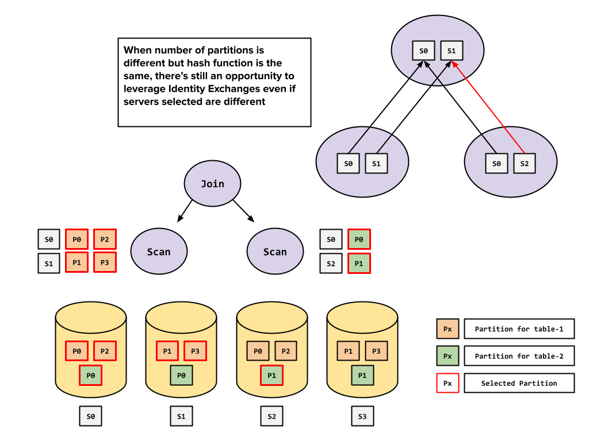

# Physical Optimizer


The Physical Optimizer is an optional query optimizer for the multi-stage engine, included in Pinot 1.4 and currently in Beta. This Beta label applies to the Physical Optimizer specifically, not to the core multi-stage engine, which is generally available.


We have added a new query optimizer in the Multistage Engine that computes and tracks precise Data Distribution across the entire plan before running some critical optimizations like Sort Pushdown, Aggregate Split/Pushdown, etc.

One of the biggest features of this Optimizer is that it can eliminate Shuffles or simplify Exchanges, when applicable, for arbitrarily complex queries, without requiring any Query Hints.

To enable this Optimizer for your MSE query, you can use the following Query Options:

```sql
SET useMultistageEngine=true;
SET usePhysicalOptimizer=true;
```

## Key Features

The examples below are based on the `COLOCATED_JOIN` Quickstart.

### Automatic Colocated Joins and Shuffle Simplification

Consider the query below which consists of 3 Joins. With the new query optimizer, the entire query can run without any cross-server data exchange, since the data is partitioned by userUUID into a compatible number of partitions (see the "Setting Up Table Data Distribution" section below).

```sql
SET useMultistageEngine = true;
SET usePhysicalOptimizer = true;

WITH filtered_users AS (
  SELECT 
    userUUID
  FROM userAttributes
  WHERE userUUID NOT IN (
    SELECT 
      userUUID
    FROM userGroups
      WHERE groupUUID = 'group-1'
  )
  AND userUUID IN (
    SELECT
      userUUID
    FROM userGroups
      WHERE groupUUID = 'group-2'
  )
)
SELECT 
  userUUID,
  SUM(tripAmount)
FROM userFactEvents
WHERE
  userUUID IN (
    SELECT userUUID FROM filtered_users
  )
GROUP BY userUUID
```

The query plan for this query is shown below. You can see that the entire query leverages `IDENTITY_EXCHANGE`, which is a 1:1 Exchange as defined in Exchange Types below.

```iecst
PhysicalExchange(exchangeStrategy=[SINGLETON_EXCHANGE])
  PhysicalAggregate(group=[{1}], agg#0=[$SUM0($0)], aggType=[DIRECT])
    PhysicalJoin(condition=[=($1, $2)], joinType=[semi])
      PhysicalExchange(exchangeStrategy=[IDENTITY_EXCHANGE])
        PhysicalProject(tripAmount=[$7], userUUID=[$10])
          PhysicalTableScan(table=[[default, userFactEvents]])
      PhysicalJoin(condition=[=($0, $1)], joinType=[semi])
        PhysicalProject(userUUID=[$0])
          PhysicalFilter(condition=[IS NOT TRUE($3)])
            PhysicalJoin(condition=[=($1, $2)], joinType=[left])
              PhysicalExchange(exchangeStrategy=[IDENTITY_EXCHANGE])
                PhysicalProject(userUUID=[$6], userUUID0=[$6])
                  PhysicalTableScan(table=[[default, userAttributes]])
              PhysicalExchange(exchangeStrategy=[IDENTITY_EXCHANGE])
                PhysicalAggregate(group=[{0}], agg#0=[MIN($1)], aggType=[DIRECT])
                  PhysicalProject(userUUID=[$4], $f1=[true])
                    PhysicalFilter(condition=[=($3, _UTF-8'group-1')])
                      PhysicalTableScan(table=[[default, userGroups]])
        PhysicalExchange(exchangeStrategy=[IDENTITY_EXCHANGE])
          PhysicalProject(userUUID=[$4])
            PhysicalFilter(condition=[=($3, _UTF-8'group-2')])
              PhysicalTableScan(table=[[default, userGroups]])
```

### Shuffle Simplification with Different Servers / Partition Count

The new optimizer can simplify shuffles even if:

* The Servers used by either side of a Join are different
* The Partition Count for the join inputs are different

In the example below, we have a Join performed across two tables: orange (left) and green (right).

The orange table has 4 partitions and the green table has 2 partitions. The servers selected for the Orange and Green tables are \[S0, S1] and \[S0, S2] respectively. The Join is performed in the servers \[S0, S1], because Physical Optimizer by default uses the same Workers as the leftmost input operator.

If the hash-function used for partitioning the two tables is the same, we can leverage an Identity Exchange and skip re-partitioning the data on either side of the join. This is because S0 will consist of records from partitions $$P_0$$ and $$P_2$$ of the Orange table, which together contain all records that would make up partition $$P_0$$ modulo 2. i.e.

$$
{(P_0 \cup P_2)}_{mod 4}  = (P_0)_{mod 2}
$$

Note that Identity Exchange does not imply that the servers in the sender and receiver will be the same. It only implies that there will be a 1:1 mapping from senders to receivers. In the example below, the data transfer from S2 to S1 will be over the network.



**

### Automatically Skip Aggregate Exchange

To evaluate something like `GROUP BY userUUID` accurately you would need to distribute records based on the `userUUID` column. The old query optimizer would add a Partitioning Exchange under each Aggregate, unless one used the query hint `is_partitioned_by_group_by_keys`.

The Physical Optimizer can detect when data is already partitioned by the required column, and will automatically skip adding an Exchange. This has two advantages:

* We avoid unnecessary Data Exchanges
* We avoid splitting the Aggregate, since by default when an Aggregate exists on top of an Exchange, a copy of the Aggregate is added under the Exchange (unless `is_skip_leaf_stage_group_by` query hint is set)

This optimization can be seen in action in the query example shared above. Since data is already partitioned by `userUUID`, all aggregations are run in `DIRECT` mode, i.e. without splitting the aggregate into multiple aggregates.

### Segment / Server Pruning

Similar to the Single Stage Engine, if you have enabled `segmentPrunerTypes` in your table's Routing config, the Physical Optimizer will prune segments and servers using time, partition or other pruner types for the Leaf Stage. e.g. the following query will only select segments which satisfy the following constraint:

```
segmentPartition = Murmur("user-1") % numPartitions
```

```sql
SET useMultistageEngine = true;
SET usePhysicalOptimizer = true;

WITH user_events AS (
  SELECT
    productCode, tripAmount
  FROM
    userFactEvents
  WHERE
    userUUID = 'user-1'
  ORDER BY
    ts
  DESC
  LIMIT 100
)
SELECT
  productCode,
  SUM(tripAmount)
FROM
  user_events
GROUP BY productCode
    
```

If partitioning is done in a way that segments corresponding to a given partition are present on only 1 server, then the entire query above will run within a single server, simulating shard-local execution from other systems.

### Solve Constant Queries in Pinot Broker

Apache Calcite is capable of detecting Filter Expressions that will always evaluate to False. In such cases, the query plan may not have any Table Scans at all. Physical Optimizer solves such queries within the Broker itself, without involving any servers.

```sql
SET useMultistageEngine = true;
SET usePhysicalOptimizer = true;

SELECT
  COUNT(*)
FROM
  userFactEvents
WHERE
  userUUID = 'user-1' AND userUUID = 'user-2'
```

## Worker Assignment

At present, Worker Assignment follows these simple rules:

* Leaf Stage will have workers assigned based on Table Scan and Filters, using the Routing configs set in the Table Config.
* Other Stages will use the same workers as the left-most input stage.
* Some Plan Nodes, such as `Sort(fetch=..)`, may require data to be collected in a single Worker. In such a case, that stage will be run on a single Worker, which will be randomly selected from one of the input workers.

## Limitations

Some of the features of the existing MSE query optimizer are not yet available in the Physical Optimizer. We aim to add support for most these in Pinot 1.5:

* Spools.
* Dynamic filters for semi-join
