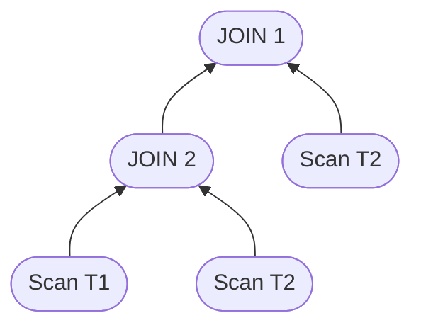
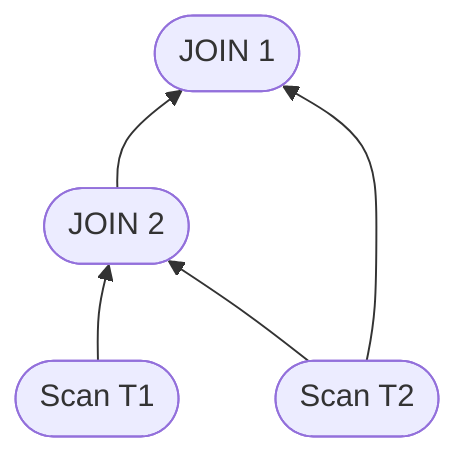

# Stage-Level Spooling


Stage-level spooling is still under development and may have some limitations.&#x20;

It is not recommended to turn them on by default but instead to enable them on a per-query basis after testing it actually improves the query performance.&#x20;

Users are encouraged to report any issues they encounter.


## Overview <a href="#overview" id="overview"></a>

In the multi-stage query engine, it is common for queries to inadvertently read from the same table or execute the same join multiple times. This can happen, for example, when using `WITH` expressions or complex joins. Such redundant operations can lead to significant performance overhead, especially when dealing with large datasets or expensive operations like joins and aggregations.

To address this issue, Apache Pinot now supports **stage-level spooling**, which identifies and eliminates redundant stages in the query execution plan. This optimization ensures that equivalent stages are executed only once, reducing unnecessary computation and improving query performance, particularly on stages involving repeated table scans, joins, or aggregations.

## FAQs <a href="#faqs" id="faqs"></a>

### How do I enable/disable this feature for specific queries? <a href="#q1-how-do-i-enabledisabled-this-feature-for-specific-queries" id="q1-how-do-i-enabledisabled-this-feature-for-specific-queries"></a>

Use `SET useSpools = true;` or `SET useSpools = false;` in your query.

### What happens if two stages are not equivalent? <a href="#q2-what-happens-if-two-stages-are-not-equivalent" id="q2-what-happens-if-two-stages-are-not-equivalent"></a>

The query will run as usual, without any optimization.

### How can I verify if stage-level spooling is working for my query? <a href="#q3-how-can-i-verify-if-stage-level-spooling-is-working-for-my-query" id="q3-how-can-i-verify-if-stage-level-spooling-is-working-for-my-query"></a>

Use the stage stats visualizer or `EXPLAIN IMPLEMENTATION PLAN FOR` to see the query execution plan. Look for the stage ID for each send operator. If stage-level spooling is applied, you should see the same stage ID for equivalent stages.

### Is this feature limited to WITH expressions? <a href="#q4-is-this-feature-limited-to-with-expressions" id="q4-is-this-feature-limited-to-with-expressions"></a>

No, it works for any query with equivalent stages, no matter how they are written.

### If a WITH expression is used twice in a query, will stage-level spooling always be applied? <a href="#q5-if-a-with-expression-is-used-twice-in-a-query-will-stage-level-spooling-always-be-applied" id="q5-if-a-with-expression-is-used-twice-in-a-query-will-stage-level-spooling-always-be-applied"></a>

No, the feature is only applied if the stages are equivalent after other optimizations are applied. See the limitations section for more details.

## Configuration <a href="#configuration" id="configuration"></a>

Stage-level spooling is **disabled by default** but can be enabled in the following ways:

* **Globally**: Change `pinot.broker.multistage.spools` in the broker configuration file to set whether stage-level spooling is enabled by default for all queries.
* **Per Query**: Use the `useSpools` option in the query to enable or disable stage-level spooling for that query.

## Example <a href="#example" id="example"></a>

See the following example to understand how stage-level spooling works:

```sql
SET useSpools = false; -- disable stage-level spooling
SELECT *
FROM T1
JOIN T2 as t2first
    ON T1.col1 = t2first.col2
JOIN T2 as t2second
    ON t2first.col3 = t2second.col3
```

This query will generate the following plan:



When stage-level spooling is enabled (ie, with `SET useSpools = true`), the plan will be optimized as follows:



## Limitations <a href="#limitations" id="limitations"></a>

### Equivalent stages <a href="#equivalent-stages" id="equivalent-stages"></a>

Stage-level spooling is automatically applied when the query planner detects equivalent stages. Users do not need to modify their queries to benefit from this optimization. However, understanding how it works can help in writing more efficient queries.

Two stages are considered equivalent if they:

* Have the same operators
  * This means that they have to project the same columns, apply the same filters, and perform the same aggregations, etc
* Their children's stages are equivalent.
* Have different parents.
  * These two stages that are direct children of the same join or union are not equivalent.

These conditions are applied after most Pinot logical optimizations are done. This means that even if two stages are equivalent in the SQL sentence, they may not be equivalent in the final plan. This is very common when using `WITH` expressions, which are just syntactic sugar and are expanded into the main query before optimizations are applied.

Two Pinot optimizations can easily disable the stage-level spooling: Filter and Projection pushdown.

Filter pushdown is an optimization that pushes the filter deeper into the execution plan. For example, imagine a query like:

```sql
WITH with1 AS (
  SELECT col1, col2, col3, count(*) 
  FROM table1 
  GROUP BY col1, col2, col3
)
SELECT * FROM with1 as t2 
JOIN table2 as t2
ON t1.col2 = t2.col2
JOIN with1 as t3
ON t2.col3 = t3.col3
WHERE t1.col3 = 2
```

In that query, the filter `t1.col3 = 2` is defined after both joins, but given that the predicate only depends on `t1`, Pinot will push the filter and the plan will look like:

```sql
SELECT * FROM (
  SELECT col1, col2, 2, count(*) 
  FROM table1 
  WHERE col3 = 2
  GROUP BY col1, col2
) as t2 
JOIN table2 as t2
ON t1.col2 = t2.col2
JOIN (
  SELECT col1, col2, col3, count(*)
  FROM table1
  GROUP BY col1, col2
) as t3
ON t2.col3 = t3.col3
```

As you can see, in the query, both usages of the WITH expression have been expanded, and the WHERE filter has been pushed down into the first one. This makes both subqueries different, so stage-level spooling will not be applied.

The same thing happens with projection pushdown, an optimization that pushes the projection down into the execution plan. This means that if you use a WITH expression twice in the same query but each time select different columns, the stages will not be equivalent.

Pinot decides to give higher priority to these optimizations than to stage-level spooling for several reasons. The main one is that these optimizations are more common and have a bigger impact on query performance. If you find use cases where you think stage-level spooling should have higher priority, please report them as a GitHub issue.

## Known issues <a href="#known-issues" id="known-issues"></a>

Stage-level spooling is a very extensive feature, and some scenarios are difficult to predict. This is why it is considered still under development and why it is not enabled by default. Users are encouraged to test it before enabling it for all queries and open GitHub issues if they find any issues.

Here is a list of known issues that were detected during the design and early development of this feature.

### Blocks, timeouts and memory <a href="#blocks-timeouts-and-memory" id="blocks-timeouts-and-memory"></a>

In some situations, a spooled stage may have parents that take a while to consume the data. During that time, the spooled stage will need to buffer the data, which can lead to memory pressure, timeouts, or other errors.

### Limited support on intermediate stages <a href="#limited-support-on-intermediate-stages" id="limited-support-on-intermediate-stages"></a>

Early adopters of stage-level spooling found some issues when multi-stage spooling was enabled in very large queries. Sometimes, the intermediate stages were not spooled, leading to planning time errors.

### Version support <a href="#version-support" id="version-support"></a>

* This feature is available in Apache Pinot version **1.3.0** and later.
* The first version that can spool intermediate stages is **1.4.0**.
* Stage stats visualizer was introduced in Apache Pinot version **1.3.0**,
  * In 1.3.0, each spool is shown as a different node with the same stage ID, so the visualization is going to have the same shape of the JSON that stores the stats.
  * In **1.4.0,** the visualization spooled stages are shown as a single node with edges to the stages that read from them.

### References <a href="#references" id="references"></a>

* [GitHub Issue #14196](https://github.com/apache/pinot/issues/14196): This is the GitHub issue that tracks the original design and work done to write this feature.
* [Design Document](https://docs.google.com/document/d/1HQhbpU8x4mcdt0mTEptOiu2cABNwrVUQXTh_nNB2pH8): a bit outdated but useful to understand how the feature works internally.

\
