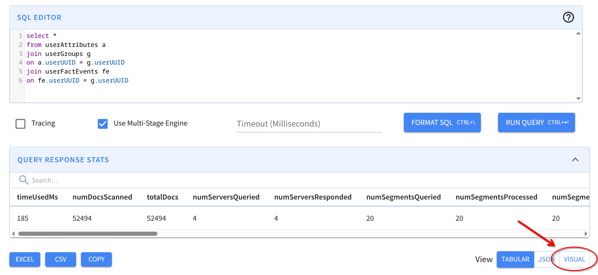

# Stats

Multi-stage stats (MSE) are more complex but also more expressive than single-stage stats. While in single-stage stats Apache Pinot returns a single set of statistics for the query, in multi-stage stats Apache Pinot returns a set of statistics for each operator of the query execution. These stats are collected by default and included in the response of any MSE query.

Starting in Pinot 1.6.0, the `stageStats` tree also includes leaf-stage pipeline-breaker subtrees by default. If an existing consumer needs the pre-1.6 shape, set `pinot.query.mse.skip.pipeline.breaker.stats=true` on the cluster to suppress those nodes again.

Each operator has its own set of statistics, which are collected during the execution of the query. See the [Operator Types](../../../build-with-pinot/querying-and-sql/multi-stage-query/operator-types) section to learn more about the different operator types and their statistics.

Use `activeWorkers` to detect uneven work distribution. `LEAF`, `MAILBOX_RECEIVE`, and `MAILBOX_SEND` count activity differently: a leaf worker is active when it has at least one segment, a receive worker when it receives at least one row, and a send worker when it sends at least one row. Compare each value with the stage's `parallelism`, and compare values down the operator tree to see where a stage narrows.

For `MAILBOX_SEND`, `maxEmittedRows` and `minNonzeroEmittedRows` show the row-count spread across workers that emitted data. A large difference indicates skew. Workers that emitted no rows are excluded from `minNonzeroEmittedRows`; use `activeWorkers` to identify idle workers.

### Multi-stage stats visualizer [](#multi-stage-stats-visualizer)

The recommended way to analyze the multi-stage stats is to use the visualizer included in the Pinot UI. It can be accessed by running a query in the Pinot controller UI and clicking on the `Visual` button.



**

Then, the view is changed to only show the multi-stage stats in a graph format like the following, where each node represents an operator. Inside each node, you can see the operator type and the statistics collected for that operator. Nodes are connected with edges that represent the relationship between the operators. Parent operators are above their children, and the edges' width represents the time spent on the child operator.

For example, the following query in ColocatedJoinQuickStart:

```sql
select * 
from userAttributes a 
join userGroups g
on a.userUUID = g.userUUID
join userFactEvents fe
on fe.userUUID = g.userUUID
```

Creates the following graph:

.png>)

**

Here we can see there are 5 stages (one for each MAILBOX\_SEND operator). A significant part of the time is spent in HASH\_JOIN on stage 1, followed by the read on `userFactEvents`. We can also see that stage 5, the one that reads from `userFactEvents` , returns 40000 rows while the other stage returns 2494 rows, so as explained in [Optimizing joins](optimizing-joins.md), it is better to have the smaller table on the right side of the join, so the query would be faster if written as:

```sql
select *
from userFactEvents fe
join (
    select *
    from userAttributes a
    join userGroups g
    on a.userUUID = g.userUUID
) as g
on fe.userUUID = g.userUUID
```

By default, the visualizer will only show the most important stats. To show all the stats, click on `Show details` button in the bottom left corner of the visualizer.

The graph being drawn is usually a tree-like structure, but it can be a directed acyclic graph (DAG) in some cases, like when using [spools](stage-level-spooling.md).

### The JSON format [](#the-json-format)

The Pinot UI stats visualizer is a convenient way to see the multi-stage stats, but sometimes you may want to see the raw JSON format. For example, you may want to analyze the stats programmatically or use a different visualization tool. To do so, you can read the `stageStats` field in the JSON response of the query.

When a query uses the streaming stats transport (`SET streamStats=true` or broker default `pinot.broker.mse.stream.stats=true`), the response also includes a `streamStatsCoverage` array. It is indexed by stage ID and reports how many workers responded cleanly, how many reported stats that the broker could not merge, and how many workers were still missing for that stage.

In streaming mode, mailbox send operators account their in-progress end-of-stream call before attaching stats to that
block. This prevents derived `selfExecutionTimeMs`, `selfClockTimeMs`, `selfAllocatedMB`, and `selfGcTimeMs` values from
becoming negative merely because a parent's final call had not yet been registered. The mailbox send snapshot does not
include the subsequent time used to serialize the stats and deliver the end-of-stream block.

```json
{
  "streamStatsCoverage": [
    null,
    {"responded": 4, "mergeFailed": 0, "missing": 0},
    {"responded": 3, "mergeFailed": 0, "missing": 1}
  ]
}
```

For example, the same query used in the previous section returns: Returns the following `stageStats`:

```json
{
  ...,
  "stageStats": {
    "type": "MAILBOX_RECEIVE",
    "executionTimeMs": 18,
    "emittedRows": 2494,
    "fanIn": 4,
    "rawMessages": 18,
    "deserializedBytes": 219393,
    "upstreamWaitMs": 80,
    "children": [
      {
        "type": "MAILBOX_SEND",
        "executionTimeMs": 75,
        "emittedRows": 2494,
        "stage": 1,
        "parallelism": 4,
        "fanOut": 1,
        "rawMessages": 14,
        "serializedBytes": 216854,
        "serializationTimeMs": 4,
        "children": [
          {
            "type": "HASH_JOIN",
            "executionTimeMs": 70,
            "emittedRows": 2494,
            "timeBuildingHashTableMs": 73,
            "children": [
              {
                "type": "MAILBOX_RECEIVE",
                "emittedRows": 2494,
                "fanIn": 4,
                "inMemoryMessages": 18,
                "rawMessages": 12,
                "deserializedBytes": 2085,
                "upstreamWaitMs": 131,
                "children": [
                  {
                    "type": "MAILBOX_SEND",
                    "executionTimeMs": 23,
                    "emittedRows": 2494,
                    "stage": 2,
                    "parallelism": 4,
                    "fanOut": 4,
                    "inMemoryMessages": 14,
                    "children": [
                      {
                        "type": "HASH_JOIN",
                        "executionTimeMs": 21,
                        "emittedRows": 2494,
                        "timeBuildingHashTableMs": 20,
                        "children": [
                          {
                            "type": "MAILBOX_RECEIVE",
                            "executionTimeMs": 1,
                            "emittedRows": 10000,
                            "fanIn": 2,
                            "inMemoryMessages": 6,
                            "rawMessages": 18,
                            "deserializedBytes": 221576,
                            "deserializationTimeMs": 3,
                            "upstreamWaitMs": 61,
                            "children": [
                              {
                                "type": "MAILBOX_SEND",
                                "executionTimeMs": 11,
                                "emittedRows": 10000,
                                "stage": 3,
                                "parallelism": 2,
                                "fanOut": 4,
                                "inMemoryMessages": 4,
                                "rawMessages": 12,
                                "serializedBytes": 220890,
                                "serializationTimeMs": 6,
                                "children": [
                                  {
                                    "type": "LEAF",
                                    "table": "userAttributes",
                                    "executionTimeMs": 8,
                                    "emittedRows": 10000,
                                    "numDocsScanned": 10000,
                                    "totalDocs": 10000,
                                    "numEntriesScannedPostFilter": 40000,
                                    "numSegmentsQueried": 4,
                                    "numSegmentsProcessed": 4,
                                    "numSegmentsMatched": 4,
                                    "threadCpuTimeNs": 4733524
                                  }
                                ]
                              }
                            ]
                          },
                          {
                            "type": "MAILBOX_RECEIVE",
                            "executionTimeMs": 7,
                            "emittedRows": 2494,
                            "fanIn": 2,
                            "inMemoryMessages": 10,
                            "rawMessages": 26,
                            "deserializedBytes": 46102,
                            "deserializationTimeMs": 3,
                            "upstreamWaitMs": 40,
                            "children": [
                              {
                                "type": "MAILBOX_SEND",
                                "executionTimeMs": 4,
                                "emittedRows": 2494,
                                "stage": 4,
                                "parallelism": 2,
                                "fanOut": 4,
                                "inMemoryMessages": 8,
                                "rawMessages": 20,
                                "serializedBytes": 45422,
                                "serializationTimeMs": 4,
                                "children": [
                                  {
                                    "type": "LEAF",
                                    "table": "userGroups",
                                    "executionTimeMs": 5,
                                    "emittedRows": 2494,
                                    "numDocsScanned": 2494,
                                    "totalDocs": 2494,
                                    "numEntriesScannedPostFilter": 4988,
                                    "numSegmentsQueried": 8,
                                    "numSegmentsProcessed": 8,
                                    "numSegmentsMatched": 8,
                                    "threadCpuTimeNs": 1423051
                                  }
                                ]
                              }
                            ]
                          }
                        ]
                      }
                    ]
                  }
                ]
              },
              {
                "type": "MAILBOX_RECEIVE",
                "executionTimeMs": 48,
                "emittedRows": 40000,
                "fanIn": 2,
                "inMemoryMessages": 10,
                "rawMessages": 30,
                "deserializedBytes": 1755012,
                "deserializationTimeMs": 7,
                "upstreamWaitMs": 133,
                "children": [
                  {
                    "type": "MAILBOX_SEND",
                    "executionTimeMs": 30,
                    "emittedRows": 40000,
                    "stage": 5,
                    "parallelism": 2,
                    "fanOut": 4,
                    "inMemoryMessages": 8,
                    "rawMessages": 24,
                    "serializedBytes": 1754652,
                    "serializationTimeMs": 15,
                    "children": [
                      {
                        "type": "LEAF",
                        "table": "userFactEvents",
                        "executionTimeMs": 21,
                        "emittedRows": 40000,
                        "numDocsScanned": 40000,
                        "totalDocs": 40000,
                        "numEntriesScannedPostFilter": 320000,
                        "numSegmentsQueried": 8,
                        "numSegmentsProcessed": 8,
                        "numSegmentsMatched": 8,
                        "threadCpuTimeNs": 32716947
                      }
                    ]
                  }
                ]
              }
            ]
          }
        ]
      }
    ]
  },
  ...
}
```

Each node in the tree represents an operation that is executed and the tree structure form is similar (but not equal) to the logical plan of the query that can be obtained with the `EXPLAIN PLAN` command.

The stats are always a tree structure when using the JSON format, even when [spools](stage-level-spooling.md) are used. In that case, the spooled stages will be included more than once in the tree. You will need to create the DAG yourself by looking at the `stage` field for each operator and connect the operators with the same stage ID.
