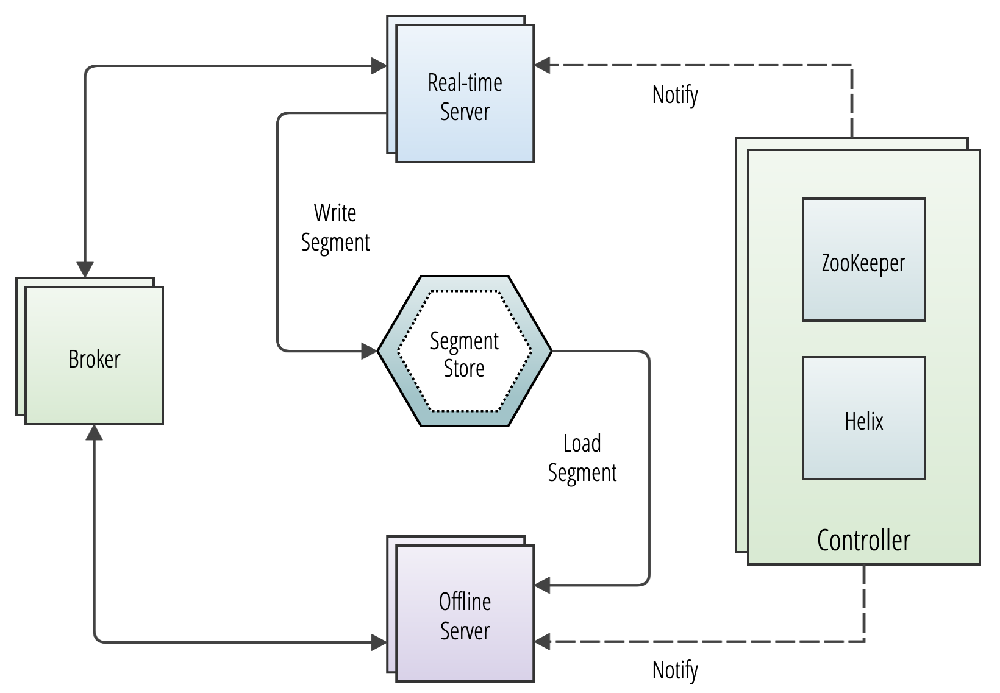

# Components

Apache Pinot™ is a database designed to deliver highly concurrent, ultra-low-latency queries on large datasets through a set of common data model abstractions. Delivering on these goals requires several foundational architectural commitments, including:

* Storing data in columnar form to support high-performance scanning
* Sharding of data to scale both storage and computation
* A distributed architecture designed to scale capacity linearly
* A tabular data model read by SQL queries

## Components

Learn about the major components and logical abstractions used in Pinot.

#### Operator reference

-   :octicons-server-24: [Cluster](cluster/)
    
    ---
    Pinot cluster overview and management.

-   :octicons-gear-24: [Controller](cluster/controller.md)

    ---
    Manages cluster metadata and operations.

-   :octicons-broadcast-24: [Broker](cluster/broker.md)
    
    ---
    Routes queries to appropriate servers.

-   :octicons-database-24: [Server](cluster/server.md)
    
    ---
    Stores and serves data segments.

-   :octicons-person-24: [Minion](cluster/minion.md)
    
    ---
    Executes background tasks.

-   :octicons-organization-24: [Tenant](cluster/tenant.md)
    
    ---
    Logical grouping for resource isolation.

#### Developer reference

-   :octicons-table-24: [Table](table/)
    
    ---
    Pinot table abstraction and management.

-   :octicons-file-code-24: [Schema](table/schema.md)
    
    ---
    Table schema definition.

-   :octicons-package-24: [Segment](table/segment/)
    
    ---
    Data segment details and operations.

