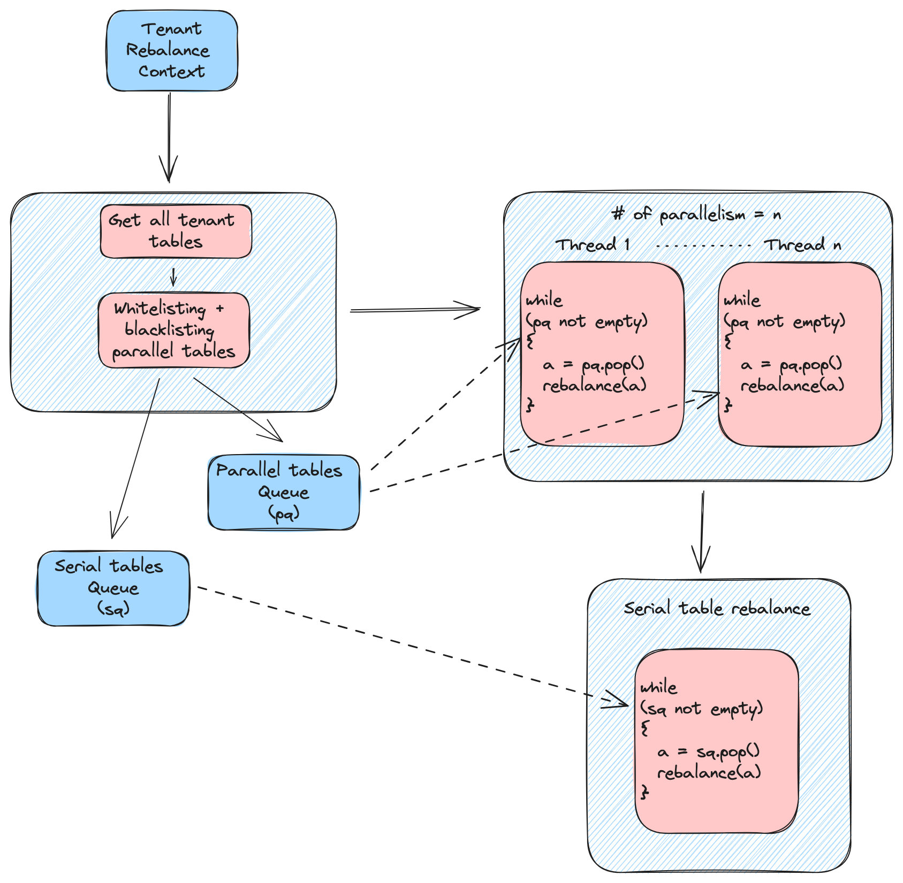

# Rebalance Tenant

Usually when we tag/untag servers to a tenant it gets tedious to rebalance each table under that tenant. This operation becomes impossible to handle if the tenant has large number of tables. The tenant rebalance operation allows us to do server rebalance on all the tables on a tenant and track the individual table rebalance progress with minimal operational overhead.

## Changes that require a rebalance

Basically all the factors which require server rebalance apply here. The only difference with this operation is it can address those changes over multiple tables with a single operation.

## How the tenant rebalance works

The tenant rebalance operation just provides a tunable orchestration of server rebalancing on multiple tables. Under the hood it leverages the existing server rebalance operation to perform the actual rebalance on each table. It provides the user a way to perform server rebalance on tables selectively in series and parallel. This is achieved using additional tuning parameters on top of usual [rebalance parameters](rebalance-servers.md#rebalance-parameters).



## Tuning parameters

The rebalance API for tenant will take the same set of [parameters](rebalance-servers.md#rebalance-parameters) as the server rebalance API. In addition to that the tenant rebalance API will also take the below parameters

| Request param       | Default vale | Description                                                                                                                                                                                                                                               |
| ------------------- | ------------ | --------------------------------------------------------------------------------------------------------------------------------------------------------------------------------------------------------------------------------------------------------- |
| tenantName          | null         | The tenant to rebalance                                                                                                                                                                                                                                   |
| degreeOfParallelism | 1            | Number of tables to rebalance in parallel at a time                                                                                                                                                                                                       |
| parallelWhitelist   | {}           | Set of tables that can be rebalanced in parallel with other tables in this set. If the set is empty and degree of parallelism is > 1 then all the tables under the tenant are considered as whitelist                                                     |
| parallelBlacklist   | {}           | Set of tables which should not be rebalanced in parallel with other tables in the tenant. This list takes priority over whitelist tables, i.e. if a table is present in both the lists its considered as blacklisted and hence not rebalanced in parallel |
| verboseResult       | false        | When set to true it will return all the server rebalance output for each table. When set to false it will only return the server rebalance job tracking id and status                                                                                     |

## Running a Rebalance

To run a tenant rebalance, use the following API. `POST /tenants/{tenantName}/rebalance`

Sample payload:

```json
{
  "tenantName": "DefaultTenant",
  "degreeOfParallelism": 2,
  "parallelWhitelist": [
    "airlineStats1_OFFLINE",
    "airlineStats2_OFFLINE"
  ],
  "parallelBlacklist": [
    "airlineStats1_REALTIME"
  ],
  "verboseResult": false,
  "dryRun": false,
  "downtime": false,
  "reassignInstances": false,
  "includeConsuming": false,
  "bootstrap": false,
  "minAvailableReplicas": 1,
  "bestEfforts": false,
  "updateTargetTier": false,
  "externalViewCheckIntervalInMs": 1000,
  "externalViewStabilizationTimeoutInMs": 3600000
}
```

Sample response:

```json
{
  "jobId": "dfbbebb7-1f62-497d-82a7-ded6e0d855e1",
  "rebalanceTableResults": {
    "airlineStats1_OFFLINE": {
      "jobId": "2d4dc2da-1071-42b5-a20c-ac38a6d53fc4",
      "status": "IN_PROGRESS",
      "description": "In progress, check controller task status for the progress"
    },
    "airlineStats2_OFFLINE": {
      "jobId": "2d4dc2da-497d-82a7-a20c-a113dfbbebb7",
      "status": "IN_PROGRESS",
      "description": "In progress, check controller task status for the progress"
    },
    "airlineStats1_REALTIME": {
      "jobId": "9284f137-29c1-4c5a-a113-17b90a484403",
      "status": "NO_OP",
      "description": "Table is already balanced"
    }
  }
}
```

## Observability

On tenant rebalance job submission it will return the job id for the tenant rebalance job to track the tenant rebalance progress along with all the individual table server rebalance job ids to track individual table rebalance progress.

### Tenant rebalance progress

To track the tenant rebalance progress use the below API `GET /tenants/rebalanceStatus/{jobId}` Sample response:

```json
{
  "tenantRebalanceProgressStats": {
    "startTimeMs": 1689679866904,
    "timeToFinishInSeconds": 2345,
    "completionStatusMsg": "Successfully rebalanced tenant DefaultTenant.",
    "tableStatusMap": {
      "airlineStats1_OFFLINE": "Table is already balanced",
      "airlineStats2_OFFLINE": "Table rebalance in progress",
      "airlineStats1_REALTIME": "Table is already balanced"
    },
    "totalTables": 3,
    "remainingTables": 1,
    "tableRebalanceJobIdMap": {
      "airlineStats1_OFFLINE": "2d4dc2da-1071-42b5-a20c-ac38a6d53fc4",
      "airlineStats2_OFFLINE": "2d4dc2da-497d-82a7-a20c-a113dfbbebb7",
      "airlineStats1_REALTIME": "9284f137-29c1-4c5a-a113-17b90a484403"
    }
  },
  "timeElapsedSinceStartInSeconds": 12345
}
```

### Table rebalance progress

Use the same API mentioned in [server rebalance status tracking](rebalance-servers.md#checking-status)
