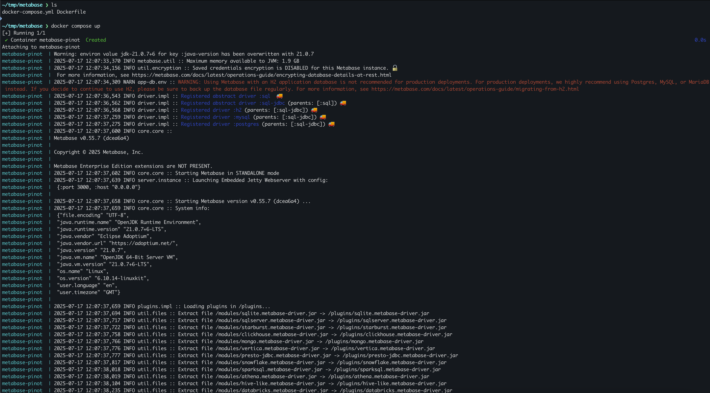

# Metabase

<figure><figcaption></figcaption></figure>

This guide provides step-by-step instructions for setting up Metabase with an Apache Pinot connector. The integration allows you to visualize and explore data stored in Apache Pinot directly within Metabase dashboards.

> Note: This is a preview version. For issues or bug reports, please join slack or file github issue.

The code is available at [https://github.com/startreedata/metabase-pinot-driver](https://github.com/startreedata/metabase-pinot-driver) under Apache 2 license.

## Prerequisites

Ensure the following tools are installed on your system:

* Git
* Docker
* Node.js (version 22+)
* Java (version 17+)
* Clojure 1.12.1.1550
* NodeJS 22
* NPM 10
* Yarn 1.22
* Apache Pinot 1.3.0
* Metabase v0.55.7

## QuickStart

### Local Run

* Start Pinot

To be simple, use Pinot docker image to run with quickstart

```bash
docker run -d --name pinot-quickstart -p 9000:9000 -p 8000:8000 -p 8080:8080 apachepinot/pinot:latest  QuickStart -type MULTI_STAGE
```

* Download Metabase

Go to Metabase release page, find the release jar.

This quickstart uses [Metabase v0.55.7](https://github.com/metabase/metabase/releases/tag/v0.55.7) .

JAR download: [https://downloads.metabase.com/v0.55.7.x/metabase.jar](https://downloads.metabase.com/v0.55.7.x/metabase.jar)

```bash
mkdir -p /tmp/metabase
cd /tmp/metabase
wget https://downloads.metabase.com/v0.55.7.x/metabase.jar
```

* Download Pinot driver

Pinot plugins are released at [https://github.com/startreedata/metabase-pinot-driver/releases](https://github.com/startreedata/metabase-pinot-driver/releases)

This QuickStart uses [Pinot Driver v1.0.1](https://github.com/startreedata/metabase-pinot-driver/releases/tag/v1.0.1)

```bash
mkdir -p /tmp/metabase/plugins
cd /tmp/metabase/plugins
wget -O pinot.metabase-driver.jar  https://github.com/startreedata/metabase-pinot-driver/releases/download/v1.0.1/pinot.metabase-driver-v1.0.1.jar
```

* Start Metabase with Pinot plugin

```bash
cd /tmp/metabase
java --add-opens java.base/java.nio=ALL-UNNAMED -jar metabase.jar
```

Now everything should come up, you could also find the pinot plugin is loaed from the log:

<figure><figcaption></figcaption></figure>

Once Metabase is up, go to [http://localhost:3000](http://localhost:3000/) to explore it.

After the login, you can click the right side bar to Add Pinot database:

<figure><figcaption></figcaption></figure>

<figure><figcaption></figcaption></figure>

After the configuration is done, Metabase will generate some explorations automatically.\\

<figure><figcaption></figcaption></figure>

<figure><figcaption></figcaption></figure>

<figure><figcaption></figcaption></figure>

<figure><figcaption></figcaption></figure>


### Docker Compose

Copy below `Dockerfile` and `docker-compose.yml` to a directory, e.g. `/tmp/metabase` .

`Dockerfile:`

```docker
FROM metabase/metabase:v0.55.7

RUN mkdir -p /plugins && \
    curl -L -o /plugins/pinot.metabase-driver.jar \
    https://github.com/startreedata/metabase-pinot-driver/releases/download/v1.0.1/pinot.metabase-driver-v1.0.1.jar

ENV MB_PLUGINS_DIR=/plugins
```

`docker-compose.yml:`

```yaml
services:
  metabase:
    build: .
    container_name: metabase-pinot
    ports:
      - "3000:3000"
    environment:
      - MB_PLUGINS_DIR=/plugins
    volumes:
      - metabase_data:/metabase-data
    restart: unless-stopped

volumes:
  metabase_data:

```

Run `docker compose up` to start everything:

<figure><figcaption></figcaption></figure>


## Advanced Options

### Authentication header

Users can enable it by expanding the advanced options, then enable `Authentication header`&#x20;

The supported `Auth Token Type`  is `Basic` or `Bearer` .

&#x20;`Auth Token Value` is a string from your admin.

<figure><figcaption></figcaption></figure>
