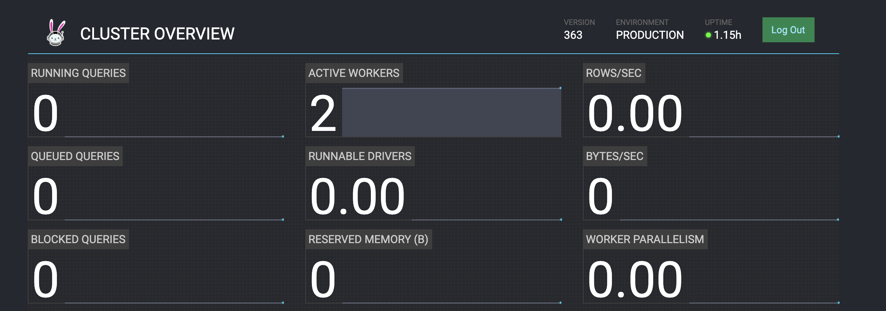

# Trino

Start running [Trino Image](https://hub.docker.com/r/trinodb/trino) with pre-built [Trino Pinot connector](https://trino.io/docs/current/connector/pinot.html).



#### 1. Install Pinot

Run below command to install Pinot using HelmCharts.

```
helm repo add pinot https://raw.githubusercontent.com/apache/pinot/master/kubernetes/helm
kubectl create ns pinot-quickstart
helm install pinot pinot/pinot -n pinot-quickstart --set cluster.name=pinot
```

You can create an example table by running the command below, if you are under pinot binary directory


Before PR [https://github.com/trinodb/trino/pull/7630](https://github.com/trinodb/trino/pull/7630) got merged, Change the Pinot table name to all lower cases for table conf/schema and ingestion job spec


```
bin/pinot-admin.sh BootstrapTable -dir examples/batch/airlineStats
```

#### 2. Install Trino

Run below command to add Trino Helm repo and fetch default helm config file:

```
helm repo add trino https://trinodb.github.io/charts/
helm inspect values trino/trino > /tmp/trino.yaml
```

Edit `/tmp/trino.yaml` file to add your pinot catalog:

Here, since pinot is deployed at namespace `pinot-quickstart`, so the controller url is `pinot-controller.pinot-quickstart:9000`

```
additionalCatalogs:
  pinot: |
    connector.name=pinot
    pinot.controller-urls=pinot-controller.pinot-quickstart:9000
```

Install Trino HelmCharts with config file:

```
helm create ns trino-quickstart
helm install my-trino trino/trino --version 0.2.0 --values /tmp/trino.yaml -n trino-quickstart 
```

#### 3. Connecting to Trino

Download Trino Client.

```
curl -L https://repo1.maven.org/maven2/io/trino/trino-cli/363/trino-cli-363-executable.jar -o /tmp/trino && chmod +x /tmp/trino
```

Port forward Trino service to your local if it's not already exposed.

```
export POD_NAME=$(kubectl get pods --namespace trino-quickstart -l "app=trino,release=my-trino,component=coordinator" -o jsonpath="{.items[0].metadata.name}")
echo "Visit http://127.0.0.1:8080 to use your application"
kubectl port-forward $POD_NAME 8080:8080 --namespace trino-quickstart
```

Use Trino console client to connect to Trino service

```
/tmp/trino --server localhost:8080 --catalog pinot --schema default
```

Then write your own queries:

```
trino:default> show tables;
     Table
---------------
 airlinestats
 baseballstats
(2 rows)

Query 20211022_214646_00003_gmppt, FINISHED, 3 nodes
Splits: 36 total, 36 done (100.00%)
0.44 [2 rows, 59B] [4 rows/s, 133B/s]
```

```
trino:default> select count(*) as flights_from_ca_to_ny from airlinestats where originstate='CA' and deststate='NY';
 flights_from_ca_to_ny
-----------------------
                    68
(1 row)

Query 20211022_215024_00007_gmppt, FINISHED, 1 node
Splits: 17 total, 17 done (100.00%)
2.14 [1 rows, 9B] [0 rows/s, 4B/s]
```

```
trino:default> select * from airlinestats limit 1;
 flightnum | origin | quarter | lateaircraftdelay | divactualelapsedtime | divwheelsons | divwheelsoffs |   airtime   |  arrdel15   | divtotalgtimes | deptimeblk | destcitymarketid |  divairportseqids  | dayssinceepoch | deptime | month | crselapsedtime | deststatename | carrier | destairportid | distance | arrtimeblk | divarrdelay | securitydelay | longestaddgtime | originwac | wheelsoff | destairportseqid | uniquecarrier | divreacheddest | diverted | actualelapsedtime | airlineid
-----------+--------+---------+-------------------+----------------------+--------------+---------------+-------------+-------------+----------------+------------+------------------+--------------------+----------------+---------+-------+----------------+---------------+---------+---------------+----------+------------+-------------+---------------+-----------------+-----------+-----------+------------------+---------------+----------------+----------+-------------------+-----------
        24 | SFO    |       1 |       -2147483648 |                 1968 | [1339, 2310] | [1908, 1758]  | -2147483648 | -2147483648 | [121, 50]      | 0700-0759  |            31703 | [1319801, 1072102] |          16075 |     723 |     1 |            335 | New York      | AA      |         12478 |     2586 | 1500-1559  |        1651 |   -2147483648 |     -2147483648 |        91 |       737 |          1247802 | AA            |              1 |        1 |       -2147483648 |     19805
(1 row)

Query 20211022_215050_00008_gmppt, FINISHED, 2 nodes
Splits: 48 total, 19 done (39.58%)
1.90 [2 rows, 1.65KB] [1 rows/s, 887B/s]
```

Meanwhile you can access [Trino Cluster UI](http://localhost:8080/ui/) to see query stats.





(Disclaimer: Trino is a third-party software that is not part of the Apache Software Foundation).
