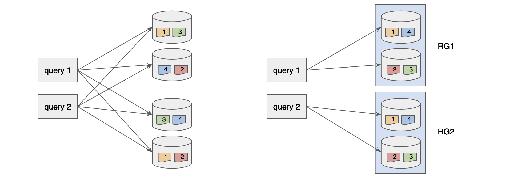
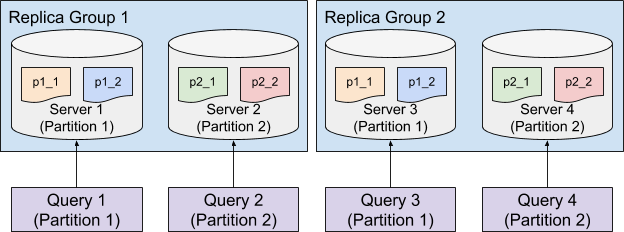

# Segment Assignment

Segment assignment refers to the strategy of assigning each segment from a table to the servers hosting the table. Picking the best segment assignment strategy can help reduce the overhead of the query routing, thus providing better performance.

## Dimension Tables

Dimension tables are a special case: Pinot always assigns their segments to all servers in the tenant so lookup queries can run locally on every server. If you want to make that default explicit, configure `segmentAssignmentConfigMap` at the top level of the table config with an `OFFLINE` entry whose `segmentAssignmentStrategy` is `allservers`. Leaving it unset also works. Balanced, replica-group, and round-robin strategies do not apply to dimension tables.

```json
{
  "segmentAssignmentConfigMap": {
    "OFFLINE": {
      "segmentAssignmentStrategy": "allservers"
    }
  }
}
```

## Balanced Segment Assignment

Balanced Segment Assignment is the default assignment strategy, where each segment is assigned to the server with the least segments already assigned. With this strategy, each server will have balanced query load, and each query will be routed to all the servers. It requires minimum configuration, and works well for small use cases.

.png>)

## Replica-Group Segment Assignment

Balanced Segment Assignment is ideal for small use cases with a small number of servers, but as the number of servers increases, routing each query to all the servers could harm the query performance due to the overhead of the increased fanout.

Replica-Group Segment Assignment is introduced to solve the horizontal scalability problem of the large use cases, which makes Pinot linearly scalable. This strategy breaks the servers into multiple replica-groups, where each replica-group contains a full copy of all the segments.

When executing queries, each query will only be routed to the servers within the same replica-group. In order to scale up the cluster, more replica-groups can be added without affecting the fanout of the query, thus not impacting the query performance but increasing the overall throughput linearly.



## Partitioned Replica-Group Segment Assignment

In order to further increase the query performance, we can reduce the number of segments processed for each query by partitioning the data and use the Partitioned Replica-Group Segment Assignment.

Partitioned Replica-Group Segment Assignment extends the Replica-Group Segment Assignment by assigning the segments from the same partition to the same set of servers. To solve a query which hits only one partition (e.g. `SELECT * FROM myTable WHERE memberId = 123` where `myTable` is partitioned with `memberId` column), the query only needs to be routed to the servers for the targeting partition, which can significantly reduce the number of segments to be processed. This strategy is especially useful to achieve high throughput and low latency for use cases that filter on an id field.



## Round-Robin Segment Assignment

Round-Robin Segment Assignment strategies are designed for use cases where new segments are in high demand. The standard Balanced and Replica-Group strategies assign new segments to instances with the lowest current segment count, which can create hotspots when many new segments are added simultaneously.

Round-Robin Segment Assignment instead cycles through instances in a round-robin order when assigning new segments, ensuring more even distribution of new data across the cluster. This prevents the newly added or less-loaded instances from becoming bottlenecks.

### RoundRobinSegmentAssignmentStrategy

This strategy extends `BalancedNumSegmentAssignmentStrategy` and uses round-robin ordering when assigning new segments. It picks the next `n_replica` instances in round-robin order rather than selecting instances with the fewest segments.

Use this strategy when:
- New segments are frequently added and have higher query demand than existing segments
- You want to avoid load concentration on newly added instances or those with lower segment counts
- Your table uses balanced (non-replica-group) assignment

### RoundRobinReplicaGroupSegmentAssignmentStrategy

This strategy extends `ReplicaGroupSegmentAssignmentStrategy` and applies round-robin ordering within each replica group. It selects the next instance in round-robin order within each replica group when assigning new segments.

Use this strategy when:
- You use replica-group segment assignment
- New segments are frequently added with higher query demand
- You want to distribute new segments evenly across instances within each replica group

### Configuration

To enable round-robin segment assignment in your table config, use the `segmentAssignmentConfigMap`:

```json
{
  "segmentAssignmentConfigMap": {
    "OFFLINE": {
      "segmentAssignmentStrategy": "roundRobin"
    }
  }
}
```

For replica-group variant, use:

```json
{
  "segmentAssignmentConfigMap": {
    "OFFLINE": {
      "segmentAssignmentStrategy": "roundRobinReplicaGroup"
    }
  }
}
```

### Important Notes

- The round-robin counter is maintained in-memory on each controller instance. With multiple controller instances, segment skew is bounded by the number of controllers (typically a small number, which is acceptable).
- The initial counter value is randomized across controllers to help reduce skew.
- Round-robin assignment only applies to new segment assignment (the `assignSegment()` operation). Non-bootstrap rebalancing operations use the same logic as the parent strategy.

## Configure Segment Assignment

Segment assignment is configured along with the instance assignment, check [Instance Assignment](instance-assignment.md) for details.
