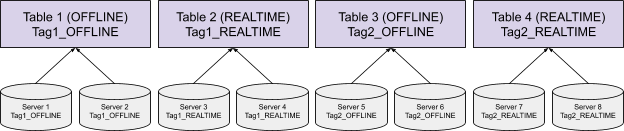
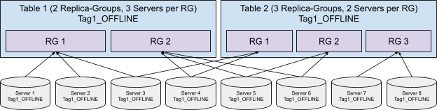
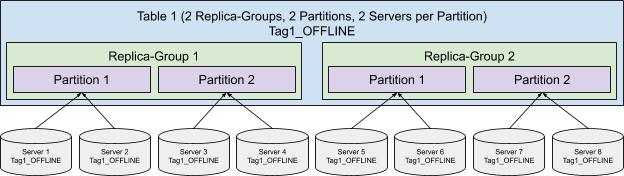
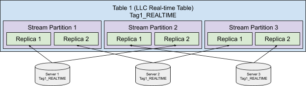

# Instance Assignment

Instance assignment is the strategy of assigning the servers to host a table. Each instance assignment strategy is associated with one segment assignment strategy (read more about [Segment Assignment](segment-assignment.md)).

Instance assignment is configured via the **InstanceAssignmentConfig**. Based on the config, Pinot can assign servers to a table, then assign segments to servers using the segment assignment strategy associated with the instance assignment strategy.

There are 3 types of instances for the InstanceAssignmentConfig: `OFFLINE`, `CONSUMING` and `COMPLETED`. `OFFLINE` represents the instances hosting the segments for the offline table; `CONSUMING` represents the instances hosting the consuming segments for the real-time table; `COMPLETED` represents the instances hosting the completed segments for the real-time table. For real-time table, if `COMPLETED` instances are not configured, completed segments will use the same instance assignment strategy as the consuming segments. If it is configured, completed segments will be automatically moved to the `COMPLETED` instances periodically.

## Default Instance Assignment

The default instance assignment strategy simply assigns all the servers in the cluster to each table, and uses the [Balanced Segment Assignment](segment-assignment.md#balanced-segment-assignment) for the table. This strategy requires no extra configurations for the cluster, and it works well for small clusters with few tables where all the resources can be shared among all the tables.


## Tag-Based Instance Assignment

For performance critical use cases, we might not want to share the server resources for multiple use cases to prevent the use case being impacted by other use cases hosted on the same set of servers. We can use the Tag-Based Instance Assignment to achieve isolation for tables.

(Note: Logically the Tag-Based Instance Assignment is identical to the [Tenant](../../basics/components/cluster/tenant.md) concept in Pinot, but just a different way of configuring the table. We recommend using the instance assignment over the tenant config because it can achieve more complex assignment strategies, as described below.)

In order to use the Tag-Based Instance Assignment, the servers should be tagged via the Helix **InstanceConfig**, where the tag suffix (`_OFFLINE` or `_REALTIME`) denotes the type of table the server is going to serve. Each server can have multiple tags if necessary.

After configuring the server tags, the Tag-Based Instance Assignment can be enabled by setting the `tag` within the InstanceAssignmentConfig for the table as shown below. Only the servers with this tag will be assigned to host this table, and the table will use the [Balanced Segment Assignment](segment-assignment.md#balanced-segment-assignment).




```javascript
{
  "listFields": {
    "TAG_LIST": [
      "Tag1_OFFLINE"
    ]
  },
  ...
}
```



```javascript
{
  "instanceAssignmentConfigMap": {
    "OFFLINE": {
      "tagPoolConfig": {
        "tag": "Tag1_OFFLINE"
      },
      "replicaGroupPartitionConfig": {
      }
    }
  },
  ...
}
```


## Control Number of Instances

On top of the Tag-Based Instance Assignment, we can also control the number of servers assigned to each table by configuring the `numInstances` in the InstanceAssignmentConfig. This is useful when we want to serve multiple tables of different sizes on the same set of servers. For example, suppose we have 30 servers hosting hundreds of tables for different analytics, we don’t want to use all 30 servers for each table, especially the tiny tables with only megabytes of data.



```javascript
{
  "instanceAssignmentConfigMap": {
    "OFFLINE": {
      "tagPoolConfig": {
        "tag": "Tag1_OFFLINE"
      },
      "replicaGroupPartitionConfig": {
        "numInstances": 2
      }
    }
  },
  ...
}
```


## Replica-Group Instance Assignment

In order to use the [Replica-Group Segment Assignment](segment-assignment.md#replica-group-segment-assignment), the servers need to be assigned to multiple replica-groups of the table, where the Replica-Group Instance Assignment comes into the picture. Enable it and configure the `numReplicaGroups` and `numInstancesPerReplicaGroup` in the InstanceAssignmentConfig, and Pinot will assign the instances accordingly.




```javascript
{
  "instanceAssignmentConfigMap": {
    "OFFLINE": {
      "tagPoolConfig": {
        "tag": "Tag1_OFFLINE"
      },
      "replicaGroupPartitionConfig": {
        "replicaGroupBased": true,
        "numReplicaGroups": 2,
        "numInstancesPerReplicaGroup": 3
      }
    }
  },
  ...
}
```


## Partitioned Replica-Group Instance Assignment

Similar to the Replica-Group Segment Assignment, in order to use the [Partitioned Replica-Group Segment Assignment](segment-assignment.md#partitioned-replica-group-segment-assignment), servers not only need to be assigned to each replica-group, but also the partition within the replica-group. Adding the `numPartitions` and `numInstancesPerPartition` in the InstanceAssignmentConfig can fulfill the requirement.

(Note: The `numPartitions` configured here does not have to match the actual number of partitions for the table in case the partitions of the table changed for some reason. If they do not match, the table partition will be assigned to the server partition in a round-robin fashion. For example, if there are 2 server partitions, but 4 table partitions, table partition 1 and 3 will be assigned to server partition 1, and table partition 2 and 4 will be assigned to server partition 2.)




```javascript
{
  "instanceAssignmentConfigMap": {
    "OFFLINE": {
      "tagPoolConfig": {
        "tag": "Tag1_OFFLINE"
      },
      "replicaGroupPartitionConfig": {
        "replicaGroupBased": true,
        "numReplicaGroups": 2,
        "numPartitions": 2,
        "numInstancesPerPartition": 2,
        "partitionColumn": "memberId"
      }
    }
  },
  ...
}
```



In order to use [Partitioned Replica-Group Segment Assignment](segment-assignment.md#partitioned-replica-group-segment-assignment), `partitionColumn` is required in `replicaGroupPartitionConfig`.


## Instance Assignment for Low Level Consumer (LLC) Real-time Table

For LLC real-time table, all the stream events are split into several stream partitions, and the events from each stream partition are consumed by a single server. Because the data is always partitioned, the LLC real-time table is using [Partitioned Replica-Group Instance Assignment](instance-assignment.md#partitioned-replica-group-instance-assignment) implicitly with `numPartitions` the same as the number of stream partitions, and `numInstancesPerPartition` of 1, and we don't allow configuring them explicitly. The replica-group based instance assignment can still be configured explicitly.

Without explicitly configuring the replica-group based instance assignment, the replicas of the stream partitions will be evenly spread over all the available instances as shown in the following diagram:



With replica-group based instance assignment, the stream partitions will be evenly spread over the instances within the replica-group:


## Pool-Based Instance Assignment

This strategy is designed for accelerating the no-downtime rolling restart of the large shared cluster.

For example, suppose we have a cluster with 100 servers hosting hundreds of tables, each table has 2 replicas. Without organizing the segments, in order to keep no-downtime (at least 1 replica for each table has to be alive) for the cluster, only one server can be shut down at the same time, or there is a very high chance that both replicas of some segments are served on the down servers, which causes down time for the segment. Rolling restart servers one by one could take a very long time (even days) for a large cluster with petabytes of data. Pool-Based Instance Assignment is introduced to help organize the segments so that each time multiple servers can be restarted at the same time without bringing down any segment.

To use the Pool-Based Instance Assignment, each server should be assigned to a pool under the tag via the Helix InstanceConfig as shown below. Then the strategy can be configured by enabling the `poolBased` in the InstanceAssignmentConfig. All the tables in this cluster should use the Replica-Group Instance Assignment, and Pinot will assign servers from different pools to each replica-group of the table. It is guaranteed that servers within one pool only host one replica of any table, and it is okay to shut down all servers within one pool without bringing down any table. This can significantly reduce the deploy time of the cluster, where the 100 servers for the above example can be restarted in 2 rounds (less than an hour) instead of 100 rounds (days).

(Note: A table can have more replicas than the number of pools for the cluster, in which case the replica-group will be assigned to the pools in a round-robin fashion, and the servers within a pool can host more than one replicas of the table. It is still okay to shut down the whole pool without bringing down the table because there are other replicas hosted by servers from other pools.)



```javascript
{
  "listFields": {
    "TAG_LIST": {
      "Tag1_OFFLINE"
    }
  },
  "mapFields": {
    "pool": {
      "Tag1_OFFLINE": 1
    }
  },
  ...
}
```



```javascript
{
  "instanceAssignmentConfigMap": {jav
    "OFFLINE": {
      "tagPoolConfig": {
        "tag": "Tag1_OFFLINE",
        "poolBased": true
      },
      "replicaGroupPartitionConfig": {
        "replicaGroupBased": true,
        "numReplicaGroups": 2,
        "numPartitions": 2,
        "numInstancesPerPartition": 2,
        "partitionColumn": "memberId"
      }
    }
  },
  ...
}
```



In order to use [Partitioned Replica-Group Segment Assignment](segment-assignment.md#partitioned-replica-group-segment-assignment), `partitionColumn` is required in `replicaGroupPartitionConfig`.


## Fault-Domain-Aware Instance Assignment

This strategy is to maximize Fault Domain diversity for replica-group based assignment strategy. Specifically, data center and cloud service (e.g. Azure) today provides the idea of rack or fault domain, as to ensure hardware resiliency upon power/network failure.

Specifically, if a table has _**R**_ replicas and the underlying infrastructure provides _**F**_ fault domains, then we guarantee that with the Fault-Domain-Aware Instance Assignment algorithm, if a fault domain is down, at most _**Ceil(R/F)**_ instances from _**R**_ mirrored machines can go down.

The configuration of this comes in two folds:

1. Tag the servers of a specific Fault Domain with the same pool ID (see instance config tagging in [pool based assignment](https://docs.pinot.apache.org/operators/operating-pinot/instance-assignment#pool-based-instance-assignment)).
2. Specify partitionSelector in instanceAssignmentConfigMap to use FD\_AWARE\_INSTANCE\_PARTITION\_SELECTOR

```javascript
{
  "instanceAssignmentConfigMap": {
    "OFFLINE": {
      "partitionSelector": "FD_AWARE_INSTANCE_PARTITION_SELECTOR",
      "tagPoolConfig": {
        "tag": "Tag1_OFFLINE",
        "poolBased": true
      },
      "replicaGroupPartitionConfig": {
        "replicaGroupBased": true,
        "numReplicaGroups": 2,
        "numPartitions": 2,
        "numInstancesPerPartition": 2
      }
    }
  },
  ...
}
```

## Change the Instance Assignment

Sometimes we don’t have the instance assignment configured in the optimal way in the first shot, or the capacity or requirement of the use case changes and we have to change the strategy. In order to do that, simply apply the table config with the updated InstanceAssignmentConfig, and kick off a rebalance of the table (read more about [Rebalance Servers](rebalance/rebalance-servers.md)). Pinot will reassign the instances for the table, and also rebalance the segments on the servers without downtime.
