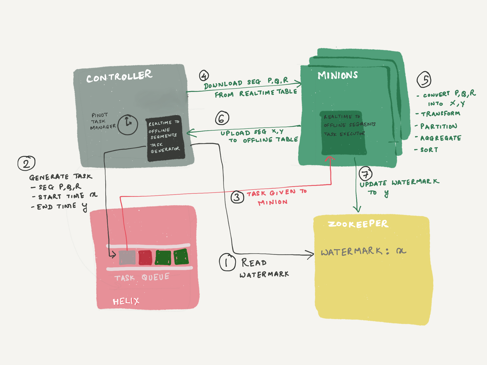

# Managed offline flows


Managed offline flows allow you to transition data from real-time to offline tables. This feature automatically manage the movement of the data to a corresponding OFFLINE table, so you don't have to write any offline jobs.

The most common use case for Pinot is providing real-time analytics based on streaming data with a real-time table. However, there's a few reasons you might want to also have that data available in an offline table, including the following examples:

  * In real-time tables, you can't easily replace segments or remove duplicate columns because all data must come in through streaming.
  * In real-time tables, there's no way to backfill a specific day's data, whereas for offline tables, you can run a one-off backfill job.
  * In real-time tables, the data tends to be highly granular. Offline tables let you look at bigger windows of data, including rollups for the time column, aggregations across common dimensions, better compression, and dedup.

## How it works

There are two parts to the process: task generation and task execution.
Let's look at each in turn.

### Task generation

Once the real-time to offline job has been scheduled, the task generator (running on the Pinot Controller) will create tasks to be run by a [Pinot Minion](https://docs.pinot.apache.org/basics/components/minion).

The generator determines the window start and end time based on the provided configuration.
It will then check to see if any of the completed segments are eligible by checking their start and end time, starting from the segment with the earliest time.
Eligible segments must overlap with that window, as shown in the diagram below:

<p>
    
    <em>Real-Time to Offline Job - Selecting eligible segments</em>
</p>

<Callout>
There must be at least one completed/flushed segment in the real-time table, otherwise the task won't try to create any offline segments.
</Callout> 

As long as some segments match the window, a task will be created and sent to the Minion. 
If no matching segments are found for the window, the generator will move to the next time window and repeat the process.

<Callout type="info">
When the generator is checking the most recently completed segment, it will make sure that the segment crosses over the end of the window to make sure that the consuming segment doesn't contain some portion of the window.
</Callout>

### Task Execution

Once the Minion receives a task to execute, it does the following steps:

1. Downloads the existing segments.
2. Filter records based on the time window
3. Round the time value in the records (optional)
4. Partition the records if partitioning is enabled in the table config
5. Merge records based on the merge type
6. Sort records if sorting is enabled in the table config
7. Uploads new segments to the Pinot Controller.
Managed offline flows moves records from the real-time table to the offline table one `time window` at a time. 

For example, if the real-time table has records with timestamp starting 10-24-2020T13:56:00, then the Pinot managed offline flows will move records for the time window \[10-24-2020, 10-25-2020) in the first run, followed by \[10-25-2020, 10-26-2020) in the next run, followed by \[10-26-2020, 10-27-2020) in the next run, and so on. This **window length** of one day is just the default, and it can be configured to any length of your choice.


**Note**

Only completed (ONLINE) segments of the real-time table are used for movement. If the window's data falls into the CONSUMING segment, that run will be skipped. That window will be processed in a future run when all data has made it to the completed segments.


This feature uses the **pinot-minions** and **the Helix Task Executor framework**. This feature consists of 2 parts



1. **RealtimeToOfflineSegmentsTaskGenerator** - This is the minion task scheduler, which schedules tasks of type "**RealtimeToOfflineSegmentsTask**". This task is scheduled by the controller periodic task - **PinotTaskManager**.\
   A **watermark is maintained in zookeeper**, which is the end time of the time window last successfully processed. The task generator refers to this watermark, to determine the start of the time window, for the next task it generates. The end time is calculated based on the window length (configurable, 1d default). The task generator will find all segments which have data in \[start, end), and set it into the **task configs**, along with the start and end.\
   The generator will not schedule a new task, unless the previous task has COMPLETED (or been stuck for over 24h). This is to ensure that we always move records in sequential time windows (exactly mimicking offline flows), because out-of-order data pushes will mess with the time boundary calculation of the hybrid table.
2. **RealtimeToOfflineSegmentsTaskExecutor** - This is a minion task executor to execute the RealtimeToOfflineSegmentsTask generated by the task generator. These **tasks are run by the pinot-minion** component.\
   The task executor will download all segments from the REALTIME table, as indicated in the task config. Using the SegmentProcessorFramework, it will **extract data for \[start, end), build the segments, and push them to the OFFLINE table**. The segment processor framework will **do any required partitioning & sorting based on the OFFLINE table config**.\
   Before exiting from the task, it will **update the watermark in zookeeper**, to reflect the end time of the time window processed.

### Config

**Step 0:** Start a pinot-minion

**Step 1**: Set up your REALTIME table. Add "RealtimeToOfflineSegmentsTask" in the task configs

```
"tableName": "myTable_REALTIME",
"tableType": "REALTIME",
...
...
"task": {
    "taskTypeConfigsMap": {
      "RealtimeToOfflineSegmentsTask": {
      }
    }
  }
```

**Step 2**: Create the corresponding OFFLINE table

**Step 3**: Enable PinotTaskManager

The PinotTaskManager periodic task is disabled by default. Enable this using one of the 2 methods described in [Auto-Schedule](https://docs.pinot.apache.org/basics/components/minion#auto-schedule) section. Set the frequency to some reasonable value (frequently is better, as extra tasks will not be scheduled unless required). Controller will need a restart after setting this config.

**Step 4**: Advanced configs

If needed, you can add more configs to the task configs in the REALTIME table, such as

```
"task": {
    "taskTypeConfigsMap": {
      "RealtimeToOfflineSegmentsTask": {
        "bucketTimePeriod": "6h",
        "bufferTimePeriod": "5d",
        "roundBucketTimePeriod": "1h",
        "mergeType": "rollup",
        "score.aggregationType": "max",
        "maxNumRecordsPerSegment": "100000"
      }
    }
  }
```

where,

| Property                                                                        | Description                                                                                                                                                                                                                                                                                                                                                            | Default   |
| ------------------------------------------------------------------------------- | ---------------------------------------------------------------------------------------------------------------------------------------------------------------------------------------------------------------------------------------------------------------------------------------------------------------------------------------------------------------------- | --------- |
| bucketTimePeriod                                                                | **Time window size** for each run. Adjust this to change the time window. E.g. if set to 1h, each task will process 1h data at a time.                                                                                                                                                                                                                                 | 1d        |
| bufferTimePeriod                                                                | <p><strong>Buffer time</strong>. Will not schedule tasks unless time window is older than this buffer.<br>Configure this according to how late you expect your data. E.g. if your system can emit events later than 3d, set this to 3d to make sure those are included.</p><p>Note: Once a given time window has been processed, it will never be processed again.</p> | 2d        |
| <p>roundBucketTimePeriod</p><p>(supported since release <code>0.8.0</code>)</p> | **Round the time value before merging the rows**. This is useful if time column is highly granular in the REALTIME table and is not needed by the application. In the OFFLINE table you can rollup the time values (e.g. milliseconds granularity in REALTIME table, but okay with minute level granularity in the application - set to `1m`                           | None      |
| <p>mergeType</p><p>(supported since release <code>0.8.0</code>)</p>             | <p>Allowed values are<br><strong>concat</strong> - no aggregations<br><strong>rollup</strong> - perform metrics aggregations across common dimensions + time<br><strong>dedup</strong> - deduplicates rows with the same values</p>                                                                                                                                    | concat    |
| {metricName}.aggregationType                                                    | **Aggregation function to apply to the metric** for aggregations. Only applicable for `rollup` case. Allowed values are `sum`, `max`, `min`                                                                                                                                                                                                                            | sum       |
| maxNumRecordsPerSegment                                                         | Control the **number of records you want in a segment generated**. Useful if the time window has many records, but you don't want them all in the same segment.                                                                                                                                                                                                        | 5,000,000 |


The following properties are deprecated/removed in release `0.8.0`

* **timeColumnTransformFunction** (removed): Use [ingestion transforms](../../developers/advanced/ingestion-level-transformations.md) or **roundBucketTimePeriod** instead
* **collectorType** (deprecated): Replaced by **mergeType**


### **Limitations & possible enhancements**

#### **Late data problem**

Once the time window has moved forward, it will never be processed again. If some data arrives into your stream after the window has moved on, that data will never be processed. Set the "bufferTimePeriod" accordingly, to account for late data issues in your setup.\
We will potentially consider ability to schedule ad hoc one-off tasks. For example, user can specify "rerun for day 10/23", which would sweep all segments again and collect data, replacing the old segments. This will help resolve the problem of data arriving very late.

#### Backfill/bootstrap

This feature automates the daily/hourly pushes to the offline counterpart of your hybrid table. And since you now have an OFFLINE table created, it opens up the possibility of doing an ad hoc backfill or re-bootstrap. However, there are no mechanisms for doing an automated backfill/re-bootstrap from some offline data. You still have to write your own flows for such scenarios.

#### Memory constraints

The segments download, data extraction, transformation, aggregations, sorting all happens on a single minion node for every run. You will need to be mindful of the memory available on the minion machine. Adjust the `bucketSize` and `maxNumRecordsPerSegment` if you are running into memory issues.\
We will potentially introduce smarter config adjustments based on memory, or consider using Spark/Hadoop MR.

\\
