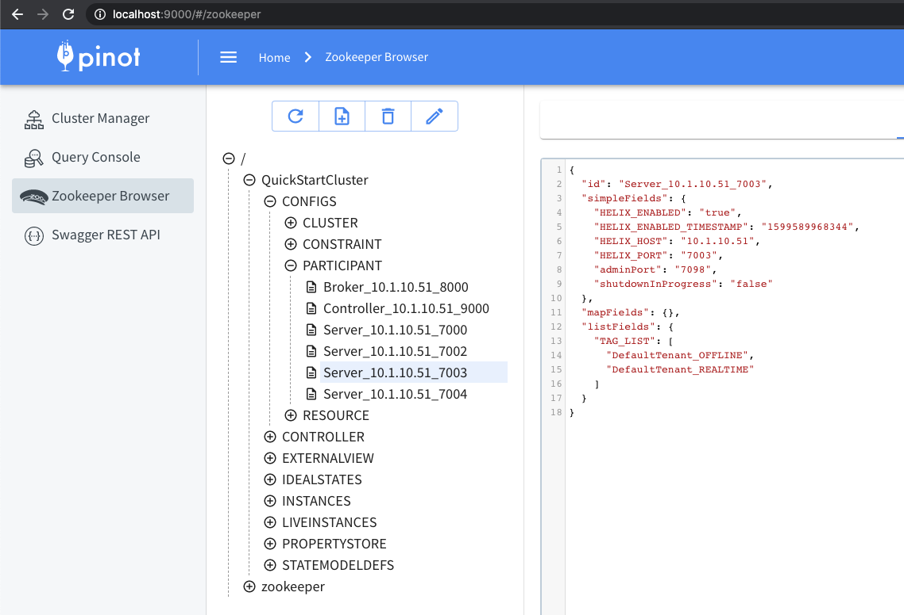

# Rebalance Servers

The rebalance operation is used to recompute the assignment of brokers or servers in the cluster. This is not a single command, but rather a series of steps that need to be taken.

In the case of servers, rebalance operation is used to balance the distribution of the segments amongst the servers being used by a Pinot table. This is typically done after capacity changes or config changes such as replication or segment assignment strategies or table migration to a different tenant.

## Changes that require a rebalance

Below are changes that need to be followed by a rebalance.

1. Capacity changes
2. Increasing/decreasing replication for a table
3. Changing segment assignment for a table
4. Moving table from one tenant to a different tenant

### Capacity changes

These are typically done when downsizing/uplifting a cluster or replacing nodes of a cluster.

#### Tenants and tags

Every server added to the Pinot cluster has tags associated with it. A group of servers with the same tag forms a server tenant.

By default, a server in the cluster gets added to the `DefaultTenant` i.e. gets tagged as `DefaultTenant_OFFLINE` and `DefaultTenant_REALTIME`.

Below is an example of how this looks in the znode, as seen in ZooInspector.



A Pinot table config has a tenants section, to define the tenant to be used by the table. The Pinot table will use all the servers which belong to the tenant as described in this config. For more details about this, see the [Tenants](../../../basics/components/cluster/tenant.md) section.

```
 {   
    "tableName": "myTable_OFFLINE",
    "tenants" : {
      "broker":"DefaultTenant",
      "server":"DefaultTenant"
    }
  }
```

#### Updating tags

_**0.6.0 onwards**_

In order to change the server tags, use the following API.

`PUT /instances/{instanceName}/updateTags?tags=<comma separated tags>`

_**0.5.0 and prior**_

UpdateTags API is not available in 0.5.0 and prior. Instead, use this API to update the Instance.

`PUT /instances/{instanceName}`

For example,

```
curl -X PUT "http://localhost:9000/instances/Server_10.1.10.51_7000" 
    -H "accept: application/json" 
    -H "Content-Type: application/json" 
    -d "{ \"host\": \"10.1.10.51\", \"port\": \"7000\", \"type\": \"SERVER\", \"tags\": [ \"newName_OFFLINE\", \"DefaultTenant_REALTIME\" ]}"
```


**NOTE**

The output of GET and input of PUT don't match for this API. Make sure to use the right payload as shown in example above. Particularly, notice that the instance name "Server\_host\_port" gets split up into separate fields in this PUT API.


When upsizing/downsizing a cluster, you will need to make sure that the host names of servers are consistent. You can do this by setting the following config parameter:

```
pinot.set.instance.id.to.hostname=true
```

### Replication changes

In order to change the replication factor of a table, update the table config as follows:

OFFLINE table - update the `replication` field

REALTIME table - update the `replicasPerPartition` field

### Segment Assignment changes

The most common segment assignment change is moving from the default segment assignment to replica group segment assignment. Discussing the details of the segment assignment is beyond the scope of this page. More details can be found in [Routing](../tuning/routing.md) and in this [FAQ question](../../../basics/getting-started/frequent-questions/#docs-internal-guid-3eddb872-7fff-0e2a-b4e3-b1b43454add3).

### Table Migration to a different tenant

In a scenario where you need to move table across tenants, for e.g table was assigned earlier to a different Pinot tenant and now you want to move it to a separate one, then you need to call the rebalance API with reassignInstances set to true.

To move a table to other tenants, modify the following configs in both realtime and offline tables:



```
"REALTIME": {
  ...
  "tenants": {
    ...
    "server": "<tenant_name>",
    ...
  },
  ...
  "instanceAssignmentConfigMap": {
    ...
    "CONSUMING": {
      ...
      "tagPoolConfig": {
        ...
        "tag": "<tenant_name>_REALTIME",
        ...
      },
      ...
    },
    ...
    "COMPLETED": {
      ...
      "tagPoolConfig": {
        ...
        "tag": "<tenant_name>_REALTIME",
        ...
      },
      ...
    },
    ...
  },
  ...
}
```



```
"OFFLINE": {
  ...
  "tenants": {
    ...
    "server": "<tenant_name>",
    ...
  },
  ...
  "instanceAssignmentConfigMap": {
    ...
    "OFFLINE": {
      ...
      "tagPoolConfig": {
        ...
        "tag": "<tenant_name>_OFFLINE",
        ...
      },
      ...
    },
    ...
  },
  ...
}
```



## Rebalance Algorithms

Currently, two rebalance algorithms are supported; one is the default algorithm and the other one is minimal data movement algorithm.

### The Default Algorithm

This algorithm is used for most of the cases. When `reassignInstances` parameter is set to true, the final lists of instance assignment will be re-computed, and the list of instances is sorted per partition per replica group. Whenever the table rebalance is run, segment assignment will respect the sequence in the sorted list and pick up the relevant instances.

### Minimal Data Movement Algorithm

This algorithm focuses more on minimizing the data movement during table rebalance. When `reassignInstances` parameter is set to true and this algorithm gets enabled, the position of instances which are still alive remains the same, and vacant seats are filled with newly added instances or last instances in the existing alive instance candidate. So only the instances which change the position will involve in data movement.

In order to switch to this table rebalance algorithm, just simply set the following config to the table config before triggering table rebalance:

```
"instanceAssignmentConfigMap": {
  ...
  "OFFLINE": {
    ...
    "replicaGroupPartitionConfig": {
      ...
      "minimizeDataMovement": true,
      ...
    },
    ...
  },
  ...
}
```

When `instanceAssignmentConfigMap` is not explicitly configured, `minimizeDataMovement` flag can also be set into the `segmentsConfig`:

```
"segmentsConfig": {
    ...
    "minimizeDataMovement": true,
    ...
}
```

## Running a Rebalance

After any of the above described changes are done, a rebalance is needed to make those changes take effect.

To run a rebalance, use the following API.

`POST /tables/{tableName}/rebalance?type=<OFFLINE/REALTIME>`

This API has a lot of parameters to control its behavior. Make sure to go over them and change the defaults as needed.


**Note**

Typically, the flags that need to be changed from the default values are

**includeConsuming=true** for REALTIME

**downtime=true** if you have only 1 replica, or prefer a faster rebalance at the cost of a momentary downtime


### Rebalance Parameters

| Query param                          | Default value | Description                                                                                                                                                                                                                                                                                                                                                                                                                                                                                                                                                                                                                                                                                                                                                                                                                     |
| ------------------------------------ | ------------- | ------------------------------------------------------------------------------------------------------------------------------------------------------------------------------------------------------------------------------------------------------------------------------------------------------------------------------------------------------------------------------------------------------------------------------------------------------------------------------------------------------------------------------------------------------------------------------------------------------------------------------------------------------------------------------------------------------------------------------------------------------------------------------------------------------------------------------- |
| dryRun                               | false         | If set to true, **rebalance is run as a dry-run** so that you can see the expected changes to the ideal state and instance partition assignment.                                                                                                                                                                                                                                                                                                                                                                                                                                                                                                                                                                                                                                                                                |
| preChecks                            | false         | If set to true, some pre-checks are performed and their status is returned. This can only be used with **dryRun=true.** See the section below for more details.                                                                                                                                                                                                                                                                                                                                                                                                                                                                                                                                                                                                                                                                 |
| includeConsuming                     | true          | <p>Applicable for REALTIME tables.</p><p><strong>CONSUMING segments are rebalanced only if this is set to true</strong>.<br>Moving a CONSUMING segment involves dropping the data consumed so far on old server, and re-consuming on the new server. If an application is sensitive to <strong>increased memory utilization due to re-consumption or to a momentary data staleness</strong>, they may choose to not include consuming in the rebalance. Whenever the CONSUMING segment completes, the completed segment will be assigned to the right instances, and the new CONSUMING segment will also be started on the correct instances. If you choose to includeConsuming=false and let the segments move later on, any downsized nodes need to remain untagged in the cluster, until the segment completion happens.</p> |
| downtime                             | false         | <p><strong>This controls whether Pinot allows downtime while rebalancing.</strong><br>If downtime = true, all replicas of a segment can be moved around in one go, which could result in a momentary downtime for that segment (time gap between ideal state updated to new servers and new servers downloading the segments).<br>If downtime = false, Pinot will make sure to keep certain number of replicas (config in next row) always up. The rebalance will be done in multiple iterations under the hood, in order to fulfill this constraint.</p><p><strong>Note</strong>: <em>If you have only 1 replica for your table, rebalance with downtime=false is not possible.</em></p>                                                                                                                                       |
| minAvailableReplicas                 | -1            | <p>Applicable for rebalance with downtime=false.</p><p>This is the <strong>minimum number of replicas that are expected to stay alive</strong> through the rebalance.</p>                                                                                                                                                                                                                                                                                                                                                                                                                                                                                                                                                                                                                                                       |
| lowDiskMode                          | false         | <p>Applicable for rebalance with downtime=false.<br>When enabled, segments will first be offloaded from servers, then added to servers after offload is done. It may increase the total time of the rebalance, but can be useful when servers are low on disk space, and we want to scale up the cluster and rebalance the table to more servers.</p>                                                                                                                                                                                                                                                                                                                                                                                                                                                                           |
| bestEfforts                          | false         | <p>Applicable for rebalance with downtime=false.</p><p>If a no-downtime rebalance cannot be performed successfully, this flag <strong>controls whether to fail the rebalance or do a best-effort rebalance</strong>. <strong>Warning:</strong> <em>setting this flag to true can cause downtime under two scenarios: 1) any segments get into ERROR state and 2) EV-IS convergence times out</em></p>                                                                                                                                                                                                                                                                                                                                                                                                                           |
| reassignInstances                    | true          | Applicable to tables where the instance assignment has been persisted to zookeeper. Setting this to true will make the rebalance **first update the instance assignment, and then rebalance the segments**. This option should be set to true if the instance assignment will be changed (e.g. increasing replication or instances per replica for replicaGroup based assignment)                                                                                                                                                                                                                                                                                                                                                                                                                                               |
| minimizeDataMovement                 | ENABLE        | Whether to ENABLE minimizeDataMovement, DISABLE it, or DEFAULT to the value in the TableConfig. If enabled, it reduces the segments that will be moved by trying to minimize the changes to the instance assignment. For tables using implicit instance assignment (no INSTANCE\_PARTITIONS) this is a no-op.                                                                                                                                                                                                                                                                                                                                                                                                                                                                                                                   |
| bootstrap                            | false         | Rebalances all segments again, **as if adding segments to an empty table**. If this is false, then the rebalance will try to minimize segment movements. **Warning:** _Only use this option if a reshuffle of all segments is desirable._                                                                                                                                                                                                                                                                                                                                                                                                                                                                                                                                                                                       |
| externalViewCheckIntervalInMs        | 1000          | How often to check if external view converges with ideal states                                                                                                                                                                                                                                                                                                                                                                                                                                                                                                                                                                                                                                                                                                                                                                 |
| externalViewStabilizationTimeoutInMs | 3600000       | How long to wait till external view converges with ideal states. For large tables it is recommended to increase this timeout.                                                                                                                                                                                                                                                                                                                                                                                                                                                                                                                                                                                                                                                                                                   |
| heartbeatIntervalInMs                | 300000        | How often to make a status update (i.e. heartbeat)                                                                                                                                                                                                                                                                                                                                                                                                                                                                                                                                                                                                                                                                                                                                                                              |
| heartbeatTimeoutInMs                 | 3600000       | How long to wait for next status update (i.e. heartbeat) before the job is considered failed                                                                                                                                                                                                                                                                                                                                                                                                                                                                                                                                                                                                                                                                                                                                    |
| maxAttempts                          | 3             | Max number of attempts to rebalance                                                                                                                                                                                                                                                                                                                                                                                                                                                                                                                                                                                                                                                                                                                                                                                             |
| retryInitialDelayInMs                | 300000        | Initial delay to exponentially backoff retry                                                                                                                                                                                                                                                                                                                                                                                                                                                                                                                                                                                                                                                                                                                                                                                    |
| updateTargetTier                     | false         | Whether to update segment target tier as part of the rebalance. Only relevant for tiered storage enabled tables.                                                                                                                                                                                                                                                                                                                                                                                                                                                                                                                                                                                                                                                                                                                |

### Checking status

The following API is used to check the progress of a rebalance Job. The API takes the jobId of the rebalance job. The API to see the jobIds of rebalance Jobs for a table is shown next.


Note that rebalanceStatus API is available from this [commit](https://github.com/apache/pinot/pull/10359)


```
curl -X GET "https://localhost:9000/rebalanceStatus/ffb38717-81cf-40a3-8f29-9f35892b01f9" -H "accept: application/json"
```

```json
{"tableRebalanceProgressStats": {
    "startTimeMs": 1679073157779,
    "status": "DONE", // IN_PROGRESS/DONE/FAILED    
    "timeToFinishInSeconds": 0, // Time it took for the rebalance job after it completes/fails 
    "completionStatusMsg": "Finished rebalancing table: airlineStats_OFFLINE with minAvailableReplicas: 1, enableStrictReplicaGroup: false, bestEfforts: false in 44 ms."
     
     // The total amount of work required for rebalance 
    "initialToTargetStateConvergence": {
      "_segmentsMissing": 0, // Number of segments missing in the current state but present in the target state
      "_segmentsToRebalance": 31, // Number of segments that needs to be assigned to hosts so that the current state can get to the target state.
      "_percentSegmentsToRebalance": 100, // Total number of replicas that needs to be assigned to hosts so that the current state can get to the target state.
      "_replicasToRebalance": 279 // Remaining work to be done in %
    },
    
    // The pending work for rebalance
    "externalViewToIdealStateConvergence": {
      "_segmentsMissing": 0,
      "_segmentsToRebalance": 0,
      "_percentSegmentsToRebalance": 0,
      "_replicasToRebalance": 0
    },
    
    // Additional work to catch up with the new ideal state, when the ideal 
    // state shifts since rebalance started. 
    "currentToTargetConvergence": {
      "_segmentsMissing": 0,
      "_segmentsToRebalance": 0,
      "_percentSegmentsToRebalance": 0,
      "_replicasToRebalance": 0
    },
  },
  "timeElapsedSinceStartInSeconds": 28 // If rebalance is IN_PROGRESS, this gives the time elapsed since it started
  }
```

Below is the API to get the jobIds of rebalance jobs for a given table. The API takes the table name and jobType which is TABLE\_REBALANCE.

```
curl -X GET "https://localhost:9000/table/airlineStats_OFFLINE/jobstype=OFFLINE&jobTypes=TABLE_REBALANCE" -H "accept: application/json"
```

```json
 "ffb38717-81cf-40a3-8f29-9f35892b01f9": {
    "jobId": "ffb38717-81cf-40a3-8f29-9f35892b01f9",
    "submissionTimeMs": "1679073157804",
    "jobType": "TABLE_REBALANCE",
    "REBALANCE_PROGRESS_STATS": "{\"initialToTargetStateConvergence\":{\"_segmentsMissing\":0,\"_segmentsToRebalance\":31,\"_percentSegmentsToRebalance\":100.0,\"_replicasToRebalance\":279},\"externalViewToIdealStateConvergence\":{\"_segmentsMissing\":0,\"_segmentsToRebalance\":0,\"_percentSegmentsToRebalance\":0.0,\"_replicasToRebalance\":0},\"currentToTargetConvergence\":{\"_segmentsMissing\":0,\"_segmentsToRebalance\":0,\"_percentSegmentsToRebalance\":0.0,\"_replicasToRebalance\":0},\"startTimeMs\":1679073157779,\"status\":\"DONE\",\"timeToFinishInSeconds\":0,\"completionStatusMsg\":\"Finished rebalancing table: airlineStats_OFFLINE with minAvailableReplicas: 1, enableStrictReplicaGroup: false, bestEfforts: false in 44 ms.\"}",
    "tableName": "airlineStats_OFFLINE"
```


Note that rebalanceStatus API's result has changed from this [commit](https://github.com/apache/pinot/pull/15266) to add two sections to the existing stats. The goal is to eventually remove the existing stats in favor of these new ones.


From [commit](https://github.com/apache/pinot/pull/15266) onwards, the stats will include the following newly added sections to the original stats posted above:

```json
  "rebalanceProgressStatsOverall": { // Meant to be used to track overall progress of the rebalance job
    "totalSegmentsToBeAdded": 60, // Segments to be added overall as part of this rebalance job
    "totalSegmentsToBeDeleted": 60, // Segments to be deleted overall as part of this rebalance job
    "totalRemainingSegmentsToBeAdded": 21, // Segments that are yet to be added
    "totalRemainingSegmentsToBeDeleted": 15, // Segments that are yet to be deleted
    "totalRemainingSegmentsToConverge": 0, // Segments that belong to the correct instance but who's EV state doesn't match the expected IS state
    "totalCarryOverSegmentsToBeAdded": 0, // Segments adds carried over from the previous rebalance step
    "totalCarryOverSegmentsToBeDeleted": 0, // Segment deletes carried over from the previous rebalance step
    "totalUniqueNewUntrackedSegmentsDuringRebalance": 0, // Newly added segments detected but which are not yet monitored by the rebalance job, some of these may be monitored later
    "percentageRemainingSegmentsToBeAdded": 35, // Percentage segments yet to be added (including carry-over segments)
    "percentageRemainingSegmentsToBeDeleted": 25, // Percentage segments yet to be deleted (including carry-over segments)
    "estimatedTimeToCompleteAddsInSeconds": 10476.487, // Estimated time to complete segment adds in seconds based on historical time taken so far
    "estimatedTimeToCompleteDeletesInSeconds": 6485.444333333333, // Estimated time to complete segment deletes in seconds based on historical time taken so far
    "averageSegmentSizeInBytes": 5448028669, // Average segment size in bytes
    "totalEstimatedDataToBeMovedInBytes": 326881720140, // Total estimated data to be moved (total segments to be added * average segment size)
    "startTimeMs": 1744393492152 // Start time of the rebalance job
  },
  "rebalanceProgressStatsCurrentStep": { // Captures the stats of the current rebalance step being performed
    "totalSegmentsToBeAdded": 45, // Segments to be added as part of this rebalance step
    "totalSegmentsToBeDeleted": 45, // Segments to be deleted as part of this rebalance step
    "totalRemainingSegmentsToBeAdded": 6, // Segments that are yet to be added in this rebalance step
    "totalRemainingSegmentsToBeDeleted": 0, // Segments that are yet to be deleted in this rebalance step
    "totalRemainingSegmentsToConverge": 0, // Segments that belong to the correct instance but who's EV state doesn't match the expected IS state
    "totalCarryOverSegmentsToBeAdded": 0, // Segments adds carried over from the previous rebalance step
    "totalCarryOverSegmentsToBeDeleted": 0, // Segments deletes carried over from the previous rebalance step
    "totalUniqueNewUntrackedSegmentsDuringRebalance": 0, // Newly added segments detected but which are not yet monitored by the rebalance job, some of these may be monitored later
    "percentageRemainingSegmentsToBeAdded": 13.333333333333334, // Percentage segments yet to be added (including carry-over segments due to which it may show > 100%)
    "percentageRemainingSegmentsToBeDeleted": 0, // Percentage segments yet to be deleted (including carry-over segments due to which it may show > 100%)
    "estimatedTimeToCompleteAddsInSeconds": 2993.278923076923, // Estimated time to complete segment adds in seconds for the current step
    "estimatedTimeToCompleteDeletesInSeconds": 0, // Estimated time to complete segment deletes in seconds for the current step
    "averageSegmentSizeInBytes": 5448028669, // Average segment size in bytes
    "totalEstimatedDataToBeMovedInBytes": 245161290105, // Total estimated data to be moved (total segments to be added in this step * average segment size)
    "startTimeMs": 1744393492172 // Start time of the current rebalance step
  },
```

In the new stats above, `rebalanceProgressStatsOverall` is meant for tracking the overall progress of the rebalance job and is the main stats to monitor. The `rebalanceProgressStatsCurrentStep` are used to calculate the overall stats, but do not need to be monitored for obtaining the overall rebalance status since the overall stats will be updated regularly. The `rebalanceProgressStatsCurrentStep` can be used for debugging if needed.

## Rebalance Pre-Checks

With options `dryRun=true, preChecks=true`, some pre-checks relevant to rebalance will be performed:

* Check the status of the `minimizeDataMovement` flag in the TableConfig. This is an important flag for instance assignment strategies such as replicaGroups which controls how much data movement may occur.&#x20;
* Check if any of the servers needs to be reloaded (do the segments on these servers need to be updated based on the latest TableConfig and Schema).
*   Check if disk utilization may become a problem during or after rebalance based on a default threshold defined by the config (defaulted to 0.9):

    ```
    controller.rebalance.disk.utilization.threshold
    ```

For each check the return includes a `preCheckStatus`which is one of: `PASS`|`WARN`|`ERROR` and a message to explain what the status means from this OSS PR [https://github.com/apache/pinot/pull/15233](https://github.com/apache/pinot/pull/15233) onwards. Prior to this, these just returned `true`| `false`|`error` with no further explanation.

### Examples

#### 1. TableConfig / schema change, minimizeDataMovement=true, disk utilization within threshold

```json
  "preChecksResult": {
    "isMinimizeDataMovement": {
      "preCheckStatus": "PASS",
      "message": "minimizeDataMovement is enabled"
    },
    "diskUtilizationDuringRebalance" : {
      "preCheckStatus" : "PASS",
      "message" : "Within threshold (<90%)"
    },
    "diskUtilizationAfterRebalance" : {
      "preCheckStatus" : "PASS",
      "message" : "Within threshold (<90%)"
    },
    "needsReloadStatus": {
      "preCheckStatus": "WARN",
      "message": "Reload needed prior to running rebalance"
    }
  },
```

#### 2. Segments up to date with TableConfig / schema, balanced instance assignment (default), disk utilization above threshold

Balanced assignment does not use `minimizeDataMovement` algorithm

```json
  "preChecksResult": {
    "isMinimizeDataMovement": {
      "preCheckStatus": "PASS",
      "message": "Instance assignment not allowed, no need for minimizeDataMovement"
    },
    "diskUtilizationDuringRebalance" : {
      "preCheckStatus" : "ERROR",
      "message" : "UNSAFE. Servers with unsafe disk utilization (>90%): Server_localhost_3 (95%), Server_localhost_2 (98%)"
    },
    "diskUtilizationAfterRebalance" : {
      "preCheckStatus" : "ERROR",
      "message" : "UNSAFE. Servers with unsafe disk utilization (>90%): Server_localhost_2 (92%)"
    },
    "needsReloadStatus": {
      "preCheckStatus": "PASS",
      "message": "No need to reload"
    }
  },
```

#### 3. Tenant migration with minimizeDataMovement=true, TableConfig / schema not updated, disk utilization below threshold

```json
  "preChecksResult": {
    "isMinimizeDataMovement": {
      "preCheckStatus": "PASS",
      "message": "minimizeDataMovement is enabled"
    },
    "diskUtilizationDuringRebalance" : {
      "preCheckStatus" : "PASS",
      "message" : "Within threshold (<90%)"
    },
    "diskUtilizationAfterRebalance" : {
      "preCheckStatus" : "PASS",
      "message" : "Within threshold (<90%)"
    },
    "needsReloadStatus": {
      "preCheckStatus": "ERROR",
      "message": "Could not determine needReload status, run needReload API manually"
    }
  },
```

The `ERROR` status for `needsReloadStatus` above maybe due to errors returned by a subset of servers hosting the segments. In such cases, it is recommended to try again or run it manually via `needReload` API.

As part of  [PR #15360](https://github.com/apache/pinot/pull/15360), a fix was made to fetch the status from the servers currently assigned in the IdealState rather than relying on the tagged instances as this may change as part of rebalance. Prior to this PR, even for scenarios such as tenant move, `ERROR` status would be thrown.

## Rebalance Summary

Rebalance (without or without `dryRun=true`) will return a summary of the changes that will occur during the rebalance along with the usual instance and segment assignments. Right now, the summary will be divided into two portions:

* Server level - captures information about changes occurring at the server level and also dumps per server information about changes taking place.
* Segment level - captures information about changes happening at the segment level

Fields such as the `status` and `description` can be used to identify whether the rebalance will result in any change or not (`status=NO-OP` indicates that the table is already balanced), and can be a quick check prior to checking the summary.

### Examples

All examples below skip showing the instance assignment and segment assignment for brevity.

#### 1. Increase replication factor

Changes:

* Number of replicaGroups increased from 1 to 2 (replicaGroup based instance assignment)
* New server tagged with correct DefaultTenant tag

```json
{
  "jobId": "872d693f-07f2-48fd-9c11-98838ebaed6b",
  "status": "DONE",
  "description": "Dry-run summary mode",
  "rebalanceSummaryResult": {
    "serverInfo": {
      "numServersGettingNewSegments": 1,
      "numServers": {
        "valueBeforeRebalance": 1,
        "expectedValueAfterRebalance": 2
      },
      "serversAdded": [
        "Server_pinot-server-server-0-1.pinot-pinot-server-headless.cell-dfrqih-managed.svc.cluster.local_8098"
      ],
      "serversRemoved": [],
      "serversUnchanged": [
        "Server_pinot-server-server-0-0.pinot-pinot-server-headless.cell-dfrqih-managed.svc.cluster.local_8098"
      ],
      "serversGettingNewSegments": [
        "Server_pinot-server-server-0-1.pinot-pinot-server-headless.cell-dfrqih-managed.svc.cluster.local_8098"
      ],
      "serverSegmentChangeInfo": {
        "Server_pinot-server-server-0-1.pinot-pinot-server-headless.cell-dfrqih-managed.svc.cluster.local_8098": {
          "serverStatus": "ADDED",
          "totalSegmentsAfterRebalance": 15,
          "totalSegmentsBeforeRebalance": 0,
          "segmentsAdded": 15,
          "segmentsDeleted": 0,
          "segmentsUnchanged": 0,
          "tagList": [
            "DefaultTenant_OFFLINE",
            "DefaultTenant_REALTIME"
          ]
        },
        "Server_pinot-server-server-0-0.pinot-pinot-server-headless.cell-dfrqih-managed.svc.cluster.local_8098": {
          "serverStatus": "UNCHANGED",
          "totalSegmentsAfterRebalance": 15,
          "totalSegmentsBeforeRebalance": 15,
          "segmentsAdded": 0,
          "segmentsDeleted": 0,
          "segmentsUnchanged": 15,
          "tagList": [
            "DefaultTenant_OFFLINE",
            "DefaultTenant_REALTIME"
          ]
        }
      }
    },
    "segmentInfo": {
      "totalSegmentsToBeMoved": 15,
      "maxSegmentsAddedToASingleServer": 15,
      "estimatedAverageSegmentSizeInBytes": 478983831,
      "totalEstimatedDataToBeMovedInBytes": 7184757465,
      "replicationFactor": {
        "valueBeforeRebalance": 1,
        "expectedValueAfterRebalance": 2
      },
      "numSegmentsInSingleReplica": {
        "valueBeforeRebalance": 15,
        "expectedValueAfterRebalance": 15
      },
      "numSegmentsAcrossAllReplicas": {
        "valueBeforeRebalance": 15,
        "expectedValueAfterRebalance": 30
      }
    }
  }
}
```

#### 2. Change instance assignment from balanced to replicaGroup based

Changes:

* Change TableConfig from balanced to replicaGroup based assignment by adding the instanceAssignmentConfigMap
  * Replication factor remains the same. Instances per replica group chosen as 1
* No change in tagged servers

```json
{
  "jobId": "35998b64-c1b2-439c-ab5b-da886874f0c2",
  "status": "DONE",
  "description": "Dry-run summary mode",
  "rebalanceSummaryResult": {
    "serverInfo": {
      "numServersGettingNewSegments": 1,
      "numServers": {
        "valueBeforeRebalance": 2,
        "expectedValueAfterRebalance": 1
      },
      "serversAdded": [],
      "serversRemoved": [
        "Server_pinot-server-server-0-1.pinot-pinot-server-headless.cell-dfrqih-managed.svc.cluster.local_8098"
      ],
      "serversUnchanged": [
        "Server_pinot-server-server-0-0.pinot-pinot-server-headless.cell-dfrqih-managed.svc.cluster.local_8098"
      ],
      "serversGettingNewSegments": [
        "Server_pinot-server-server-0-0.pinot-pinot-server-headless.cell-dfrqih-managed.svc.cluster.local_8098"
      ],
      "serverSegmentChangeInfo": {
        "Server_pinot-server-server-0-1.pinot-pinot-server-headless.cell-dfrqih-managed.svc.cluster.local_8098": {
          "serverStatus": "REMOVED",
          "totalSegmentsAfterRebalance": 0,
          "totalSegmentsBeforeRebalance": 7,
          "segmentsAdded": 0,
          "segmentsDeleted": 7,
          "segmentsUnchanged": 0,
          "tagList": [
            "DefaultTenant_OFFLINE",
            "DefaultTenant_REALTIME"
          ]
        },
        "Server_pinot-server-server-0-0.pinot-pinot-server-headless.cell-dfrqih-managed.svc.cluster.local_8098": {
          "serverStatus": "UNCHANGED",
          "totalSegmentsAfterRebalance": 15,
          "totalSegmentsBeforeRebalance": 8,
          "segmentsAdded": 7,
          "segmentsDeleted": 0,
          "segmentsUnchanged": 8,
          "tagList": [
            "DefaultTenant_OFFLINE",
            "DefaultTenant_REALTIME"
          ]
        }
      }
    },
    "segmentInfo": {
      "totalSegmentsToBeMoved": 7,
      "maxSegmentsAddedToASingleServer": 7,
      "estimatedAverageSegmentSizeInBytes": 478983831,
      "totalEstimatedDataToBeMovedInBytes": 3352886817,
      "replicationFactor": {
        "valueBeforeRebalance": 1,
        "expectedValueAfterRebalance": 1
      },
      "numSegmentsInSingleReplica": {
        "valueBeforeRebalance": 15,
        "expectedValueAfterRebalance": 15
      },
      "numSegmentsAcrossAllReplicas": {
        "valueBeforeRebalance": 15,
        "expectedValueAfterRebalance": 15
      }
    }
  }
}
```

#### 3. Increase instances per replicaGroup

Changes:

* Increase the number of instances per replica group from 1 to 2

```json
{
  "jobId": "deff09ea-85ca-4623-b34d-a37ea7eff6b7",
  "status": "DONE",
  "description": "Dry-run summary mode",
  "rebalanceSummaryResult": {
    "serverInfo": {
      "numServersGettingNewSegments": 1,
      "numServers": {
        "valueBeforeRebalance": 1,
        "expectedValueAfterRebalance": 2
      },
      "serversAdded": [
        "Server_pinot-server-server-0-1.pinot-pinot-server-headless.cell-dfrqih-managed.svc.cluster.local_8098"
      ],
      "serversRemoved": [],
      "serversUnchanged": [
        "Server_pinot-server-server-0-0.pinot-pinot-server-headless.cell-dfrqih-managed.svc.cluster.local_8098"
      ],
      "serversGettingNewSegments": [
        "Server_pinot-server-server-0-1.pinot-pinot-server-headless.cell-dfrqih-managed.svc.cluster.local_8098"
      ],
      "serverSegmentChangeInfo": {
        "Server_pinot-server-server-0-1.pinot-pinot-server-headless.cell-dfrqih-managed.svc.cluster.local_8098": {
          "serverStatus": "ADDED",
          "totalSegmentsAfterRebalance": 7,
          "totalSegmentsBeforeRebalance": 0,
          "segmentsAdded": 7,
          "segmentsDeleted": 0,
          "segmentsUnchanged": 0,
          "tagList": [
            "DefaultTenant_OFFLINE",
            "DefaultTenant_REALTIME"
          ]
        },
        "Server_pinot-server-server-0-0.pinot-pinot-server-headless.cell-dfrqih-managed.svc.cluster.local_8098": {
          "serverStatus": "UNCHANGED",
          "totalSegmentsAfterRebalance": 8,
          "totalSegmentsBeforeRebalance": 15,
          "segmentsAdded": 0,
          "segmentsDeleted": 7,
          "segmentsUnchanged": 8,
          "tagList": [
            "DefaultTenant_OFFLINE",
            "DefaultTenant_REALTIME"
          ]
        }
      }
    },
    "segmentInfo": {
      "totalSegmentsToBeMoved": 7,
      "maxSegmentsAddedToASingleServer": 7,
      "estimatedAverageSegmentSizeInBytes": 478983831,
      "totalEstimatedDataToBeMovedInBytes": 3352886817,
      "replicationFactor": {
        "valueBeforeRebalance": 1,
        "expectedValueAfterRebalance": 1
      },
      "numSegmentsInSingleReplica": {
        "valueBeforeRebalance": 15,
        "expectedValueAfterRebalance": 15
      },
      "numSegmentsAcrossAllReplicas": {
        "valueBeforeRebalance": 15,
        "expectedValueAfterRebalance": 15
      }
    }
  }
}
```

#### 4. Move table to a different Tenant

Changes:

* Change the table's tenant tag to point to the new tenant tag
* Tag servers on new tenant with new tenant tag

```json
{
  "jobId": "1db14f0c-daf7-4e26-ae2a-fd52a5b86ac6",
  "status": "DONE",
  "description": "Dry-run summary mode",
  "rebalanceSummaryResult": {
    "serverInfo": {
      "numServersGettingNewSegments": 1,
      "numServers": {
        "valueBeforeRebalance": 1,
        "expectedValueAfterRebalance": 1
      },
      "serversAdded": [
        "Server_pinot-server-server-0-2.pinot-pinot-server-headless.cell-dfrqih-managed.svc.cluster.local_8098"
      ],
      "serversRemoved": [
        "Server_pinot-server-server-0-0.pinot-pinot-server-headless.cell-dfrqih-managed.svc.cluster.local_8098"
      ],
      "serversUnchanged": [],
      "serversGettingNewSegments": [
        "Server_pinot-server-server-0-2.pinot-pinot-server-headless.cell-dfrqih-managed.svc.cluster.local_8098"
      ],
      "serverSegmentChangeInfo": {
        "Server_pinot-server-server-0-0.pinot-pinot-server-headless.cell-dfrqih-managed.svc.cluster.local_8098": {
          "serverStatus": "REMOVED",
          "totalSegmentsAfterRebalance": 0,
          "totalSegmentsBeforeRebalance": 15,
          "segmentsAdded": 0,
          "segmentsDeleted": 15,
          "segmentsUnchanged": 0,
          "tagList": [
            "DefaultTenant_OFFLINE",
            "DefaultTenant_REALTIME"
          ]
        },
        "Server_pinot-server-server-0-2.pinot-pinot-server-headless.cell-dfrqih-managed.svc.cluster.local_8098": {
          "serverStatus": "ADDED",
          "totalSegmentsAfterRebalance": 15,
          "totalSegmentsBeforeRebalance": 0,
          "segmentsAdded": 15,
          "segmentsDeleted": 0,
          "segmentsUnchanged": 0,
          "tagList": [
            "NewDefaultTenant_OFFLINE",
            "NewDefaultTenant_REALTIME"
          ]
        }
      }
    },
    "segmentInfo": {
      "totalSegmentsToBeMoved": 15,
      "maxSegmentsAddedToASingleServer": 15,
      "estimatedAverageSegmentSizeInBytes": 478983831,
      "totalEstimatedDataToBeMovedInBytes": 7184757465,
      "replicationFactor": {
        "valueBeforeRebalance": 1,
        "expectedValueAfterRebalance": 1
      },
      "numSegmentsInSingleReplica": {
        "valueBeforeRebalance": 15,
        "expectedValueAfterRebalance": 15
      },
      "numSegmentsAcrossAllReplicas": {
        "valueBeforeRebalance": 15,
        "expectedValueAfterRebalance": 15
      }
    }
  }
}
```

#### 5. Scale Down table with balanced assignment

Changes:

* Untag servers that should no longer host the given table

```json
{
  "jobId": "6bebdafe-3e7d-445f-9b1f-f8fcd1aaab68",
  "status": "DONE",
  "description": "Dry-run summary mode",
  "rebalanceSummaryResult": {
    "serverInfo": {
      "numServersGettingNewSegments": 1,
      "numServers": {
        "valueBeforeRebalance": 2,
        "expectedValueAfterRebalance": 1
      },
      "serversAdded": [],
      "serversRemoved": [
        "Server_pinot-server-server-0-1.pinot-pinot-server-headless.cell-dfrqih-managed.svc.cluster.local_8098"
      ],
      "serversUnchanged": [
        "Server_pinot-server-server-0-0.pinot-pinot-server-headless.cell-dfrqih-managed.svc.cluster.local_8098"
      ],
      "serversGettingNewSegments": [
        "Server_pinot-server-server-0-0.pinot-pinot-server-headless.cell-dfrqih-managed.svc.cluster.local_8098"
      ],
      "serverSegmentChangeInfo": {
        "Server_pinot-server-server-0-1.pinot-pinot-server-headless.cell-dfrqih-managed.svc.cluster.local_8098": {
          "serverStatus": "REMOVED",
          "totalSegmentsAfterRebalance": 0,
          "totalSegmentsBeforeRebalance": 7,
          "segmentsAdded": 0,
          "segmentsDeleted": 7,
          "segmentsUnchanged": 0,
          "tagList": [
            "NewDefaultTenant_OFFLINE",
            "NewDefaultTenant_REALTIME"
          ]
        },
        "Server_pinot-server-server-0-0.pinot-pinot-server-headless.cell-dfrqih-managed.svc.cluster.local_8098": {
          "serverStatus": "UNCHANGED",
          "totalSegmentsAfterRebalance": 15,
          "totalSegmentsBeforeRebalance": 8,
          "segmentsAdded": 7,
          "segmentsDeleted": 0,
          "segmentsUnchanged": 8,
          "tagList": [
            "DefaultTenant_OFFLINE",
            "DefaultTenant_REALTIME"
          ]
        }
      }
    },
    "segmentInfo": {
      "totalSegmentsToBeMoved": 7,
      "maxSegmentsAddedToASingleServer": 7,
      "estimatedAverageSegmentSizeInBytes": 478983831,
      "totalEstimatedDataToBeMovedInBytes": 3352886817,
      "replicationFactor": {
        "valueBeforeRebalance": 1,
        "expectedValueAfterRebalance": 1
      },
      "numSegmentsInSingleReplica": {
        "valueBeforeRebalance": 15,
        "expectedValueAfterRebalance": 15
      },
      "numSegmentsAcrossAllReplicas": {
        "valueBeforeRebalance": 15,
        "expectedValueAfterRebalance": 15
      }
    }
  }
}
```

#### 6. minimizeDataMovement flag comparison for increasing replication factor of replicaGroup based assignment

Changes for both scenarios:

* Increase number of replicaGroups from 2 to 3, keep instances per replicaGroup the same
* Ensure enough servers are tagged with the tenant tag

For each scenario, note the server stats in terms of how the server topology is changing. This can have a large effect on how much data is moved as part of the rebalance, and checking the summary along with the pre-checks can help identify if the changes are as expected.&#x20;

Scenario 1: `minimizeDataMovement=false`

* 2 servers added, 1 removed

```json
{
  "jobId": "658761e6-b7fd-4e02-9e75-1dd0ce234648",
  "status": "DONE",
  "description": "Dry-run summary mode",
  "preChecksResult": {
    "isMinimizeDataMovement": "false",
    "needsReloadStatus": "error"
  },
  "rebalanceSummaryResult": {
    "serverInfo": {
      "numServersGettingNewSegments": 2,
      "numServers": {
        "valueBeforeRebalance": 2,
        "expectedValueAfterRebalance": 3
      },
      "serversAdded": [
        "Server_pinot-server-server-0-3.pinot-pinot-server-headless.cell-dfrqih-managed.svc.cluster.local_8098",
        "Server_pinot-server-server-0-2.pinot-pinot-server-headless.cell-dfrqih-managed.svc.cluster.local_8098"
      ],
      "serversRemoved": [
        "Server_pinot-server-server-0-1.pinot-pinot-server-headless.cell-dfrqih-managed.svc.cluster.local_8098"
      ],
      "serversUnchanged": [
        "Server_pinot-server-server-0-0.pinot-pinot-server-headless.cell-dfrqih-managed.svc.cluster.local_8098"
      ],
      "serversGettingNewSegments": [
        "Server_pinot-server-server-0-3.pinot-pinot-server-headless.cell-dfrqih-managed.svc.cluster.local_8098",
        "Server_pinot-server-server-0-2.pinot-pinot-server-headless.cell-dfrqih-managed.svc.cluster.local_8098"
      ],
      "serverSegmentChangeInfo": {
        "Server_pinot-server-server-0-3.pinot-pinot-server-headless.cell-dfrqih-managed.svc.cluster.local_8098": {
          "serverStatus": "ADDED",
          "totalSegmentsAfterRebalance": 15,
          "totalSegmentsBeforeRebalance": 0,
          "segmentsAdded": 15,
          "segmentsDeleted": 0,
          "segmentsUnchanged": 0,
          "tagList": [
            "DefaultTenant_OFFLINE",
            "DefaultTenant_REALTIME"
          ]
        },
        "Server_pinot-server-server-0-1.pinot-pinot-server-headless.cell-dfrqih-managed.svc.cluster.local_8098": {
          "serverStatus": "REMOVED",
          "totalSegmentsAfterRebalance": 0,
          "totalSegmentsBeforeRebalance": 15,
          "segmentsAdded": 0,
          "segmentsDeleted": 15,
          "segmentsUnchanged": 0,
          "tagList": [
            "DefaultTenant_OFFLINE",
            "DefaultTenant_REALTIME"
          ]
        },
        "Server_pinot-server-server-0-0.pinot-pinot-server-headless.cell-dfrqih-managed.svc.cluster.local_8098": {
          "serverStatus": "UNCHANGED",
          "totalSegmentsAfterRebalance": 15,
          "totalSegmentsBeforeRebalance": 15,
          "segmentsAdded": 0,
          "segmentsDeleted": 0,
          "segmentsUnchanged": 15,
          "tagList": [
            "DefaultTenant_OFFLINE",
            "DefaultTenant_REALTIME"
          ]
        },
        "Server_pinot-server-server-0-2.pinot-pinot-server-headless.cell-dfrqih-managed.svc.cluster.local_8098": {
          "serverStatus": "ADDED",
          "totalSegmentsAfterRebalance": 15,
          "totalSegmentsBeforeRebalance": 0,
          "segmentsAdded": 15,
          "segmentsDeleted": 0,
          "segmentsUnchanged": 0,
          "tagList": [
            "DefaultTenant_OFFLINE",
            "DefaultTenant_REALTIME"
          ]
        }
      }
    },
    "segmentInfo": {
      "totalSegmentsToBeMoved": 30,
      "maxSegmentsAddedToASingleServer": 15,
      "estimatedAverageSegmentSizeInBytes": 478983831,
      "totalEstimatedDataToBeMovedInBytes": 14369514930,
      "replicationFactor": {
        "valueBeforeRebalance": 2,
        "expectedValueAfterRebalance": 3
      },
      "numSegmentsInSingleReplica": {
        "valueBeforeRebalance": 15,
        "expectedValueAfterRebalance": 15
      },
      "numSegmentsAcrossAllReplicas": {
        "valueBeforeRebalance": 30,
        "expectedValueAfterRebalance": 45
      }
    }
  }
}
```

Scenario 2: `minimizeDataMovement=true`

* 1 server added

```json
{
  "jobId": "e0c4e81b-f680-44cd-880f-3c9469594b0b",
  "status": "DONE",
  "description": "Dry-run summary mode",
  "preChecksResult": {
    "isMinimizeDataMovement": "true",
    "needsReloadStatus": "error"
  },
  "rebalanceSummaryResult": {
    "serverInfo": {
      "numServersGettingNewSegments": 1,
      "numServers": {
        "valueBeforeRebalance": 2,
        "expectedValueAfterRebalance": 3
      },
      "serversAdded": [
        "Server_pinot-server-server-0-2.pinot-pinot-server-headless.cell-dfrqih-managed.svc.cluster.local_8098"
      ],
      "serversRemoved": [],
      "serversUnchanged": [
        "Server_pinot-server-server-0-1.pinot-pinot-server-headless.cell-dfrqih-managed.svc.cluster.local_8098",
        "Server_pinot-server-server-0-0.pinot-pinot-server-headless.cell-dfrqih-managed.svc.cluster.local_8098"
      ],
      "serversGettingNewSegments": [
        "Server_pinot-server-server-0-2.pinot-pinot-server-headless.cell-dfrqih-managed.svc.cluster.local_8098"
      ],
      "serverSegmentChangeInfo": {
        "Server_pinot-server-server-0-1.pinot-pinot-server-headless.cell-dfrqih-managed.svc.cluster.local_8098": {
          "serverStatus": "UNCHANGED",
          "totalSegmentsAfterRebalance": 15,
          "totalSegmentsBeforeRebalance": 15,
          "segmentsAdded": 0,
          "segmentsDeleted": 0,
          "segmentsUnchanged": 15,
          "tagList": [
            "DefaultTenant_OFFLINE",
            "DefaultTenant_REALTIME"
          ]
        },
        "Server_pinot-server-server-0-0.pinot-pinot-server-headless.cell-dfrqih-managed.svc.cluster.local_8098": {
          "serverStatus": "UNCHANGED",
          "totalSegmentsAfterRebalance": 15,
          "totalSegmentsBeforeRebalance": 15,
          "segmentsAdded": 0,
          "segmentsDeleted": 0,
          "segmentsUnchanged": 15,
          "tagList": [
            "DefaultTenant_OFFLINE",
            "DefaultTenant_REALTIME"
          ]
        },
        "Server_pinot-server-server-0-2.pinot-pinot-server-headless.cell-dfrqih-managed.svc.cluster.local_8098": {
          "serverStatus": "ADDED",
          "totalSegmentsAfterRebalance": 15,
          "totalSegmentsBeforeRebalance": 0,
          "segmentsAdded": 15,
          "segmentsDeleted": 0,
          "segmentsUnchanged": 0,
          "tagList": [
            "DefaultTenant_OFFLINE",
            "DefaultTenant_REALTIME"
          ]
        }
      }
    },
    "segmentInfo": {
      "totalSegmentsToBeMoved": 15,
      "maxSegmentsAddedToASingleServer": 15,
      "estimatedAverageSegmentSizeInBytes": 478983831,
      "totalEstimatedDataToBeMovedInBytes": 7184757465,
      "replicationFactor": {
        "valueBeforeRebalance": 2,
        "expectedValueAfterRebalance": 3
      },
      "numSegmentsInSingleReplica": {
        "valueBeforeRebalance": 15,
        "expectedValueAfterRebalance": 15
      },
      "numSegmentsAcrossAllReplicas": {
        "valueBeforeRebalance": 30,
        "expectedValueAfterRebalance": 45
      }
    }
  }
}
```
