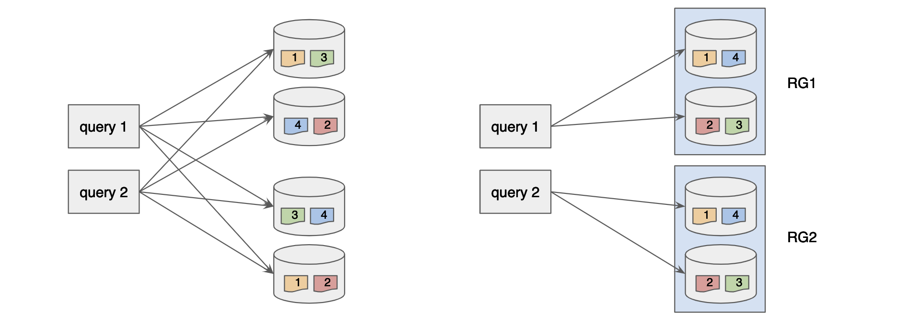
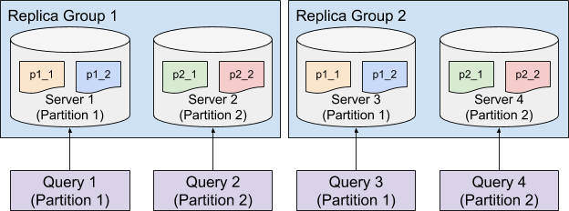

# Segment Assignment

Segment assignment refers to the strategy of assigning each segment from a table to the servers hosting the table. Picking the best segment assignment strategy can help reduce the overhead of the query routing, thus providing better performance.

## Balanced Segment Assignment

Balanced Segment Assignment is the default assignment strategy, where each segment is assigned to the server with the least segments already assigned. With this strategy, each server will have balanced query load, and each query will be routed to all the servers. It requires minimum configuration, and works well for small use cases.

.png>)

## Replica-Group Segment Assignment

Balanced Segment Assignment is ideal for small use cases with a small number of servers, but as the number of servers increases, routing each query to all the servers could harm the query performance due to the overhead of the increased fanout.

Replica-Group Segment Assignment is introduced to solve the horizontal scalability problem of the large use cases, which makes Pinot linearly scalable. This strategy breaks the servers into multiple replica-groups, where each replica-group contains a full copy of all the segments.

When executing queries, each query will only be routed to the servers within the same replica-group. In order to scale up the cluster, more replica-groups can be added without affecting the fanout of the query, thus not impacting the query performance but increasing the overall throughput linearly.

## Partitioned Replica-Group Segment Assignment

In order to further increase the query performance, we can reduce the number of segments processed for each query by partitioning the data and use the Partitioned Replica-Group Segment Assignment.

Partitioned Replica-Group Segment Assignment extends the Replica-Group Segment Assignment by assigning the segments from the same partition to the same set of servers. To solve a query which hits only one partition (e.g. `SELECT * FROM myTable WHERE memberId = 123` where `myTable` is partitioned with `memberId` column), the query only needs to be routed to the servers for the targeting partition, which can significantly reduce the number of segments to be processed. This strategy is especially useful to achieve high throughput and low latency for use cases that filter on an id field.

## Configure Segment Assignment

Segment assignment is configured along with the instance assignment, check [Instance Assignment](instance-assignment.md) for details.
