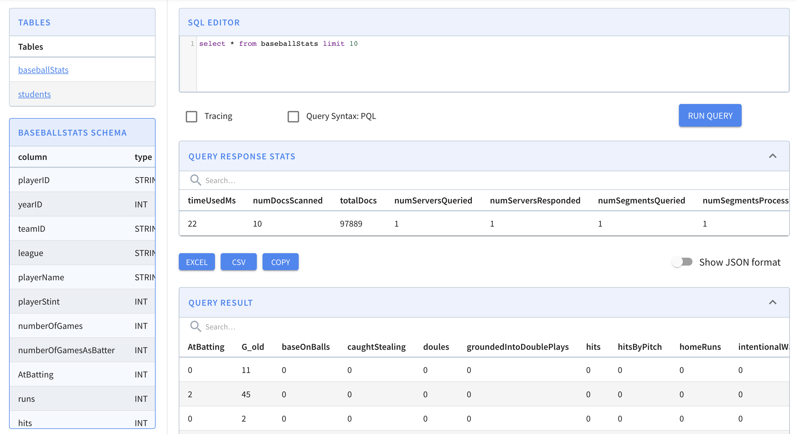

# Broker Query API

### REST API on the Broker

Pinot can be queried via a broker endpoint as follows. This example assumes broker is running on `localhost:8099`



The Pinot REST API can be accessed by invoking `POST` operation with a JSON body containing the parameter `sql` to the `/query/sql` endpoint on a broker.

When TLS/SSL is not enabled:

```java
$ curl -H "Content-Type: application/json" -X POST \
   -d '{"sql":"select foo, count(*) from myTable group by foo limit 100"}' \
   http://localhost:8099/query/sql
```

When TLS/SSL is enabled:

```java
$ curl -k -H "Content-Type: application/json" -X POST \
   -d '{"sql":"select foo, count(*) from myTable group by foo limit 100"}' \
   https://localhost:8099/query/sql
```

If the SQL statement contains `"`, in the JSON body, it needs to be replaced by `'"'"'`, for example:

```java
$ curl -H "Content-Type: application/json" -X POST \
   -d '{"sql":"select foo, count(*) from myTable where foo='"'"'abc'"'"' limit 100"}' \
   http://localhost:8099/query/sql
```



The multi-stage query engine can be used via a `POST` operation to the `/query` endpoint on a broker with a JSON body containing the parameter `sql`.

When TLS/SSL is not enabled:

```java
$ curl -H "Content-Type: application/json" -X POST \
   -d '{"sql":"select count(*) from a JOIN b ON a.x = b.x"}' \
   http://localhost:8099/query
```

When TLS/SSL is enabled:

```java
$ curl -k -H "Content-Type: application/json" -X POST \
   -d '{"sql":"select count(*) from a JOIN b ON a.x = b.x"}' \
   https://localhost:8099/query
```

If the SQL statement contains `"`, in the JSON body, it needs to be replaced by `'"'"'`, for example:

```java
$ curl -H "Content-Type: application/json" -X POST \
   -d '{"sql":"select count(*) from a JOIN b ON a.x = b.x where foo='"'"'abc'"'"'"}' \
   http://localhost:8099/query
```



### Query Console

Query Console can be used for running ad hoc queries (checkbox available to query the PQL endpoint). The Query Console can be accessed by entering the `<controller host>:<controller port>` in your browser



### pinot-admin

You can also query using the `pinot-admin` scripts. Make sure you follow instructions in [Getting Pinot](../../../basics/getting-started/running-pinot-locally.md#getting-pinot) to get Pinot locally, and then

```bash
cd incubator-pinot/pinot-tools/target/pinot-tools-pkg 
bin/pinot-admin.sh PostQuery \
  -queryType sql \
  -brokerPort 8000 \
  -query "select count(*) from baseballStats"
2020/03/04 12:46:33.459 INFO [PostQueryCommand] [main] Executing command: PostQuery -brokerHost localhost -brokerPort 8000 -queryType sql -query select count(*) from baseballStats
2020/03/04 12:46:33.854 INFO [PostQueryCommand] [main] Result: {"resultTable":{"dataSchema":{"columnDataTypes":["LONG"],"columnNames":["count(*)"]},"rows":[[97889]]},"exceptions":[],"numServersQueried":1,"numServersResponded":1,"numSegmentsQueried":1,"numSegmentsProcessed":1,"numSegmentsMatched":1,"numConsumingSegmentsQueried":0,"numDocsScanned":97889,"numEntriesScannedInFilter":0,"numEntriesScannedPostFilter":0,"numGroupsLimitReached":false,"totalDocs":97889,"timeUsedMs":185,"segmentStatistics":[],"traceInfo":{},"minConsumingFreshnessTimeMs":0}
```

###
