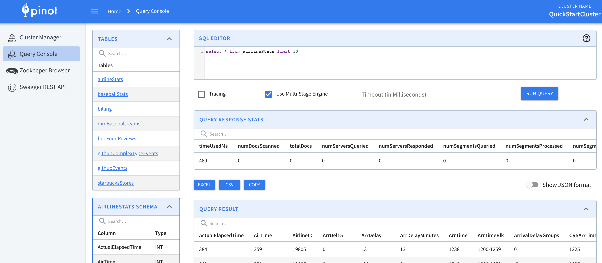

# Query

<figure><figcaption></figcaption></figure>


[querying-pinot.md](querying-pinot.md)



[query-options.md](query-options.md)



[query-quotas.md](query-quotas.md)


### Explore query syntax:


[json-queries.md](../../functions/json-queries.md)



[supported-aggregations.md](../../functions/supported-aggregations.md)



[how-to-handle-unique-counting.md](../../functions/how-to-handle-unique-counting.md)



[explain-plan.md](explain-plan.md)



[filtering-with-idset.md](query-syntax/filtering-with-idset.md)



[gap-fill-functions.md](gap-fill-functions.md)



[grouping-algorithm.md](grouping-algorithm.md)



[joins.md](query-syntax/joins.md)



[joins.md](query-syntax/joins.md)



[lookup-udf-join.md](query-syntax/lookup-udf-join.md)



[supported-transformations.md](../../functions/supported-transformations.md)



[scalar-functions.md](../../functions/scalar-functions.md)



[windows-functions.md](../../windows-functions.md)



[windows-functions.md](../../windows-functions.md)

