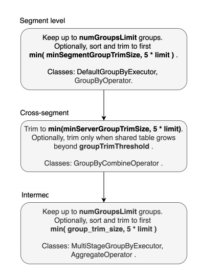

# Grouping Algorithm

In this guide we will learn about the heuristics used for trimming results in Pinot's grouping algorithm (used when processing `GROUP BY` queries) to make sure that the server doesn't run out of memory.

## V1 / Single Stage Query Engine

<figure><figcaption><p>Group by results approximation at various stages of V1 query execution</p></figcaption></figure>

## Within segment

When grouping rows within a segment, Pinot keeps a maximum of `numGroupsLimit` groups per segment. This value is set to 100,000 by default and can be configured by the `pinot.server.query.executor.num.groups.limit` property.

If the number of groups of a segment reaches this value, the extra groups will be ignored and the results returned may not be completely accurate. The `numGroupsLimitReached` property will be set to `true` in the query response if the value is reached.

### Trimming tail groups

After the inner segment groups have been computed, the Pinot query engine optionally trims tail groups. Tail groups are ones that have a lower rank based on the `ORDER BY` clause used in the query.

When segment group trim is enabled, the query engine will trim the tail groups and keep only `max(minSegmentGroupTrimSize, 5 * LIMIT)` , \
where LIMIT  is the maximum  number of records returned by query - usually set via `LIMIT` clause). Pinot keeps at least `5 * LIMIT` groups when trimming tail groups to ensure the accuracy of results. Trimming is performed only when ordering and limit is specified.

This value can be overridden on a query by query basis by passing the following option:

```sql
SELECT * 
FROM ...
OPTION(minSegmentGroupTrimSize=value)
```

## Cross segments

Once grouping has been done within a segment, Pinot will merge segment results and trim tail groups and keep `max(minServerGroupTrimSize, 5 * LIMIT)` groups if it gets more groups.

`minServerGroupTrimSize` is set to 5,000 by default and can be adjusted by configuring the `pinot.server.query.executor.min.server.group.trim.size` property. Cross segments trim can be disabled by setting the property to `-1`.

When cross segments trim is enabled, the server will trim the tail groups before sending the results back to the broker. To reduce memory usage while merging per-segment results, It will also trim the tail groups when the number of groups reaches the `trimThreshold`.

`trimThreshold` is the upper bound of groups allowed in a server for each query to protect servers from running out of memory. To avoid too frequent trimming, the actual trim size is bounded to `trimThreshold / 2`. Combining this with the above equation, the actual trim size for a query is calculated as `min(max(minServerGroupTrimSize, 5 * LIMIT), trimThreshold / 2)`.

This configuration is set to 1,000,000 by default and can be adjusted by configuring the `pinot.server.query.executor.groupby.trim.threshold` property.

A higher threshold reduces the amount of trimming done, but consumes more heap memory. If the threshold is set to more than 1,000,000,000, the server will only trim the groups once before returning the results to the broker.

This value can be overridden on a query by query basis by passing the following option:

```sql
SELECT * 
FROM ...
OPTION(groupTrimThreshold=value)
```

## At Broker

When broker performs the final merge of the groups returned by various servers, there is another level of trimming that takes place. The tail groups are trimmed and \
&#x20;`max(minBrokerGroupTrimSize, 5 * LIMIT)` groups are retained.&#x20;

Default value of `minBrokerGroupTrimSize` is set to 5000. This can be adjusted by configuring  `pinot.broker.min.group.trim.size` property.

## GROUP BY behavior

Pinot sets a default `LIMIT` of 10 if one isn't defined and this applies to `GROUP BY` queries as well. Therefore, if no limit is specified, Pinot will return 10 groups.

Pinot will trim tail groups based on the `ORDER BY` clause to reduce the memory footprint and improve the query performance. It keeps at least `5 * LIMIT` groups so that the results give good enough approximation in most cases. The configurable min trim size can be used to increase the groups kept to improve the accuracy but has a larger extra memory footprint.

## HAVING behavior

If the query has a `HAVING` clause, it is applied on the merged `GROUP BY` results that already have the tail groups trimmed. If the `HAVING` clause is the opposite of the `ORDER BY` order, groups matching the condition might already be trimmed and not returned. e.g.

```sql
SELECT SUM(colA) 
FROM myTable 
GROUP BY colB 
HAVING SUM(colA) < 100 
ORDER BY SUM(colA) DESC 
LIMIT 10
```

Increase min trim size to keep more groups in these cases.

## Examples

For a simple keyed aggregation query such as:

```sql
SELECT i, j, count(*) AS cnt
FROM tab
GROUP BY i, j
ORDER BY i ASC, j ASC
LIMIT 3;
```

a simplified execution plan, showing where trimming happens, looks like:

```sql
BROKER_REDUCE(sort:[i, j],limit:10) <- sort and trim groups to minBrokerGroupTrimSize
  COMBINE_GROUP_BY <- sort and trim groups to minServerGroupTrimSize
    PLAN_START
      GROUP_BY <- limit to numGroupsLimit, then sort and trim to minSegmentGroupTrimSize
        PROJECT(i, j)
          DOC_ID_SET
            FILTER_MATCH_ENTIRE_SEGMENT
```

For sake of brevity, plan above doesn't mention that actual number of groups left is  \
`min( trim_value, 5*limit )` .

## V2 / Multi Stage Query Engine

Compared to V1, V2 engine uses similar algorithm, but there are notable differences:

* V2 doesn't implicitly limit number of query results (to 10)
* V2 doesn't limit number of groups when aggregating cross-segment data
* V2 doesn't trim results by default in any stage
* V2 doesn't aggregate results in the broker, pushing final aggregation processing to server(s)

The default V2 algorithm is shown on the following diagram:

<figure><figcaption><p>Default V2 engine group by results approximation</p></figcaption></figure>

Apart from limiting number of groups on segment level, similar limit is applied at _intermediate_ stage.  Since V2 query engine allows for subqueries, in an execution plan, there could be arbitrary number of stages doing _intermediate_ aggregation between leaf (bottom-most) and top-most stages, and each stage can be implemented with many instances of `AggregateOperator` (shown as `PinotLogicalAggregate` in  [EXPLAIN's](https://docs.pinot.apache.org/users/user-guide-query/query-syntax/explain-plan-multi-stage) output).  \
The operator limits number of distinct groups to 100,000 by default, which can be overridden with `numGroupsLimit` option or `num_groups_limit` aggregate hint. The limit applies to a single operator instance, meaning that next stage could receive a total of `num_instances * num_groups_limit`.

It is possible to enable group limiting and trimming at other stages with:

* `is_enable_group_trim` hint - it enables trimming at all V1/V2 levels  and group limiting at cross-segment level.  `minSegmentGroupTrimSize` value needs to be set separately. \
  Default value: false&#x20;
* `group_trim_size` hint - triggers sorting and trimming of group by results at intermediate stage. Requires `is_enable_group_trim` hint.\
  Default value: -1 (disabled)

When the above hints are used, query processing looks as follows:

<figure><figcaption><p>Group by results trimming at various stages of V2 query execution utilizing V1 in leaf stage</p></figcaption></figure>

The actual processing depends on the query, which may not contain V1 leaf stage aggregate component, and rely on AggregateOperator on all levels. Moreover, since trimming relies on order and limit propagation, it may not happen in a subquery if order by column(s) are not available.&#x20;

## Examples

*   If hints are applied to query mentioned in V1 examples above, that is :\


    ```sql
    SELECT /*+  aggOptions(is_enable_group_trim='true',group_trim_size='10') */        
    i, j, count(*) as cnt
     FROM myTable
     GROUP BY i, j
     ORDER BY i ASC, j ASC
     LIMIT 3
    ```

    \
    then execution plan should be as follows:\


    ```sql
    LogicalSort
      PinotLogicalSortExchange(distribution=[hash])
        LogicalSort
          PinotLogicalAggregate <- aggregate up to num_groups_limit groups, then sort and trim output to group_trim_size
            PinotLogicalExchange(distribution=[hash[0, 1]])
              LeafStageCombineOperator(table=[mytable])
                StreamingInstanceResponse
                  CombineGroupBy <- aggregate up to minSegmentGroupTrimSize groups
                    GroupBy <- aggregate up to numGroupsLimit groups, optionally sort and trim to minSegmenGroupTrimSize
                      Project
                        DocIdSet
                          FilterMatchEntireSegment
    ```

    \
    In the plan above trimming happens in three operators: `GroupBy`, `CombineGroupBy` and `AggregateOperator` (which is the physical implementation of `PinotLogicalAggregate`).  \

*   Aggregating over result of a join,  e.g. \


    ```sql
    select /*+  aggOptions(is_enable_group_trim='true',group_trim_size='3') */ 
           t1.i, t1.j, count(*) as cnt
    from tab t1
    join tab t2 on 1=1
    group by t1.i, t1.j
    order by t1.i asc, t1.j asc
    limit 5
    ```

    \
    should produce following execution plan:\


    ```sql
    LogicalSort
      PinotLogicalSortExchange(distribution=[hash])
        LogicalSort
          PinotLogicalAggregate(aggType=[FINAL]) <- aggregate up to num_groups_limit groups, then sort and trim output to group_trim_size
            PinotLogicalExchange(distribution=[hash[0, 1]])
              PinotLogicalAggregate(aggType=[LEAF]) <- aggregate up to num_groups_limit groups, then sort and trim output to group_trim_size
                LogicalJoin(condition=[true])
                  PinotLogicalExchange(distribution=[random])
                    LeafStageCombineOperator(table=[mytable])
                      ...
                        FilterMatchEntireSegment
                  PinotLogicalExchange(distribution=[broadcast])
                    LeafStageCombineOperator(table=[mytable])
                      ...
                        FilterMatchEntireSegment
    ```

    \
    in which there is no leaf stage V1 operator and all aggregation stages are implemented with V2 operator - `PinotLogicalAggregate`. \


## Configuration Parameters/hints

<table data-full-width="true"><thead><tr><th width="325">Parameter</th><th width="107">Default</th><th width="339">Query Override</th><th>Description</th></tr></thead><tbody><tr><td><code>pinot.server.query.executor.num.groups.limit</code><br></td><td>100,000</td><td><code>OPTION(numGroupsLimit=value)</code></td><td>The maximum number of groups allowed per segment.</td></tr><tr><td><code>pinot.server.query.executor.min.segment.group.trim.size</code><br></td><td>-1 (disabled)</td><td><p><code>OPTION(</code></p><p><code>minSegmentGroupTrimSize=value)</code></p></td><td>The minimum number of groups to keep when trimming groups at the segment level.</td></tr><tr><td><code>pinot.server.query.executor.min.server.group.trim.size</code><br></td><td>5,000</td><td><p><code>OPTION(</code></p><p><code>minServerGroupTrimSize=value)</code></p></td><td>The minimum number of groups to keep when trimming groups at the server level.</td></tr><tr><td><code>pinot.server.query.executor.groupby.trim.threshold</code><br></td><td>1,000,000</td><td><p><code>OPTION(</code></p><p><code>groupTrimThreshold=value)</code></p></td><td>The number of groups to trigger the server level trim.</td></tr><tr><td><code>pinot.server.query.executor.max.execution.threads</code><br></td><td>-1 (use all execution threads)</td><td><p><code>OPTION(</code></p><p><code>maxExecutionThreads=value)</code></p></td><td>The maximum number of execution threads (parallelism of segment processing) used per query.</td></tr><tr><td><code>pinot.broker.min.group.trim.size</code><br><br></td><td>5000</td><td><p><code>OPTION(</code></p><p><code>minBrokerGroupTrimSize=value)</code></p><p></p></td><td>The minimum number of groups to keep when trimming groups at the broker.<br>Applies only to SSQ(*).</td></tr><tr><td><code>pinot.server.query.executor.group.trim.size</code></td><td>-1 (disabled)</td><td><p><code>OPTION(groupTrimSize=value)</code> or<br><code>SET groupTrimSize=value;</code> or<br><code>/*+ aggOptions(</code></p><p><code>group_trim_size='value') */</code></p></td><td>The number of groups to keep when trimming groups at intermediate level.<br>Applies only to MSQ(**).</td></tr><tr><td></td><td>false (disabled)</td><td><p><code>/*+ aggOptions(</code></p><p><code>is_enable_group_trim='value') */</code></p></td><td>Enable pushdown of order by and limit to leaf stage (if possible in a query). Applies only to MSQ(**).</td></tr></tbody></table>

(\*) SSQ - Single-Stage Query

(\*\*) MSQ - Multi-Stage Query
