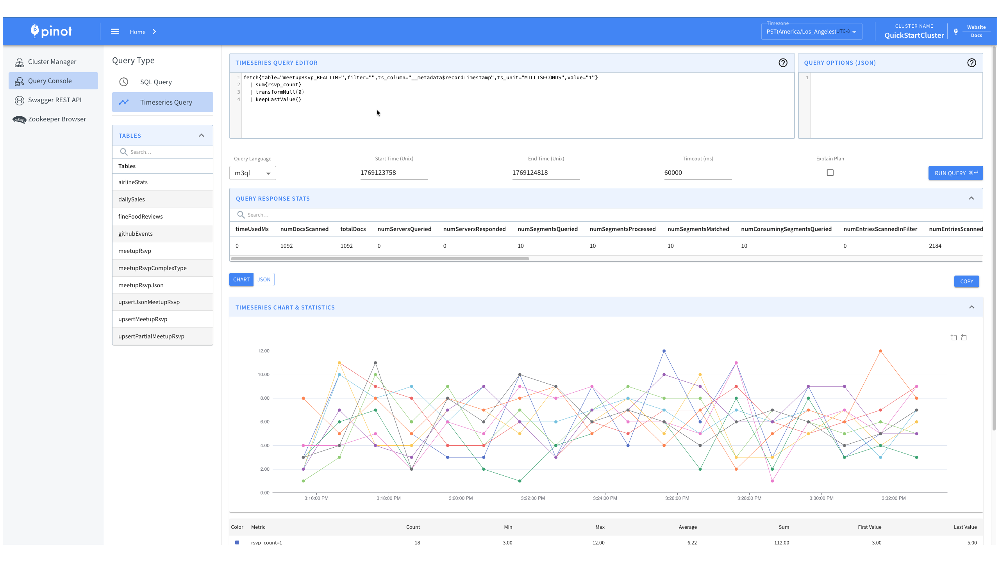

# Time Series Queries

Pinot has a "Time Series Engine" that can be used to support any Time Series Query Language, provided an appropriate Time Series Language Plugin is implemented.

Languages such as PromQL, Uber's M3QL, and many more can be implemented using the Plugin. A toy language plugin, intended only for demo/testing purposes, is included in the apache/pinot repo.


**Status:** The Time Series Engine is in **Beta** as of Pinot 1.4 and is slated to be **Generally Available** in Pinot 1.5.


## Running Time Series Queries with Quickstart

You can use the `time_series` Quickstart type to run Pinot with the Time Series Engine enabled. The Quickstart uses the toy language implementation included in the apache/pinot repo.

You can refer to our [Quick Start Examples](../../basics/getting-started/quick-start.md) page for more information.

## Running Time Series Queries in Production

Assuming you have implemented your own Timeseries Language Plugin, with the code-name "mytsql", you can set the following configurations in each of Controller, Broker and Server configs. The class and series builder factory names are hypothetical. Note that the key of the planner and series builder configs contain the language code.

```properties
pinot.timeseries.languages=mytsql
pinot.timeseries.mytsql.logical.planner.class=com.example.mytsql.MyTSLogicalPlanner
pinot.timeseries.mytsql.series.builder.factory=com.example.mytsql.MyTSQLSeriesBuilderFactory
```

Pinot even allows running multiple Time Series Query Languages. For instance, if you had another query language plugin for `promql` and you wanted to run it alongside `mytsql`, the configs would look like:

```properties
pinot.timeseries.languages=mytsql,promql
pinot.timeseries.mytsql.logical.planner.class=com.example.mytsql.MyTSLogicalPlanner
pinot.timeseries.mytsql.series.builder.factory=com.example.mytsql.MyTSQLSeriesBuilderFactory
pinot.timeseries.promql.logical.planner.class=com.example.promql.PromQLLogicalPlanner
pinot.timeseries.promql.series.builder.factory=com.example.promql.PromQLSeriesBuilderFactory
```

## Time Series Features

### Controller UI

Pinot includes a Time Series Query page in the Controller UI for easy querying and visualization at `http://localhost:9000`.

<figure><figcaption>Time Series Query UI showing the query editor, time controls, and visualization options</figcaption></figure>

The UI includes a query editor with language selector (compatible with custom language plugins) and visualizes results as both an interactive time series chart and raw JSON. It also displays query statistics and supports explain plans and query options for enhanced control.

### Broker-Compatible API

The time series API `POST /query/timeseries` returns responses in the standard `BrokerResponse` format, allowing existing Pinot client libraries to work without modification. The response includes familiar query statistics like `numDocsScanned`, `numSegmentsQueried`, and `totalDocs`, along with the same exception handling structure as SQL queries.

Time series data is returned in a `ResultTable` with the following key columns:
- `ts` - Array of timestamps for each time bucket
- `values` - Array of metric values corresponding to each timestamp
- `__name__` - Serialized tag key-value pairs identifying the series
- Additional columns for each tag/label in the series

### Prometheus-Compatible `/query_range` Endpoint

Pinot provides a Prometheus-compatible `/query_range` endpoint that follows the same conventions as the [Prometheus HTTP API](https://prometheus.io/docs/prometheus/latest/querying/api/#range-queries). This endpoint is available on both the Broker and Controller, and supports both GET and POST methods.

#### Endpoint

```
GET /timeseries/api/v1/query_range
POST /timeseries/api/v1/query_range
```

#### Request Parameters

<table>
  <thead>
    <tr>
      <th>Parameter</th>
      <th>Required</th>
      <th>Description</th>
    </tr>
  </thead>
  <tbody>
    <tr>
      <td>`language`</td>
      <td>Yes</td>
      <td>The time series query language to use (e.g., `promql`). Must match one of the configured language plugins.</td>
    </tr>
    <tr>
      <td>`query`</td>
      <td>Yes</td>
      <td>The time series query expression (e.g., a PromQL expression).</td>
    </tr>
    <tr>
      <td>`start`</td>
      <td>Yes</td>
      <td>Start timestamp for the query range. Accepts Unix timestamp in seconds (e.g., `1700000000`) or RFC3339 format.</td>
    </tr>
    <tr>
      <td>`end`</td>
      <td>Yes</td>
      <td>End timestamp for the query range. Same format as `start`.</td>
    </tr>
    <tr>
      <td>`step`</td>
      <td>Yes</td>
      <td>Query resolution step width as a duration string (e.g., `15s`, `1m`, `1h`).</td>
    </tr>
  </tbody>
</table>

For GET requests, parameters are passed as query parameters. For POST requests, parameters can be sent as URL-encoded form data or query parameters.

#### Example GET Request

```bash
curl -G 'http://localhost:8099/timeseries/api/v1/query_range' \
  --data-urlencode 'language=promql' \
  --data-urlencode 'query=sum(rate(myMetric[5m]))' \
  --data-urlencode 'start=1700000000' \
  --data-urlencode 'end=1700003600' \
  --data-urlencode 'step=60s'
```

#### Example Response

The response follows the standard Pinot `BrokerResponse` format, containing time series data in a `ResultTable`:

```json
{
  "resultTable": {
    "dataSchema": {
      "columnNames": ["ts", "values", "__name__"],
      "columnDataTypes": ["LONG_ARRAY", "DOUBLE_ARRAY", "STRING"]
    },
    "rows": [
      [
        [1700000000, 1700000060, 1700000120],
        [1.5, 2.3, 3.1],
        "sum(rate(myMetric[5m])){}"
      ]
    ]
  },
  "numDocsScanned": 10000,
  "numSegmentsQueried": 4,
  "totalDocs": 50000
}
```

#### Controller Proxy

When querying through the Controller (e.g., `http://localhost:9000/timeseries/api/v1/query_range`), the request is automatically forwarded to an available Broker instance. This is useful when clients do not have direct access to Broker endpoints.

#### Differences from `/query/timeseries`

<table>
  <thead>
    <tr>
      <th>Feature</th>
      <th>`POST /query/timeseries`</th>
      <th>`GET/POST /query_range`</th>
    </tr>
  </thead>
  <tbody>
    <tr>
      <td>Request format</td>
      <td>JSON body with `language`, `query`, and time parameters</td>
      <td>Query parameters (Prometheus-compatible)</td>
    </tr>
    <tr>
      <td>HTTP methods</td>
      <td>POST only</td>
      <td>GET and POST</td>
    </tr>
    <tr>
      <td>Time range</td>
      <td>Specified inside the JSON body</td>
      <td>Specified via `start`, `end`, and `step` parameters</td>
    </tr>
    <tr>
      <td>Compatibility</td>
      <td>Pinot-native API</td>
      <td>Prometheus-compatible, works with tools like Grafana</td>
    </tr>
  </tbody>
</table>

The `/query_range` endpoint is particularly useful when integrating Pinot with existing Prometheus-compatible tooling such as Grafana, since it follows the same API conventions.

### Other Features

* **Auth Support** - Time series queries support the same authentication and authorization mechanisms as SQL queries (user roles and table-level permissions).
* **Query Options** - Custom query options can be passed as part of the request to modify query execution behavior (both for your custom plugin and the underlying Pinot engine).
* **Query Event Listeners** - Time series queries trigger the same query event listeners as SQL queries, enabling logging, auditing, and custom metrics.
* **Explain Plans** - Explain plans help visualize the logical query plan generated by your custom language plugin.